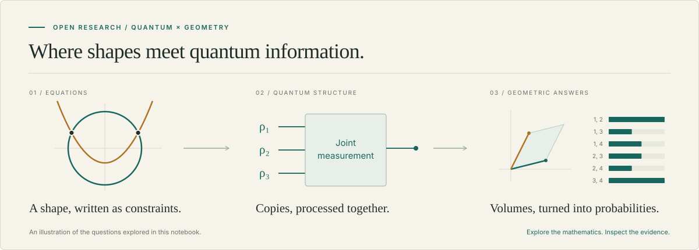

# Quantum algorithms for algebraic geometry



**Can quantum information help us answer questions about shapes defined by equations?**

This is an open research notebook about that question. A circle is the set of points satisfying `x² + y² = 1`. More elaborate polynomial equations describe a robot’s allowed configurations, the possible decompositions of a tensor, or constraints on a quantum state. Algebraic geometry studies these solution spaces and their structure.

Quantum mechanics brings another language for the same ingredients: vectors, linear maps, interference, and measurement. The challenge is to turn that connection into an algorithm whose advantage survives a fair comparison—and whose mechanism is actually new.

**[Read the interactive explainer →](https://tobiasosborne.github.io/quantum-algorithms-for-algebraic-geometry/)** · **[Download the standalone HTML](https://github.com/tobiasosborne/quantum-algorithms-for-algebraic-geometry/raw/HEAD/reports/research-report.html)**

The explainer is the best place to start. Move curves, explore the cost of postselection, sample coordinate volumes, and inspect the proofs behind each conclusion. Save the HTML file and open it in a browser: its diagrams, equations, glossary, claim registry, and source library work entirely offline.

## What has survived the search

The current result is a rigorously matched quantum **copy advantage** for selecting original generators, alongside the earlier sampling and testing results:

- **Choose which generators to retain.** Eight copies of a fixed quantum source select two original generators of the same nonreduced ideal with success above two-thirds. Every adaptive separate-copy strategy needs \(\Omega(\sqrt q)\) copies. A QSVT extension selects a growing basis using at most `6r²` copies. [Proof and independent audit](verdicts/syzygy-advantage-r12.md); [growing-rank construction](scouting/syzygy-basis-r13.md).
- **Sample a hidden subspace.** Starting from copies of a mixed quantum state, extract a state representing its support and sample coordinate subsets according to their squared volumes. A joint quantum procedure uses fewer copies than any allowed separate-copy sampler. [Construction and independent audit](verdicts/support-plucker-r9.md).
- **Test hidden tensor components.** Decide a rank condition on the unknown building blocks of a supplied symmetric tensor, without reconstructing their full list. The proved quantum copy budget is independent of dimension, while the separate-copy lower bound grows with it. Its sufficient constant is enormous and impractical. [The Waring-component tester](scouting/waring-programmable-tester.md).

Here, a *copy* means a fresh preparation from the same quantum source. Both sides receive the same input and must produce the same kind of output. The separate-copy comparator may measure each complete original copy in any way, adapt its later measurements, and keep unlimited classical memory; it cannot keep quantum memory between original copies. The promise supplies quantum data; these results do not establish a speedup for freely readable coefficient lists.

**The revised mechanism criterion is met in the fixed quantum-source model.** D25 admits QSVT and useful quantum walks while excluding QFT, Grover and DQI disguises. The generator-selection proofs use ordinary swap interference or QSVT. They concern labels in a based generator tuple, and require a fixed source: controlling the incident state changes the problem and admits a two-query classical controller in rank two. No explicit-coefficient or practical hardware speedup is claimed.

The wider search has also produced useful identities, sharper classical baselines, counterexamples, and reproducible tests. Those results help explain which geometric information a quantum state contains, what it costs to access, and where another attempt might succeed. The [success criteria](PRD.md) and [current handoff](HANDOFF.md) make the distinction between progress and completion explicit.

## Find your way around

| Start here | What you will find |
| --- | --- |
| [Interactive report](https://tobiasosborne.github.io/quantum-algorithms-for-algebraic-geometry/) | A readable tour, hands-on illustrations, and an offline evidence library. |
| [Claim registry](claims/CLAIMS.md) | The canonical status of each assertion: proved, sketch, conjecture, or refuted. |
| [Definitions](definitions/) | Notation, conventions, and precise input and output promises. |
| [Research routes](scouting/) | Proposed constructions, geometric questions, and classical comparisons. |
| [Independent verdicts](verdicts/) | Proof reviews, scope repairs, counterarguments, and mechanism audits. |
| [Checkers](checkers/) | Finite tests and deliberate wrong variants that test the tests themselves. |

Historical documents preserve the reasoning as it developed. Use the claim registry for current formal status; a passing numerical check is evidence about that check, not a replacement for a proof.

## Build and check locally

You need Python 3, Node.js/npm, and `make`. From the repository root:

```bash
make setup          # Install pinned dependencies and repository Git hooks
make setup-browser  # Install Chromium for the browser checks
make ci             # Rebuild, validate, and run the offline browser suite
```

Use `make report` to rebuild just the standalone HTML, or `make report-check` to check its links and reproducibility. Setup downloads dependencies; the build and browser checks run locally. The report hook does not install dependencies or make network requests. See the [report build notes](reports/README.md) for details and an existing-Chromium option.

## Bring a question—or a counterexample

Contributions can start with a new geometric task, a concrete quantum circuit, a better classical baseline, a clearer explanation, or a sharp counterexample. Describe the input you assume, the output you want, and the resources you charge. Small, well-supported corrections are welcome: finding the missing cost in an attractive idea is useful research too.

Please keep proposed statements distinct from proved ones, link the evidence, and preserve the original material in [`seed/`](seed/). The project uses [Beads](AGENTS.md) for local task tracking.

Licensed under the [GNU Affero General Public License v3.0](LICENSE) (`AGPL-3.0-only`).
