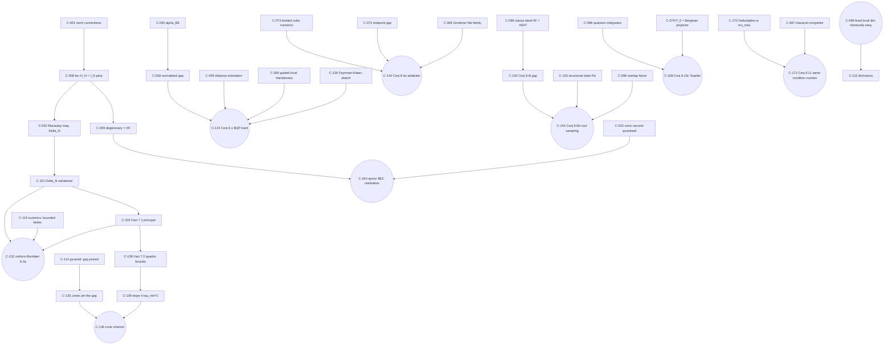

<!-- ROLE: the campaign claims DAG (rk-light law L1). The ONLY place a claim status lives.
     UPDATE POLICY: status goes UP only after a converged adversarial critic loop with a
     verdict in verdicts/ carrying no FATAL/MAJOR. Never by the author. REFUTED rows are
     kept forever. Extracted 2026-09-02 from seed/analysis-2026-09-01/ (read-only). -->

# CLAIMS — quantum algorithms for algebraic geometry

Scope of this extraction: every claim in `seed/analysis-2026-09-01/report.md` (§1–§9,
every numbered Fact/Proposition/Conjecture), every claim on `seed/page81.tex`, and every
draft claim that `referee/round1.md` or `referee/round2.md` refuted.

Status legend and entry rule (rk-light L1):

- `SKETCH` — a proof or derivation exists in the seed, but no converged critic verdict in
  THIS campaign. Every seed "theorem-level" item enters here. **Nothing enters as PROVED.**
  Widened 2026-09-03 (orchestrator, verdicts/quantum-primitives-r3.md Q16): a published theorem
  imported from the literature with a resolved arXiv id or DOI also enters as SKETCH, marked
  `(cited theorem)` in where-proved, following the existing C-092/C-099 convention; it is not a
  campaign proof and is promoted only by a verdict that checks the citation and its hypotheses.
- `CONJECTURE` — seed §8 conjectures, open questions, and directional statements.
- `REFUTED` — killed by the seed itself or by a referee round. Each REFUTED row names the
  surviving weaker statement by C-id.
- `PROVED` — unreachable by extraction; requires a `verdicts/` file.

Ordering: `report.md` §1→§9 (C-001–C-158), then `page81.tex` (C-159–C-186), then the
refuted draft claims in referee order (C-187–C-212). Definition slugs `D-*` are best-guess;
the full list is reconciled in `EXTRACTION-NOTES.md`.

`where-tested` paths are relative to `seed/analysis-2026-09-01/numerics/`.

---

## §1 — Setting and normalisation

### C-001
- statement: On the fixed graded piece `R_N` of `R = C[z_0,...,z_n]` there are three
  inner products, specified by the norm of the monomial `z^k`, `|k|=N`: Fock/Fischer
  `||z^k||^2 = k!`; Bombieri–Weyl (Kostlan, Drury–Arveson) `||z^k||^2 = k!/N!`; sphere
  `S^{2n+1}` (the notebook's normalisation) `||z^k||^2 = n! k!/(N+n)!`. The adjoint of
  multiplication by `z_j` is exactly `∂_j` in the Fock norm; `∂_j` up to a degree-dependent
  positive scalar in Bombieri–Weyl; `∂_j (D+n)^{-1}` (`D` the degree operator) in the
  sphere norm.
- status: SKETCH
- depends-on: D-polynomial-ring, D-fock-basis, D-bombieri-weyl-norm, D-sphere-norm
- where-proved: report.md §1 (table)
- where-tested: none
- referee: round1 #1 flagged only the cross-degree consequence, not the table itself.
- north-star relevance: infrastructure — fixes the normalisation every gap statement is
  quantified in; the whole speedup question is stated in normalised units.

### C-002
- statement: For each fixed `N`, the three inner products of C-001 differ on `R_N` by a
  positive scalar. Hence for every `N`, orthogonal complements inside `R_N`, kernels of
  homogeneous constant-coefficient differential operators on `R_N`, and the ground space
  of `H_N` are the same subspace in all three normalisations.
- status: SKETCH
- depends-on: C-001, D-fock-basis, D-bombieri-weyl-norm, D-sphere-norm
- where-proved: report.md §1
- where-tested: none
- referee: round1 #1 accepts the degreewise statement ("kernel statements survive").
- north-star relevance: infrastructure — licenses moving the ground-space claims between
  the notebook's sphere convention and the Fock convention used for all algorithms.

### C-003
- statement: The graded direct sums `⊕_N R_N` under the three norms of C-001 are NOT the
  same Hilbert module under the identity map. Norms of the graded sums, boundedness of the
  shift operators, spectra, Arveson curvature and essential normality all depend on which
  norm is chosen; only degreewise statements transfer.
- status: SKETCH
- depends-on: C-001, C-002, D-drury-arveson-space
- where-proved: report.md §1 (final paragraph); forced by referee/round1.md #1
- where-tested: none
- referee: round1 #1 "significant" — the report's §1 is the fix demanded there.
- north-star relevance: infrastructure — blocks an entire class of false cross-degree
  arguments (curvature, essential normality) that would otherwise be cited as speedups.

### C-004
- statement: In the Fock normalisation `R_N ≅ Sym^N(C^{n+1}) = H^0(P^n, O(N))` unitarily,
  with `dim R_N = C(N+n, n)`; this is the symmetric subspace of `N` qudits of local
  dimension `n+1` (not `n`), i.e. the ambient space of the `N`-th Veronese embedding.
- status: SKETCH
- depends-on: C-001, D-fock-basis, D-symmetric-sector
- where-proved: report.md §1
- where-tested: none
- referee: not addressed directly; round1 #2 fixes the related `H^2_{n+1}` index.
- north-star relevance: infrastructure — this is the identification that makes the whole
  construction a bosonic (hence linear-optics / BEC-attackable) model.

### C-005
- statement: With `|k> = z^k/sqrt(k!)` orthonormal, `a_j = ∂_j`, `a_j^† = z_j`, one has
  `[a_i, a_j^†] = δ_ij`; the construction is literally `n+1` bosonic modes and `R_N` is
  the `N`-boson sector.
- status: SKETCH
- depends-on: C-001, C-004, D-fock-basis
- where-proved: report.md §1
- where-tested: task1_conic.py
- referee: not addressed (accepted throughout both rounds).
- north-star relevance: hardware attack — `n+1` modes at fixed total boson number `N` is
  exactly the regime of linear optics with postselection, boson sampling and
  Bose–Hubbard-type simulators.

### C-006
- statement: The notebook's `L^2(CP^n)` must be read as the Hardy space of the sphere
  `S^{2n+1}` or as symmetric Fock space; the genuine `L^2(CP^n)` is a different,
  non-holomorphic space. (Same content as report §9.2.)
- status: SKETCH
- depends-on: C-001, C-004, C-181, C-183
- where-proved: report.md §1, §9.2
- where-tested: none
- referee: not addressed.
- north-star relevance: infrastructure — corrects the ambient space; nothing downstream
  survives if the wrong `L^2` is used.

### C-007
- statement: For homogeneous `f = Σ_α f_α z^α` of degree `m`, set `a^†(f) = f(a^†)` =
  multiplication by `f`, and `a(f) := a^†(f)^† = conj(f)(∂) = Σ_α conj(f_α) ∂^α`. The
  conjugation of the coefficients is forced by self-adjointness; the notebook's `f(∂)`
  agrees with `a(f)` only when `f` has real coefficients.
- status: SKETCH
- depends-on: C-001, C-005, D-fock-basis
- where-proved: report.md §1, §9.3
- where-tested: task1_conic.py, task7_coherent.py
- referee: round1 #7 confirms there is no conjugation error in the final energy formula.
- north-star relevance: infrastructure — without it `H` is not positive and the whole
  frustration-free picture (C-008) fails.

---

## §2 — Ground space = Macaulay inverse system

### C-008
- statement: Let `I = (f_1,...,f_d)` be homogeneous with `deg f_j = m_j`, let
  `I_N = Σ_j f_j R_{N-m_j}`, and let `H = Σ_{j=1}^d a^†(f_j) a(f_j)`, `H_N = H|_{R_N}`.
  Then for every `N ≥ 0`, `ker H_N = ∩_j ker a(f_j)|_{R_N} = ∩_j (f_j R_{N-m_j})^⊥ =
  (I_N)^⊥`. In particular `H_N ≥ 0` and its ground space is the common kernel of each
  positive term, i.e. `H_N` is frustration-free. (Fact 2.1.)
- status: SKETCH
- depends-on: C-001, C-005, C-007, D-homogeneous-ideal, D-frustration-free
- where-proved: report.md §2 (Fact 2.1), via `ker M^† = (ran M)^⊥`
- where-tested: task2_hilbert.py, task2b_subspace.py, task1_conic.py
  (`span{z^β f_j} ⊥ ker H_N` to `1e-14`)
- referee: round1 #77 calls the algebraic kernel identity "basically sound"; no objection.
- north-star relevance: infrastructure — the single load-bearing identity of the campaign;
  every algorithmic claim and every hardware realisation reads through it.

### C-009
- statement: With the hypotheses of C-008, `dim ker H_N = C(N+n,n) - dim I_N =
  HF_{R/I}(N)` for every `N`: the ground-state degeneracy of `H_N` is the Hilbert function
  of `R/I`. (Fact 2.1.)
- status: SKETCH
- depends-on: C-008, D-hilbert-function
- where-proved: report.md §2 (Fact 2.1)
- where-tested: task2_hilbert.py (conic `2N+1`, twisted cubic `3N+1`, rational normal
  quartic `4N+1`, a monomial ideal, two generic quadrics in `P^3` (`4N`), boolean ideals),
  task2b_subspace.py, task8_cnf.py
- referee: not contested.
- north-star relevance: speedup — makes an algebraic invariant a spectral degeneracy;
  §5.2/Conj 8.7 (normalised Hilbert function) is the candidate quantum task built on it.

### C-010
- statement: With the hypotheses of C-008, `ran H_N = I_N`, so the orthogonal projector
  onto `I_N` is the step function `Θ(H_N)` of the Hamiltonian.
- status: SKETCH
- depends-on: C-008
- where-proved: report.md §2 (Fact 2.1)
- where-tested: none
- referee: not contested.
- north-star relevance: speedup — this is the substitute for the notebook's impossible
  parent Hamiltonian (C-041, C-042) and the object QSVT actually delivers (C-048).

### C-011
- statement: For `N` beyond the Castelnuovo–Mumford regularity of `I`, `dim ker H_N`
  equals the Hilbert polynomial `p_{R/I}(N)`, whose degree is `dim V(I)` and whose leading
  coefficient is `deg V(I) / (dim V(I))!`.
- status: SKETCH
- depends-on: C-009, D-hilbert-function, D-saturation-regularity-stable-range
- where-proved: report.md §2 (standard commutative algebra, cited not proved)
- where-tested: task2_hilbert.py (linear Hilbert polynomials of the rational normal curves)
- referee: not contested.
- north-star relevance: speedup — the reason a degeneracy measurement carries `dim V` and
  `deg V`; the content of Conjecture 8.7 (C-141).

### C-012
- statement: `(I_N)^⊥ = {q ∈ R_N : conj(f)(∂) q = 0 for all f ∈ I}` is the degree-`N` part
  of the Macaulay inverse system of `conj(I)` (apolarity; Macaulay 1916, Iarrobino–Kanev
  1999). (Fact 2.2.)
- status: SKETCH
- depends-on: C-008, D-inverse-system
- where-proved: report.md §2 (Fact 2.2)
- where-tested: task2b_subspace.py
- referee: not contested.
- north-star relevance: infrastructure — names the ground space in classical terms, which
  is where any classical-competitor comparison must start.

### C-013
- statement: For a principal ideal `I = (f)`, `deg f = m`, the orthogonal decomposition
  `R_N = f R_{N-m} ⊕ ker conj(f)(∂)` is Fischer's decomposition (Fischer 1918;
  Shapiro 1989). For a general homogeneous `I` the decomposition `R_N = I_N ⊕ I_N^⊥` is
  elementary orthogonality and is NOT what is classically called Fischer decomposition.
- status: SKETCH
- depends-on: C-008, C-012
- where-proved: report.md §2 (Fact 2.2)
- where-tested: none
- referee: round1 #3 "minor" — the terminology restriction to the principal case is the
  fix that was applied. See C-211 for the refuted general form.
- north-star relevance: infrastructure — terminology hygiene; no algorithmic content.

### C-014
- statement: The map `(R/I)_N → (I_N)^⊥`, `[q] ↦ P_0 q`, is a linear isomorphism, so the
  ground space *is* the graded quotient ring as a vector space; its multiplicative
  structure is the compression of the creation operators,
  `P_{0,N+1} a_j^† P_{0,N} =` multiplication by `z_j` from `(R/I)_N` to `(R/I)_{N+1}`.
- status: SKETCH
- depends-on: C-008, C-012, D-projectors, D-compressed-multiplication
- where-proved: report.md §2 (Fact 2.2)
- where-tested: none
- referee: round1 #24 demands the saturation/non-zero-divisor hypotheses only for the
  zero-dimensional Stickelberger use (C-089), not for this compression identity.
- north-star relevance: speedup — the ring structure is what a "quantum Stickelberger"
  root finder (C-089–C-092) would exploit.

### C-015
- statement: With the Bombieri–Weyl norm, `⊕_N R_N` is the Drury–Arveson space
  `H^2_{n+1}`; Arveson's `d`-shift is `S_j = a_j^† / sqrt(N̂+1)` (the creation operator
  normalised to a contraction), the closure of `I` is a graded submodule, and
  `⊕_N (I_N)^⊥` is the quotient module `H^2_{n+1}/[I]` on which the compressed `S_j` act.
- status: SKETCH
- depends-on: C-003, C-014, D-drury-arveson-space
- where-proved: report.md §2 (Operator-theoretic dictionary; cited literature)
- where-tested: none
- referee: round1 #2 "significant" — the normalised shift and the index `n+1` are the fix
  applied here. See C-210 for the refuted form.
- north-star relevance: infrastructure — imports an existing operator-theory literature;
  relevant because it is the only place with ready-made asymptotic results.

### C-016
- statement: Arveson's curvature invariant equals the Euler characteristic for graded
  modules (Arveson 2000) and, by Fang (2003), equals the leading multiplicity of the
  Hilbert polynomial of `R/I`; the dimension of the module is `deg p_{R/I} + 1`.
- status: SKETCH
- depends-on: C-011, C-015, D-arveson-curvature
- where-proved: report.md §2 (cited, not proved here)
- where-tested: none
- referee: round1 #70 "significant" — the curvature theorem captures the leading
  multiplicity/degree under its hypotheses, not the whole Hilbert polynomial; the report's
  statement is the corrected one.
- north-star relevance: infrastructure — an existing invariant equals `deg V`, so this
  direction is known mathematics and cannot on its own be a new algorithm.

### C-017
- statement: The Arveson–Douglas conjecture (essential normality of the compressed shifts
  of C-015, Schatten class `p > ` the dimension of the affine cone) is proved for
  principal, monomial, one-dimensional and radical-linear-union ideals and for varieties
  smooth away from the origin (Engliš–Eschmeier 2015; Douglas–Tang–Yu 2016), and is open
  in general as of 2025.
- status: SKETCH
- depends-on: C-015, D-essential-normality
- where-proved: report.md §2 (literature survey)
- where-tested: none
- referee: round1 #73 confirms the attributions; round1 #71 fixes the affine-cone
  (not projective) dimension threshold; both are incorporated here.
- north-star relevance: infrastructure — bounds what the operator-theory route can give;
  C-149 records that it gives no finite-`N` conditioning bound.

### C-018
- statement: For `f = z_0 z_1 - z_2^2`: `a(f)(z_0 z_1 z_2^2) = z_2^2 - 2 z_0 z_1`;
  `a(f)(z_0 z_1 + c z_2^2) = 1 - 2c`, so the kernel element has `c = 1/2`;
  `a(f) f = ∂_0∂_1(z_0z_1) + ∂_2^2(z_2^2) = 1 + 2 = 3 = ||f||^2_Fock`; and
  `dim ker H_2 = 5 = 2·2 + 1`. (Fact 2.3.)
- status: SKETCH
- depends-on: C-007, C-008, C-009
- where-proved: report.md §2 (Fact 2.3)
- where-tested: task1_conic.py (all four numbers reproduced exactly)
- referee: not contested.
- north-star relevance: infrastructure — the smallest checkable instance; the sign fix
  (C-192) is the notebook's arithmetic slip.

---

## §3 — What kind of "local" Hamiltonian this is

### C-019
- statement: Under the unitary `R_N ≅ Sym^N(C^{n+1})` a degree-`m` form `f` corresponds to
  `|F> = Σ_α f_α (α!/m!) Σ_{w: content(w)=α} |w> ∈ Sym^m` with
  `<F|F> = Σ_α |f_α|^2 α!/m! = ||f||^2_BW`. So Bombieri–Weyl is the natural tensor norm.
- status: SKETCH
- depends-on: C-004, D-bombieri-weyl-norm, D-symmetric-sector
- where-proved: report.md §3
- where-tested: task3b_hard.py (direct qubit build vs polynomial-ring `H` agrees to `2e-15`)
- referee: round1 #4 confirms the formula and the norm identity.
- north-star relevance: infrastructure — the dictionary between an ideal generator and a
  many-body interaction term; needed for any hardware statement.

### C-020
- statement: On symmetric states, `a_{j_1} ... a_{j_m} = sqrt(N!/(N-m)!) <j_1...j_m|_{1..m}
  ⊗ 1` (the contraction formula).
- status: SKETCH
- depends-on: C-004, C-005, C-019
- where-proved: report.md §3
- where-tested: task3b_hard.py
- referee: round1 #5 confirms the factorial.
- north-star relevance: infrastructure — supplies the `N!/(N-m)!` factors that make every
  gap and norm bound `N`-dependent.

### C-021
- statement: `U_N H_N U_N^† = P_sym [ Σ_j m_j! Σ_{|S|=m_j} (|F_j><F_j|)_S ] P_sym`, a
  permutation-symmetric sum of rank-one `m_j`-body positive terms, each equal to
  `||f_j||^2_BW` times a rank-one projector, compressed to the symmetric subspace.
  Individual subset terms do not preserve `Sym^N`; only the permutation-invariant sum does.
- status: SKETCH
- depends-on: C-008, C-019, C-020
- where-proved: report.md §3
- where-tested: task3b_hard.py, task6_2sat.py
- referee: round1 #5 supplies exactly this operator statement; round1 #6 supplies the
  `||F||^2`-times-a-projector correction. Both are incorporated. See C-213.
- north-star relevance: hardware attack — exhibits `H_N` as a symmetric sum of few-body
  projectors, the form a bosonic simulator or MBQC scheme would have to realise.

### C-022
- statement: The ordinary (total-degree) construction is a *bosonic, permutation-symmetric*
  analogue of quantum `k`-SAT: forbidden `m_j`-body states `|F_j>`, restricted to the
  symmetric sector, with every forbidden state replicated over all `m_j`-subsets. It is
  NOT a Bravyi `k`-QSAT instance on distinguishable particles.
- status: SKETCH
- depends-on: C-021, D-quantum-k-sat
- where-proved: report.md §3
- where-tested: none
- referee: round1 #9 "significant" — this wording is the demanded fix. See C-215.
- north-star relevance: infrastructure — prevents importing QSAT hardness results into the
  ordinary grading for free; the honest route is Prop 8.2 (C-125).

### C-023
- statement: For the conic `f = z_0 z_1 - z_2^2`,
  `H = n_0 n_1 + n_2(n_2 - 1) - (a_0^† a_1^† a_2^2 + h.c.)`.
- status: SKETCH
- depends-on: C-008, C-005
- where-proved: report.md §3
- where-tested: task1_conic.py, task3c_exact.py
- referee: not contested.
- north-star relevance: hardware attack — the explicit second-quantised form that is
  matched to a physical Hamiltonian in C-024.

### C-024
- statement: The operator of C-023 is the spin-mixing Hamiltonian of a spin-1 spinor Bose–Einstein condensate
  in the single-mode approximation (Law–Pu–Bigelow 1998, arXiv:cond-mat/9807258,
  DOI 10.1103/PhysRevLett.81.5257) under `(z_0, z_1, z_2) ↔ (a_{+1}, a_{-1}, a_0)`; its
  ferromagnetic phase has exactly `2N+1` degenerate ground states, which is `HF_{R/(f)}(N)` for the
  conic. The INTERACTION has been physically realised and its spin-changing dynamics observed
  (Chang et al. 2004, DOI 10.1103/PhysRevLett.92.140403); a direct experimental measurement of the
  `2N+1` ground-space dimension has NOT been identified, so the former clause "this quadric ideal's
  ground space has already been realised experimentally" is WITHDRAWN.
- status: SKETCH
- depends-on: C-009, C-023, D-spin-mixing-hamiltonian, C-297
- where-proved: report.md §3 (identification asserted; the `2N+1` degeneracy is C-009)
- where-tested: task1_conic.py, task3c_exact.py (degeneracy `2N+1`, `Δ_N = N+1` for `N≤30`)
- referee: not addressed in either round; weakened 2026-09-03 by C-323 (C-NEW-QN-C024-WEAKENING)
  (verdicts/quantum-native-r1.md O9; r3 lockstep).
- north-star relevance: **hardware attack (highest)** — this is the campaign's only
  existing physical realisation of the INTERACTION whose ground space is a projective-variety
  ground space; the degeneracy readout is not demonstrated. The natural seed
  for the required "cheaper heuristic attack" via a condensed-matter model.

### C-025
- statement: Locality accounting: each term `a^†(f_j) a(f_j)` moves `m_j` bosons and can
  change up to `2 m_j` occupation numbers; it is `m_j`-body on the qudit (`Sym^N`)
  register. It is NOT local on the qubit register a quantum computer would use (occupation
  numbers in binary); there `H_N` is a sparse, efficiently row-computable operator, which
  is the right notion for QSVT.
- status: SKETCH
- depends-on: C-021, D-k-body
- where-proved: report.md §3
- where-tested: none
- referee: round1 #8 "minor" — "changes at most `m` occupation numbers" is false; the
  `2m_j` bound is the fix. See C-214.
- north-star relevance: hardware attack — determines which physical architectures can
  implement a term natively (bosonic: yes; qubit-local: no).

### C-026
- statement: The normalised spin-coherent state `|p>^{⊗N}` with `||p|| = 1` is the
  polynomial `(p·z)^N / sqrt(N!)`, and the reproducing property
  `<(p·z)^N, q> = N! q(conj p)` gives, for every `N`,
  `|p>^{⊗N} ∈ ker H_N ⟺ q(conj p) = 0 for all q ∈ I_N ⟺ conj(p) ∈ V(I_N)`,
  with `V(I_N) = V(I)` for `N ≥ max_j m_j`. A point `x ∈ V(I)` corresponds to the physical
  state `|conj(x)>^{⊗N}`.
- status: SKETCH
- depends-on: C-008, C-007, D-coherent-state
- where-proved: report.md §3
- where-tested: task7_coherent.py
- referee: round1 #4 "minor" — the `1/sqrt(N!)` normalisation is the fix (see C-212);
  round1 #7 confirms the conjugation is correct as now written.
- north-star relevance: speedup + hardware — "points of the variety are the product states
  in the ground space" is the geometric payload; product states are exactly what linear
  optics prepares cheaply.

### C-027
- statement: For `||p|| = 1`, `<p^{⊗N}| H_N |p^{⊗N}> = Σ_j (N!/(N-m_j)!) |f_j(conj p)|^2`.
- status: SKETCH
- depends-on: C-020, C-026
- where-proved: report.md §3
- where-tested: task7_coherent.py (exact to `1e-15`; for a complex quadric and a point with
  `f(p) = 0 ≠ f(conj p)`, the state of `p` has energy `O(N^2)` and the state of `conj p`
  has energy `1e-16`)
- referee: round1 #7 "minor" — confirms the formula, including the conjugation.
- north-star relevance: speedup — energy is a weighted sum of squares of the equations, so
  a physical energy measurement is a residual measurement.

### C-028
- statement: `span{ |p>^{⊗N} : conj(p) ∈ V }` equals `(I(V)_N)^⊥`, where `I(V)` is the
  (radical) vanishing ideal of `V`, for every `N`.
- status: SKETCH
- depends-on: C-026, D-variety
- where-proved: report.md §3; listed among the report's theorems in §8
- where-tested: task7_coherent.py
- referee: round1 #58 "significant" — confirms this is a theorem, not a conjecture, and
  that C-029 follows from it.
- north-star relevance: speedup — separates the classically-describable (product) part of
  the ground space from the genuinely quantum part.

### C-029
- statement: `ker H_N` is spanned by product states if and only if `I_N = I(V)_N`
  (degreewise; global radicality and saturation require this for all large `N`). Otherwise
  the ground space contains exactly `dim I(V)_N - dim I_N` further states orthogonal to all
  coherent states of points of `V`, which are necessarily entangled and carry the
  non-reduced or irrelevant-torsion structure.
- status: SKETCH
- depends-on: C-008, C-028, D-saturation-regularity-stable-range, D-variety, D-entangled-defect
- where-proved: report.md §3; listed among the report's theorems in §8
- where-tested: none
- referee: round1 #10 "minor" (degreewise equality is not global radicality/saturation) and
  round1 #58 are both incorporated. See C-216.
- north-star relevance: speedup — the entangled part is where a classical description of
  the ground space fails, hence the only place a genuine quantum advantage can live.

### C-030
- statement: Multigraded (Segre) version: with variables `z_{i,s}`, `i = 1..n` (sites),
  `s = 0..q-1` (levels), the multidegree `(1,...,1)` sector of `C[z_{i,s}]` is
  `(C^q)^{⊗n}` under `z_{1,s_1} ... z_{n,s_n} ↔ |s_1...s_n>`, and this basis is orthonormal
  (all Fock norms equal 1).
- status: SKETCH
- depends-on: C-005, D-multidegree-sector
- where-proved: report.md §3
- where-tested: task6_2sat.py, task3b_hard.py
- referee: round1 #11 "minor" — confirms correctness and asks that it be stated separately
  from the symmetric formula, which the report does.
- north-star relevance: infrastructure — the bridge that carries QSAT hardness into the
  algebraic-geometry language.

### C-031
- statement: For a multilinear form `f` on a set `S` of sites,
  `a^†(f) a(f)|_{(1,...,1)} = |f><f|_S ⊗ 1` exactly, with no factorial prefactors.
- status: SKETCH
- depends-on: C-030
- where-proved: report.md §3
- where-tested: task6_2sat.py, task3b_hard.py (machine precision, 3 to 12 sites; three
  generic bilinear forms on the three pairs of a 3-qubit system leave a 2-dimensional
  inverse system; three singlet projectors leave the 4-dimensional spin-3/2 multiplet)
- referee: round1 #11 confirms.
- north-star relevance: speedup — makes the multigraded sector an *exact* QSAT instance,
  so the hardness anchors transfer without loss.

### C-032
- statement: Every quantum `k`-SAT instance is the `(1,...,1)` block of an ideal generated
  by `k`-multilinear forms; a rank-`r` local projector is split into `r` rank-one terms,
  which preserves both the Hamiltonian and its gap.
- status: SKETCH
- depends-on: C-030, C-031, D-quantum-k-sat
- where-proved: report.md §3
- where-tested: task6_2sat.py
- referee: round1 #13 "minor" — the reductions use local projectors, not intrinsically
  rank-one ones; spectral decomposition into rank-one constraints is legitimate for
  constant local dimension. That is the wording now used. See C-218.
- north-star relevance: speedup — establishes that the construction is at least as hard as
  QSAT, i.e. that no universal efficient algorithm exists.

### C-033
- statement: In the multigraded sector the product-state solutions are the points of the
  multiprojective variety `V(I) ⊂ (P^{q-1})^n`; the entangled solutions are the remaining
  part of the inverse system in that multidegree.
- status: SKETCH
- depends-on: C-026, C-029, C-030
- where-proved: report.md §3
- where-tested: task6_2sat.py
- referee: not contested.
- north-star relevance: speedup — identifies "product-state satisfiability" with a
  geometric question, the cleanest algebraic-geometry framing of QSAT.

### C-034
- statement: (Prop 3.1, part a.) For ideals generated by `k`-multilinear forms across `n`
  blocks of `q` variables, the promise problem [`HF_{R/I}(1,...,1) > 0`] versus
  [`λ_min(H_{(1,...,1)}) ≥ 1/poly(n)`] is in P for `k = 2` and `q = 2`
  (Bravyi 2006, arXiv:quant-ph/0602108).
- status: SKETCH
- depends-on: C-030, C-031, C-032, D-quantum-k-sat
- where-proved: report.md §3 (Prop 3.1); cited theorem
- where-tested: task6_2sat.py
- referee: round2 #1 "significant" — restricting the P statement to `q = 2` is the fix
  applied. See C-251 for the refuted general-`q` form.
- north-star relevance: speedup — marks the easy boundary; any advantage must be sought
  above it.

### C-035
- statement: (Prop 3.1, part b.) For bilinear forms across blocks of unequal sizes such as
  `(2,5)`, the same promise problem is already `QMA_1`-complete
  (Rudolph–Gharibian–Nagaj 2024, arXiv:2401.02368).
- status: SKETCH
- depends-on: C-034
- where-proved: report.md §3 (Prop 3.1); cited theorem
- where-tested: none
- referee: round2 #1 supplies this citation as the correction to C-208.
- north-star relevance: speedup — `k = 2` with unequal local dimensions is already hard, so
  quadratic generators are not automatically safe.

### C-036
- statement: (Prop 3.1, part c.) The same promise problem is `QMA_1`-complete for `k = 3`,
  `q = 2` (Gosset–Nagaj 2013, arXiv:1302.0290).
- status: SKETCH
- depends-on: C-034
- where-proved: report.md §3 (Prop 3.1); cited theorem
- where-tested: none
- referee: round1 #12 confirms the promise-problem form of the citation.
- north-star relevance: speedup — supplies the hardness used by Prop 8.2 (C-125).

### C-037
- statement: (Prop 3.1, part d.) With monomial generators the same promise problem is
  classical `k`-SAT, NP-complete for `k ≥ 3`.
- status: SKETCH
- depends-on: C-034
- where-proved: report.md §3 (Prop 3.1)
- where-tested: none
- referee: round1 #48 confirms.
- north-star relevance: speedup — monomial ideals give no quantum advantage; they are the
  classical shadow of the construction.

### C-038
- statement: (Prop 3.1, part e.) Without the NO-gap promise, exact vanishing of the Hilbert
  function at multidegree `(1,...,1)` is NOT thereby placed in `QMA_1`.
- status: SKETCH
- depends-on: C-034, C-036
- where-proved: report.md §3 (Prop 3.1)
- where-tested: none
- referee: round1 #12 "significant" — this is exactly the demanded fix. See C-217.
- north-star relevance: infrastructure — keeps promise problems and exact problems apart;
  the single most frequent overclaim in the draft.

### C-039
- statement: (Prop 3.1, part f.) The geometric question `V(I) ≠ ∅` (product-state
  satisfiability) is, by the Nullstellensatz, non-vanishing of the multigraded Hilbert
  function in ALL large multidegrees, not just at `(1,...,1)`.
- status: SKETCH
- depends-on: C-033, C-038
- where-proved: report.md §3 (Prop 3.1)
- where-tested: none
- referee: not contested.
- north-star relevance: speedup — the Hilbert function at the multilinear degree is only a
  linear-algebra relaxation of the geometric question, and it is already quantum-hard.

---

## §4 — No parent Hamiltonian for the ideal itself

### C-040
- statement: The notebook's construction `H ↦ Σ_α J^α H (J^α)^†` cannot have kernel `I_N`.
  The obstruction is exact: the kernel of a sum of positive operators is the INTERSECTION
  of the kernels (AND), whereas `I_N = span_β { z^β f_j }` is a SPAN (OR); the intersection
  `∩_α J^α (ker H_0)` is far too small.
- status: SKETCH
- depends-on: C-008, C-207, C-208, D-shift-operator, D-parent-hamiltonian
- where-proved: report.md §4, §9.6
- where-tested: none
- referee: not contested (the notebook itself notices the AND/OR problem).
- north-star relevance: infrastructure — closes off the notebook's main proposed direction
  and redirects to `Θ(H_N)` (C-048).

### C-041
- statement: (Fact 4.1.) Let `0 ≠ I_N ≠ R_N` and `N ≥ k + min_j m_j`. If `T ≥ 0` is a
  `k`-body operator on the symmetric sector with `T(I_N) = 0`, then `T = 0` on `Sym^N`.
  Equivalently: there is no `k`-body positive parent Hamiltonian whose kernel is `I_N`.
- status: SKETCH
- depends-on: C-008, C-020, C-025, D-k-body, D-parent-hamiltonian
- where-proved: report.md §4 (Fact 4.1, proof sketch)
- where-tested: none
- referee: round1 #15 "significant" demanded a proof of full marginal support; round2 #3
  "significant" supplied the argument and said it should not remain a conjecture. The
  report's Fact 4.1 is that argument written out.
- north-star relevance: infrastructure — a hard negative result; it means the ideal itself
  is only reachable non-locally, which is why every §5 task goes through `Θ(H_N)`.

### C-042
- statement: (Fact 4.1, key step.) A vector `u ∈ Sym^k` orthogonal to the joint support of
  the `k`-body marginals of `I_N` satisfies `conj(u)(∂)(f h) = 0` for a generator `f` and
  all `h ∈ R_{N-m}`. Taking `h = ℓ^{N-m}` with `ℓ` a linear form, `u(ℓ) ≠ 0`, `ℓ ∤ f`, and
  coordinates with `ℓ = z_0`, the coefficient of `z_0^{N-m-k}` in
  `conj(u)(∂)(f z_0^{N-m})` is `(N-m)_k conj(u(ℓ)) f|_{z_0=0} ≠ 0`. Hence the marginals
  have full support in `Sym^k`.
- status: SKETCH
- depends-on: C-041
- where-proved: report.md §4 (Fact 4.1); round2 #3
- where-tested: none
- referee: round2 #3 supplies exactly this argument as the FIX DEMAND.
- north-star relevance: infrastructure — the only nontrivial proof step in Fact 4.1; the
  first thing a critic must recompute.

### C-043
- statement: Fact 4.1 applies to monomial ideals as well: for `I = (z_0)` the projector
  `P_{I_N^⊥} = (1 - |0><0|)^{⊗N}` restricted to `Sym^N` is `N`-body, and the threshold
  `θ(n̂_0)` is diagonal and efficiently computable in the occupation encoding but is not
  fixed-body local.
- status: SKETCH
- depends-on: C-041, D-k-body
- where-proved: report.md §4, §9.6
- where-tested: none
- referee: round1 #14 FATAL against the draft's claimed monomial exception; round1 #16 adds
  that a unitary rotation of a monomial ideal does not help. See C-219.
- north-star relevance: infrastructure — removes the last hoped-for loophole in Fact 4.1.

### C-044
- statement: (Fact 4.2, forward direction.) In the mode (second-quantised) sense, if `I` is
  generated by forms in the modes of a bounded set `A` (after a unitary change of
  variables), then `I_N = ⊕_r (I ∩ R(A))_r ⊗ R(A^c)_{N-r}`, and `1 - P_{I ∩ R(A)}` is an
  `|A|`-mode operator with kernel `I_N`. It is an unbounded function of the mode operators,
  legitimate as an on-site term in a Bose–Hubbard sense, but not a local Hamiltonian in the
  complexity-theoretic sense.
- status: SKETCH
- depends-on: C-008, C-041, D-few-mode
- where-proved: report.md §4 (Fact 4.2)
- where-tested: none
- referee: round2 #2 "significant" — the direct-sum-over-`r` form and the bounded-total-mode
  qualifier are exactly the demanded fix.
- north-star relevance: hardware attack — identifies the only ideals with a genuinely
  on-site Bose–Hubbard parent Hamiltonian.

### C-045
- statement: (Fact 4.2, converse, narrowed form.) For a monomial ideal whose generator
  supports cannot be covered by any of the allowed mode sets, e.g.
  `(z_0 z_1, z_2 z_3, ..., z_{2r} z_{2r+1})` with `r` large, any few-mode `T ≥ 0`
  annihilating `I_N` also annihilates every `|k>` with at least two bosons outside its mode
  set, so the common kernel is strictly larger than `I_N`.
- status: SKETCH
- depends-on: C-044
- where-proved: report.md §4 (Fact 4.2)
- where-tested: none
- referee: round2 #4 FATAL against the unrestricted converse; the narrowing to monomial
  ideals with uncoverable supports is the surviving form. See C-252.
- north-star relevance: hardware attack — bounds how far the Bose–Hubbard realisation of
  C-044 can be pushed.

### C-046
- statement: "Confined to boundedly many modes" is a property of a generating tuple, not of
  the ideal: `(z_0 + z_1, z_0 - z_1) = (z_0, z_1)` is confined to two modes although its
  displayed generators are non-monomial and share variables.
- status: SKETCH
- depends-on: C-044, C-045
- where-proved: report.md §4 (Fact 4.2, closing note); round2 #4
- where-tested: none
- referee: round2 #4 FATAL supplies exactly this counterexample.
- north-star relevance: infrastructure — the same presentation-dependence that afflicts
  `Δ_N` (C-106); an ideal-invariant formulation is still missing.

### C-047
- statement: `P_{I_N} = Θ(H_N)` is obtainable by QSVT at cost
  `O((α_BE/Δ_N) · log(1/ε))` uses of an `α_BE`-normalised block encoding of `H_N`. It is
  non-local, but efficient whenever `Δ_N/α_BE` is not too small.
- status: SKETCH
- depends-on: C-010, C-055, C-056, D-qsvt, D-normalised-gap, D-block-encoding-normalisation
- where-proved: report.md §4, §5
- where-tested: none
- referee: round1 #18 replaces `||H_N||/Δ_N` by `α_BE/Δ_N` throughout; that is the form used.
- north-star relevance: speedup — the actual algorithmic primitive replacing the impossible
  parent Hamiltonian; every §5 task is built on it.

### C-048
- statement: The notebook's requested "unitary version of `L_f^†`" is the isometry `U_f` in
  the polar decomposition `M_f = U_f |M_f|` of multiplication by `f`,
  `M_f : R_{N-m} → R_N`. `U_f` maps `R_{N-m}` isometrically onto `(f)_N` and is a QSVT
  singular-value transformation of `M_f`, at a cost set by `σ_max/σ_min` of `M_f`, which by
  Fact 7.1 is `O(N^{m/2})`.
- status: SKETCH
- depends-on: C-103, C-200, D-qsvt
- where-proved: report.md §4
- where-tested: none
- referee: not contested.
- north-star relevance: speedup — answers the notebook's own open question with a concrete
  polynomial-cost primitive.

### C-049
- statement: The notebook's shift operators `J_j` are the isometric parts of
  `a_j^† = J_j sqrt(n̂_j + 1)`, i.e. unilateral shifts on `ℓ^2(Z_+)`.
- status: SKETCH
- depends-on: C-005, C-201, D-shift-operator
- where-proved: report.md §4
- where-tested: none
- referee: round2 #5 confirms the distinction from `a_j^†`.
- north-star relevance: infrastructure — identifies the notebook's `J` with a standard
  object and shows why it is not the natural operator here.

### C-050
- statement: A GRADED subspace of `⊕_N R_N` invariant under all `a_j^†` is exactly a
  homogeneous ideal (a graded subspace closed under multiplication by each `z_j` is an
  ideal). Invariance under the `J_j` is a DIFFERENT condition: the occupation-dependent
  factor `sqrt(n̂_j+1)` does not preserve a general ideal. Without the grading the
  invariant-subspace lattice is strictly larger (Beurling's `θ H^2` in one variable), which
  is Arveson's Hilbert-module setting.
- status: SKETCH
- depends-on: C-015, C-049, D-homogeneous-ideal
- where-proved: report.md §4
- where-tested: none
- referee: round1 #17 FATAL against "ideals are exactly the closed invariant subspaces";
  round2 #5 "significant" against equating `J_j`- and `a_j^†`-invariance. Both fixes are in
  this statement. See C-220.
- north-star relevance: infrastructure — kills a proposed route (build the ideal as an
  invariant subspace) and explains why grading is not optional.

### C-051
- statement: Passing to `ℓ^2(Z)` (Laurent polynomials) makes the shifts unitary but
  destroys positivity of the grading and the Fock structure.
- status: SKETCH
- depends-on: C-049, C-050, C-202
- where-proved: report.md §4
- where-tested: none
- referee: not contested.
- north-star relevance: infrastructure — closes the notebook's `ℓ^2(Z)` suggestion.

---

## §5 — Quantum linear algebra on Macaulay matrices

### C-052
- statement: Let `Φ_N : ⊕_j R_{N-m_j} → R_N`, `(h_j) ↦ Σ_j f_j h_j`, be the degree-`N`
  Macaulay map in Fock norms. Then `H_N = Φ_N Φ_N^†`, `ker Φ_N = Syz(I)_N`, and
  `Δ_N := λ_min^{≠0}(H_N) = (σ_min^{≠0}(Φ_N))^2`.
- status: SKETCH
- depends-on: C-008, D-macaulay-matrix, D-macaulay-gap, D-syzygy-module
- where-proved: report.md §5
- where-tested: task3_gaps.py, task3c_exact.py
- referee: not contested.
- north-star relevance: infrastructure — defines the single quantity `Δ_N` on which every
  claimed speedup depends.

### C-053
- statement: `||H_N|| ≤ Σ_j (N!/(N-m_j)!) ||f_j||^2_BW ≤ d N^m max_j ||f_j||^2_BW`,
  where `m = max_j m_j`.
- status: SKETCH
- depends-on: C-020, C-052
- where-proved: report.md §5
- where-tested: task3_gaps.py, task3c_exact.py (`||H_N|| = N(N-1)(N-2)` exactly for
  `(z_0^2, z_0 z_1, z_1^3)`)
- referee: round1 #18 "minor" confirms the bound.
- north-star relevance: speedup — the numerator of every cost ratio.

### C-054
- statement: Input model. Generators have `poly(n)` monomials and `poly(n)`-bit
  coefficients; `N` is given in UNARY (all tasks are polynomial in `N`, never in `log N`).
  The register holds `k = (k_0,...,k_n)` with `Σ k_j = N` in `O(n log N)` qubits. `H_N` has
  row sparsity `≤ Σ_j (#monomials of f_j)^2` and entries
  `Σ_j conj(f_{j,α}) f_{j,β} sqrt(k! (k-α+β)!)/(k-α)!`, reversibly computable in
  `poly(n, log N)` time.
- status: SKETCH
- depends-on: C-052, D-input-model
- where-proved: report.md §5
- where-tested: none
- referee: round1 #19 "significant" — coefficient bit length, precision, reversible row
  enumeration and sparse state preparation were omitted in the draft; this statement is the
  fix, but the oracles are still asserted rather than constructed.
- north-star relevance: infrastructure — the input model decides what "speedup" even means;
  the unary-`N` convention is what keeps the claims honest.

### C-055
- statement: Under C-054 a sparse-access block encoding of `H_N` with normalisation
  `α_BE = O(s · max_{x,y}|H_{xy}|) = poly(n) · N^m · max_j ||f_j||^2` is available (`s` the row
  sparsity). `α_BE` is an efficiently known normalisation, not automatically `||H_N||`.
- status: SKETCH
- depends-on: C-053, C-054, D-block-encoding-normalisation
- where-proved: report.md §5
- where-tested: none
- referee: round1 #18 "significant" — replacing `||H_N||/Δ_N` by `α_BE/Δ_N` everywhere is the
  demanded fix and is applied throughout the report.
- north-star relevance: speedup — `α_BE`, not `||H_N||`, is the true cost numerator; the
  Ding et al. lesson (C-097) is that hardness hides in exactly this normalisation.

### C-056
- statement: QSVT then gives, at cost `T = poly(n^m, d) · (α_BE/Δ_N) · log(1/ε)`
  block-encoding uses, any of: `P_0` (projector onto `(I_N)^⊥ ≅ (R/I)_N`), `Θ(H_N)`
  (projector onto `I_N`), the polar isometries `U_f`, and eigenvalue-resolved access to
  `H_N`.
- status: SKETCH
- depends-on: C-048, C-055, D-qsvt, D-projectors
- where-proved: report.md §5
- where-tested: none
- referee: round1 #18, #19 as above; the cost form is accepted once `α` replaces `||H_N||`.
- north-star relevance: speedup — the master cost formula; every candidate advantage is a
  statement that `α_BE/Δ_N` is small for an interesting family.

### C-057
- statement: A degree `N` exponential in `n` is cheap in QUBITS only. `α_BE/Δ_N` and all
  precision targets scale polynomially in `N`, so at `N = d^{Θ(n)}` the running time is
  exponential even though the register is `O(n log N)` qubits.
- status: SKETCH
- depends-on: C-054, C-055, C-056
- where-proved: report.md §5
- where-tested: none
- referee: round1 #20 FATAL against the draft's "exponential `N` is cheap". This is the
  surviving statement; see C-221.
- north-star relevance: speedup — removes the largest apparent source of exponential
  advantage; the advantage must come from `n`, not from `N`.

### C-058
- statement: All promises in §5 and §8 are on the NORMALISED gap `Δ_N/α_BE`; the absolute
  `Δ_N` changes under rescaling of the generators and carries no complexity content by
  itself.
- status: SKETCH
- depends-on: C-055, C-106
- where-proved: report.md §5
- where-tested: none
- referee: round1 #21 FATAL against an absolute `Δ_N ≥ 1/poly(n)` promise implying BQP
  containment. This is the surviving statement; see C-222.
- north-star relevance: speedup — the correct unit for every complexity statement in the
  campaign.

### C-059
- statement: (Task 5.1.) Given a `poly(n)`-sparse `f ∈ R_N`, the quantity
  `<f|P_0|f> / ||f||^2 = dist_BW(f, I_N)^2 / ||f||^2` can be estimated to additive `ε` at
  cost `Õ(T/ε)` with amplitude estimation. This decides "`f ∈ I_N`" versus "`f` is
  `ε`-far", but is fundamentally an ESTIMATION problem.
- status: SKETCH
- depends-on: C-056, C-078, D-distance-to-ideal
- where-proved: report.md §5.1
- where-tested: none
- referee: round1 #45 FATAL against using this to decide exact membership; the estimation
  framing is the surviving one (see C-124, C-128, C-239).
- north-star relevance: **speedup (critical)** — the flagship candidate task; Conjecture
  8.1 asserts it is BQP-hard and in BQP.

### C-060
- statement: Exact ideal membership is EXPSPACE-complete (Mayr–Meyer) only for UNBOUNDED
  degree; at fixed `N` it is linear algebra of dimension `C(N+n, n)`, and any quantum
  advantage is exponential in `n` only inside the promise regime.
- status: SKETCH
- depends-on: C-059
- where-proved: report.md §5.1
- where-tested: none
- referee: not contested.
- north-star relevance: speedup — separates the famous hard problem from the problem the
  algorithm actually solves; prevents an EXPSPACE overclaim.

### C-061
- statement: (Task 5.2.) `HF(N)/C(N+n,n) = Tr P_0 / dim R_N` can be estimated to additive
  `ε` by DQC1-STYLE trace estimation (a maximally mixed state on the weak-composition
  register plus controlled QSVT with clean ancillas), at cost `Õ(T/ε^2)`. Membership in
  DQC1 proper is NOT claimed. Exact or multiplicative estimates are out of reach (C-091).
- status: SKETCH
- depends-on: C-009, C-056, C-091, D-dqc1-style-estimate
- where-proved: report.md §5.2
- where-tested: none
- referee: round1 #22 "significant" — no DQC1 algorithm is supplied; "DQC1-style" is
  defensible, membership is not. This wording is the fix. See C-223.
- north-star relevance: speedup — the second candidate task; the target of Conjecture 8.7.

### C-062
- statement: For `codim V = c`, `deg V = D` and `N` in the stable range,
  `HF(N)/C(N+n,n) ≈ D · n!/(n-c)! · N^{-c}`, so `c` and `D` are readable from the
  normalised Hilbert function when `c = O(1)` and the additive error is below
  `(1/2) · n!/(n-c)! · N^{-c}`, after controlling lower-order terms.
- status: SKETCH
- depends-on: C-011, C-061
- where-proved: report.md §5.2
- where-tested: none
- referee: round1 #66 "minor" supplies the explicit `(1/2)(n!/(n-c)!)N^{-c}` threshold in
  place of the draft's vague `N^{-c}/poly(n)`. See C-247.
- north-star relevance: speedup — the precise sense in which an additive estimate recovers
  genuine geometric invariants.

### C-063
- statement: (Task 5.3.) Applying `P_0` to the maximally mixed state of `R_N` yields the
  mixed state `P_0/HF(N)`; applying `Θ(H_N)` yields `P_{I_N}/dim I_N`. A Haar-random pure
  quotient element is NOT efficiently preparable.
- status: SKETCH
- depends-on: C-056, C-061
- where-proved: report.md §5.3
- where-tested: none
- referee: round1 #23 "significant" against the draft's "apply `P_0` to a Haar-random
  symmetric state". This is the fix; see C-224.
- north-star relevance: speedup — corrects what the algorithm actually produces.

### C-064
- statement: Sampling monomials from the states of C-063 is a "random Macaulay row"
  sampler whose classical analogue is trivial, so it offers no advantage.
- status: SKETCH
- depends-on: C-063
- where-proved: report.md §5.3
- where-tested: none
- referee: not contested.
- north-star relevance: speedup — an honest negative; removes a task from the candidate list.

### C-065
- statement: (Task 5.4, direction not a claim.) For `I` saturated with `R/I` a
  zero-dimensional scheme of length `D` and `z_0` a non-zero-divisor: `HF(N) = D` for
  `N ≥ reg(I)`, and the compressed operators `Z_j = P_{0,N+1} a_j^† P_{0,N}` satisfy
  `Z_j = Z_0 X_j`, where `X_j = μ_{z_0}^{-1} μ_{z_j}` is multiplication by `x_j = z_j/z_0`
  on the stabilised quotient, transported to `(I_N)^⊥`.
- status: CONJECTURE
- depends-on: C-011, C-014, D-compressed-multiplication, D-saturation-regularity-stable-range, D-variety
- where-proved: none (report.md §5.4 labels it a direction, not a claim)
- where-tested: none
- referee: round1 #24 "significant" supplies the `X_j` definition and hypotheses; round1
  #25 "significant" replaces `#V` by `deg(R/I)` = scheme length. Both incorporated. See
  C-225.
- north-star relevance: speedup — the route to a quantum root finder, where `D` may be
  exponential in `n` while the register stays `O(n log N)` qubits.

### C-066
- statement: (Stickelberger.) The eigenvalues of `X_j` are the `j`-th affine coordinates of
  the points of `V`, with Jordan blocks at non-reduced points.
- status: SKETCH
- depends-on: C-065
- where-proved: report.md §5.4 (classical theorem, cited)
- where-tested: none
- referee: round1 #25 supplies the Jordan-block caveat.
- north-star relevance: speedup — the algebraic content that makes root finding a spectral
  problem.

### C-067
- statement: The `X_j` commute but are not normal, so phase estimation does not apply. A
  QSVT singular-value scan of `Z_j - λ Z_0` is the natural substitute, with cost controlled
  by pseudospectral and eigenvector conditioning, NOT by coordinate separation alone. Such
  a scan does not by itself constitute an efficient non-Hermitian eigensolver or a uniform
  root sampler.
- status: CONJECTURE
- depends-on: C-065, C-066, D-qsvt
- where-proved: none
- where-tested: none
- referee: round1 #26 FATAL against the draft's efficient-root-sampler claim; this is the
  surviving statement. See C-226.
- north-star relevance: speedup — the honest cost model for the root-finding direction;
  the reason Conjecture 8.9 (C-164) is about pseudospectra.

### C-068
- statement: The zero-dimensional setting is attractive because `D` may be exponential in
  `n` while the register is `O(n log N)` qubits; the hardness sits in the overlap factor
  (Conjecture 8.6).
- status: CONJECTURE
- depends-on: C-065, C-096, C-150
- where-proved: none
- where-tested: none
- referee: round1 #63 "significant" — coordinate separation does not control a non-normal
  tuple; root sampling also depends on eigenvector/Jordan conditioning and the Gram matrix.
- north-star relevance: speedup — locates the bottleneck precisely (overlap, not spectrum).

### C-069
- statement: (Task 5.5.) Fix a weight `w` and generators `g_1,...,g_r` forming a
  `w`-Gröbner basis of `I` with `in_w(g_j)` single monomials (generic `w`). Scale each
  monomial `z^α` of `g_j` by `t^{max_{α'} w·α' - w·α}`, `t ∈ [0,1]`. By Eisenbud
  Thm 15.17 (after `t ↦ 1/t`) this is a FLAT family with `I_0 = in_w(I)`, PRECISELY because
  the `g_j` are a Gröbner basis; consequently `dim I_N(t)` is constant on `[0,1]`.
- status: SKETCH
- depends-on: C-009, D-initial-ideal, D-groebner-deformation-path
- where-proved: report.md §5.5 (cites Eisenbud Thm 15.17)
- where-tested: task5_groebner.py (twisted cubic, `w = (0,1,4,9)`, `N ≤ 9`: kernel
  dimension `3N+1` for all `t ∈ [1e-10, 1]`)
- referee: round1 #27 FATAL against the draft's flatness for an arbitrary generating set;
  requiring a Gröbner basis is the fix. See C-227.
- north-star relevance: **speedup (critical)** — the one construction the report calls
  genuinely new; the basis of Conjecture 8.4.

### C-070
- statement: For an arbitrary generating set the `t = 0` fibre `(in_w f_1, ..., in_w f_d)`
  can be strictly smaller than `in_w(I)`, and the kernel dimension jumps UP there.
  Furthermore `H_N(0)` is diagonal only if every limiting generator is a single monomial;
  a weight initial form may contain several tied terms even when the initial ideal is
  monomial after refinement, and then the ground monomials are the standard monomials of
  `(in_w f_j)`, not necessarily of `in_w(I)`.
- status: SKETCH
- depends-on: C-069, D-initial-ideal
- where-proved: report.md §5.5
- where-tested: task5_groebner.py
- referee: round1 #27, #28, #29 (one FATAL, two "significant") — all three fixes are in
  this statement.
- north-star relevance: infrastructure — the precondition a critic must check before any
  adiabatic Gröbner claim.

### C-071
- statement: For every `t > 0` the family of C-069 is a diagonal coordinate change, so
  constancy of `dim I_N(t)` is trivial there; the entire content is at `t = 0`.
- status: SKETCH
- depends-on: C-069
- where-proved: report.md §5.5
- where-tested: task5_groebner.py
- referee: round1 #28 "significant" states exactly this.
- north-star relevance: infrastructure — prevents mistaking a triviality for a theorem.

### C-072
- statement: At `t = 0` (with C-070's hypothesis) `H_N(0)` is diagonal, its ground states
  are the standard monomials of `in_w(I)`, and
  `Δ_N(0) ≥ min_j |c_j|^2 α^{(j)}!` where `c_j` are the leading coefficients of the
  Gröbner-basis elements and `α^{(j)}` their leading exponents. This is
  PRESENTATION-DEPENDENT: rescaling a generator changes the gap, not the ideal. Equality is
  not general (e.g. `f = x^2 y + x y^2` with `w_x > w_y` has `Δ_4(0) = 4|c|^2`, not
  `2|c|^2`).
- status: SKETCH
- depends-on: C-070, C-106, C-111, D-macaulay-gap
- where-proved: report.md §5.5, §8.4(a)
- where-tested: task5_groebner.py (`Δ_N(0) = 1` exactly for the twisted cubic, `N = 3..9`)
- referee: round1 #30 "significant" (the endpoint gap is neither automatically an integer
  nor `≥ 1`) and round2 #13 FATAL (the `x^2y + xy^2` counterexample to equality). Both
  incorporated. See C-228.
- north-star relevance: speedup — the endpoint gap is the whole runtime of the adiabatic
  Gröbner algorithm; presentation dependence is the reason Conjecture 8.4(b) needs a
  normalised presentation class.

### C-073
- statement: Numerics for the twisted cubic Gröbner path (its `2x2` minors are a Gröbner
  basis for `w = (0,1,4,9)`; `N ≤ 9`): kernel dimension `3N+1` for all `t ∈ [1e-10, 1]`;
  `Δ_N(t)` decreases monotonically from `≈ 0.85 N` at `t = 1` to exactly `1` at `t = 0`; so
  `min_t Δ_N(t) = 1` independent of `N`, and `min_t Δ_N(t)/||H_N(t)|| ≈ 2.5 N^{-1.75}`.
- status: SKETCH
- depends-on: C-069, C-072
- where-proved: none (numerical)
- where-tested: task5_groebner.py
- referee: round1 #55 "minor" — the report contains no monotonicity claim in 8.3(d); the
  `t`-monotonicity here is numerical only and does not follow from flatness.
- north-star relevance: speedup — the sole quantitative evidence for Conjecture 8.4(a), and
  the only place where a normalised gap `2.5 N^{-1.75}` is exhibited along a real path.

### C-074
- statement: Adiabatic evolution along the path of C-069 transports ONE initial standard
  monomial at a time into a ground state of `H_N`; the transported basis is related to any
  canonical basis of `(R/I)_N` by the non-abelian holonomy of the path. The
  degenerate-ground-space adiabatic theorem applies because the kernel dimension is
  constant along the path.
- status: SKETCH
- depends-on: C-069, C-071, C-072
- where-proved: report.md §5.5
- where-tested: none
- referee: round1 #31 "significant" — flatness plus a gap does not prepare a whole basis of
  an exponentially large ground space, and the runtime is not just `∫||Ḣ||/Δ^2`. This is
  the fix. See C-229.
- north-star relevance: speedup — bounds what the new algorithm delivers: one ground state
  per run, not a basis.

### C-075
- statement: The "adiabatic Gröbner deformation" of C-069–C-074 "looks genuinely new"
  (novelty assessment relative to the quantum-algorithms literature as of 2026-09-01).
- status: CONJECTURE
- depends-on: C-069, C-074
- where-proved: none (an assessment, not a mathematical statement)
- where-tested: none
- referee: round1 #76 "significant" warns against presenting "QSVT on Macaulay matrices" as
  conceptually new without separating the new observable from existing quantum
  linear-system work; the same caution applies here.
- north-star relevance: **speedup (critical)** — novelty is a north-star requirement
  ("a genuinely new quantum algorithm"), so this row must be settled by a literature scout,
  not by assertion.

### C-076
- statement: (Task 5.6.) For `f_t = (1-t)g + t f`, the Hilbert function of `R/I_t` is UPPER
  SEMICONTINUOUS in `t`: it can be larger at isolated special `t` (an excited eigenvalue of
  `H_N(t)` touches zero there) and drops back immediately after. Complex `t` is allowed,
  since `H_N(t)` stays Hermitian positive.
- status: SKETCH
- depends-on: C-009, C-052
- where-proved: report.md §5.6
- where-tested: none
- referee: round1 #32 "minor" — the draft's "jumps only up along an oriented path" is
  false (`I_t = (tx, y)` is larger at `t = 0`); upper semicontinuity is the fix. See C-230.
- north-star relevance: speedup — governs whether a homotopy path can be traversed
  adiabatically.

### C-077
- statement: Constancy of the Hilbert function does NOT detect root collisions (the scheme
  length is constant while roots merge). Hence C-076 is NOT the discriminant avoidance of
  Beltrán–Pardo / Lairez; an adiabatic root tracker would need control of the spectrum of
  the compressed multiplication operators along the path, a different and harder question.
- status: SKETCH
- depends-on: C-065, C-066, C-076
- where-proved: report.md §5.6
- where-tested: none
- referee: round1 #33 "significant" — the comparison with Beltrán–Pardo/Lairez is
  unjustified; this is the fix. See C-231.
- north-star relevance: speedup — blocks a false comparison with the best classical
  algorithm, which is exactly the comparison the north star demands be made honestly.

### C-078
- statement: (§5.7, reading 1.) `δ(f) := (<f|P_0|f>/||f||^2)^{1/2} = ||[f]||/||f||`,
  where `||[f]||` is the quotient norm on `(R/I)_N` induced from Bombieri–Weyl, i.e. the
  norm of the Drury–Arveson quotient module `H^2_{n+1}/[I]`. (The seed's §5.7 writes
  `δ(f) = ||[f]||`, which holds only for `||f|| = 1`; Conjecture 8.1 does impose unit `f`,
  §5.7 does not.)
- status: SKETCH
- depends-on: C-014, C-015, D-distance-to-ideal
- where-proved: report.md §5.7; listed among the report's theorems in §8
- where-tested: none
- referee: not contested by either round. The definitions lane (definitions.md OPEN-7)
  independently flags the missing `1/||f||`; the corrected identity is stated here.
- north-star relevance: speedup — gives the estimated quantity a canonical algebraic
  meaning, without which "distance to the ideal" looks artificial.

### C-079
- statement: (§5.7, reading 2.) The map `f ↦ (p ↦ <p^{⊗N}|f>)` is an isometry onto the
  reproducing-kernel Hilbert space of the kernel `<p,q>^N`; and for radical `I` in the
  stable range, `P_0` is the orthogonal projector onto the closed span of the kernel
  functions at points of `V` (Aronszajn).
- status: SKETCH
- depends-on: C-026, C-028, C-078, D-bergman-projector
- where-proved: report.md §5.7; listed among the report's theorems in §8
- where-tested: checkers/explore/intersection_observables.py sections A–K; section I tests the frame spectrum numerically but is evidence for, not a proof of, the operator-norm estimate in Geometry 2.4.
- referee: not contested.
- north-star relevance: speedup — turns `P_0` into a Bergman projector, which is what makes
  §5.7's geometric quantities (C-084–C-086) accessible at all.
- lockstep: amended 2026-09-03 from scouting/intersection-observables.md "Lockstep notes" (verdicts/intersection-observables-r2.md, verified r3), text verbatim.

### C-080
- statement: (§5.7, reading 2, asymptotic form.)
  `δ(f)^2 = ||f|_V||^2_{RKHS(V)} / ||f||^2 ≍ N^{dim V - n} ·
  (∫_V |f|^2_{h^N} dvol_V) / (∫_{P^n} |f|^2_{h^N} dvol)`, with comparison constants from
  Bergman-kernel asymptotics (Tian–Zelditch–Catlin) and Ohsawa–Takegoshi extension.
- status: CONJECTURE
- depends-on: C-079, D-bergman-projector
- where-proved: none (asserted with literature pointers; no proof in the seed)
- where-tested: none
- referee: not addressed.
- north-star relevance: speedup — the analytic identity that would make the quantum
  estimate a statement about honest geometry rather than about a normalisation.

### C-081
- statement: The promise "`f ∈ I` or `δ(f) ≥ ε`" says the hypersurface `{f = 0}` either
  contains `V` or misses it by a definite `L^2` amount: a Łojasiewicz-type or
  quantitative-Nullstellensatz separation. `P_0` is the degree-`N` Bergman projector of `V`
  written in ambient monomial coordinates, so §5 is quantum access to the Bergman kernel of
  a projective variety.
- status: SKETCH
- depends-on: C-059, C-079, C-080, D-bergman-projector
- where-proved: report.md §5.7
- where-tested: none
- referee: not addressed.
- north-star relevance: **speedup (critical)** — this is the clearest statement of what the
  quantum algorithm computes that a classical algorithm does not obviously compute.

### C-082
- statement: (§5.7, reading 3.) The Bombieri–Weyl space is the reproducing-kernel space of
  the homogeneous polynomial kernel `(x·y)^N`. For a finite point set `X`,
  `δ(f)^2 ||f||^2 = f_X^† G^{-1} f_X` with `G` the coherent-state Gram matrix and `f_X` the
  evaluation vector; its diagonal approximation `Σ_{x∈X} |f(x)|^2` is the objective of
  approximate vanishing ideals and Vanishing Component Analysis
  (Heldt–Kreuzer–Pokutta–Poulisse 2009; Livni et al. 2013).
- status: SKETCH
- depends-on: C-078, C-079, D-coherent-gram-matrix
- where-proved: report.md §5.7; listed among the report's theorems in §8
- where-tested: none
- referee: not addressed.
- north-star relevance: speedup — an APPLICATION AREA (machine learning on point sets) in
  which the estimated quantity is already the working notion; a candidate for the
  "cast the net wide" part of the north star.

### C-083
- statement: (§5.7, reading 4.) In Hamiltonian-complexity terms `δ(f)^2` is the weight of a
  guiding state on the ground space of a gapped frustration-free Hamiltonian, i.e. an
  instance of the guided-local-Hamiltonian family (Gharibian–Le Gall 2022 and successors);
  this is the source of the BQP intuition in Conjecture 8.1.
- status: SKETCH
- depends-on: C-059, C-078, D-distance-to-ideal-problem
- where-proved: report.md §5.7
- where-tested: none
- referee: not addressed.
- north-star relevance: speedup — locates the problem inside an existing hardness family
  where BQP-hardness results are known, which is the only credible route to C-124.

### C-084
- statement: Coherent inputs give the Berezin symbol `<p^{⊗N}|P_0|p^{⊗N}>`, a smooth
  indicator of `V` at Fubini–Study resolution `N^{-1/2}`, whose Tian–Zelditch expansion
  `N^{dim V} π^{-dim V} (1 + S(p)/2N + ...)` carries the scalar curvature `S` of `V` in the
  induced Fubini–Study metric. This is classically easy by differentiating the equations,
  so there is NO advantage here.
- status: SKETCH
- depends-on: C-026, C-079, D-bergman-projector
- where-proved: report.md §5.7
- where-tested: none
- referee: not addressed.
- north-star relevance: speedup — an honest negative; removes a superficially attractive
  task from the candidate list.

### C-085
- statement: For two ideals, `Tr(P_I P_J)` localises on `V ∩ W` at scale `N^{-1/2}`: its
  growth exponent in `N` is `dim(V ∩ W)`, and for disjoint varieties it decays like
  `cos^{2N}` of the Fubini–Study distance between them. So the normalised overlap estimates
  intersection dimension, or the distance between two varieties, without forming `I + J`.
- status: REFUTED
- surviving statement: For fixed homogeneous radical ideals whose smooth varieties intersect cleanly, the conjectural formula C-NEW-IO-CLEAN gives growth exponent dim(V ∩ W), conditional on the ambient Bergman-frame operator-norm estimate. Fixed disjoint varieties require the separate distance statement C-NEW-IO-DISTANCE.
- counterexample: The smooth conic z_0z_1=z_2^2 and its tangent line z_1=0 have dim(V ∩ W)=0 but T_N ~ Gamma(3/2) N^{1/2}.
- depends-on: C-079, D-variety
- where-proved: none (made precise as Conjecture 8.10(a),(b))
- where-tested: checkers/explore/intersection_observables.py sections A–F and J.
- north-star relevance: **speedup (critical)** — a genuinely geometric quantity with no
  obvious classical shortcut other than root finding; the strongest candidate new task.
- lockstep: amended 2026-09-03 from scouting/intersection-observables.md "Lockstep notes" (verdicts/intersection-observables-r2.md, verified r3), text verbatim.

### C-086
- statement: Toeplitz traces `Tr(P_0 T_g)/HF(N)` with `g(z, conj z)` a polynomial (so that
  `T_g` is a normal-ordered bosonic observable) converge by Berezin–Toeplitz theory
  (Bordemann–Meinrenken–Schlichenmaier) to `∫_V g dvol_V / vol(V)`: quantum integration
  over an algebraic variety.
- status: REFUTED
- surviving statement: Under the distinct D-normalised-toeplitz-operator, the conjectural replacement is Tr(T~_g^{(N)})/HF(N)=vol(V)^{-1}∫_V g dvol_V+O(N^{-1}) for fixed smooth radical V, bihomogeneous projective g, and N→∞ through the stable range.
- counterexample: Under D-toeplitz-operator, g=|z_2|^2 gives T_g=P_0 n_2 P_0 and Tr(P_0T_g)/HF(N) ~ N <|z_2|^2>_V, so the stated normalized trace diverges.
- depends-on: C-079, D-toeplitz-operator
- where-proved: none (made precise as Conjecture 8.10(c))
- where-tested: checkers/explore/intersection_observables.py sections G and K.
- north-star relevance: **speedup (critical)** — "integrate over a variety" is a
  well-posed problem from algebraic geometry with a definite classical competitor (C-087),
  and `T_g` is a bosonic observable, so the hardware attack is natural.
- lockstep: amended 2026-09-03 from scouting/intersection-observables.md "Lockstep notes" (verdicts/intersection-observables-r2.md, verified r3), text verbatim.

### C-087
- statement: Relevant classical competitors are random slicing and averaging when a witness set for V is supplied, diagonal homotopy for intersections when witness sets for both varieties are supplied, and randomized trace estimation using sparse Krylov projector filters. Their costs depend on input representation, tracking condition, certification requirements, and the requested additive precision. No universal polynomial cost from sparse generators is claimed.
- status: SKETCH
- depends-on: C-055, C-170, D-condition-number, D-kostlan-random-form, D-intersection-overlap, D-normalised-toeplitz-operator
- where-proved: report.md §5.7
- where-tested: none
- referee: not addressed.
- north-star relevance: **speedup (critical)** — the north star requires beating the BEST
  classical algorithm; this row names it. No comparison in the campaign is meaningful
  without it.
- lockstep: amended 2026-09-03 from scouting/intersection-observables.md "Lockstep notes" (verdicts/intersection-observables-r2.md, verified r3), text verbatim.

---

## §6 — Hardness anchors (where speedups cannot come from)

### C-088
- statement: The boolean ideal `J = (z_i^2 - z_i z_0)_{i=1..n}` is a radical, saturated
  complete intersection of `n` quadrics with `HF_{R/J}(N) = Σ_{i ≤ min(N,n)} C(n,i)`, equal
  to `2^n` from `N = n` on; and `(R/J)_N` is the full function algebra on `{0,1}^n` for
  `N ≥ n`. Its Castelnuovo–Mumford regularity is `reg(R/J) = n`.
- status: SKETCH
- depends-on: C-009, D-boolean-ideal, D-variety, D-saturation-regularity-stable-range, D-saturation-regularity-stable-range
- where-proved: report.md §6
- where-tested: task8_cnf.py, task2_hilbert.py (`n ≤ 5`)
- referee: round1 #34 "significant" confirms radicality, saturation and regularity for the
  pure boolean ideal.
- north-star relevance: infrastructure — the encoding substrate for every hardness anchor
  and for Conjecture 8.6.

### C-089
- statement: Adjoining to `J` the homogenised cubic clause forms of a 3-CNF `φ` (a clause
  form vanishing at `[1:x]` iff the clause is satisfied) gives an ideal `K` whose
  dehomogenisation is radical with `V = {[1:x] : x ⊨ φ}`. The homogeneous `K` is generally
  NEITHER radical NOR saturated (irrelevant torsion). Nevertheless, since cubic multiples
  generate all functions supported on unsatisfying assignments once `N ≥ n+3`,
  `HF_{R/K}(N) = #SAT(φ)` for all `N ≥ n+3`.
- status: SKETCH
- depends-on: C-088, D-clause-ideal
- where-proved: report.md §6
- where-tested: task8_cnf.py
- referee: round1 #34 "significant" (the homogeneous ideal has irrelevant torsion) and
  round1 #35 "minor" (justify directly instead of invoking an unspecified "Lazard bound").
  Both fixes are in this statement.
- north-star relevance: **speedup (critical)** — the reduction that makes an exact Hilbert
  function `#P`-hard, and the family Conjecture 8.6 is stated for.

### C-090
- statement: Numerical support for C-089: 45 random and constructed 3-CNF instances with
  `n = 3,...,7`, exact Gröbner / GF(`p`) ranks. Stabilisation of `HF_{R/K}` happens by
  `N = n+2`; for `N` below that the Hilbert function OVERSHOOTS `#SAT` (e.g.
  `29, 57, 71, 57, 29, 9, 2, 1` for a unique-solution instance with `n = 7`).
- status: SKETCH
- depends-on: C-089
- where-proved: none (numerical)
- where-tested: task8_cnf.py
- referee: not contested.
- north-star relevance: infrastructure — pins the degree threshold; the overshoot is what a
  critic must check before using `HF` as a `#SAT` oracle.

### C-091
- statement: Consequently an EXACT quantum evaluation of `HF_{R/K}(N)` would give
  `#P ⊆ FBQP`, and a multiplicative approximation would give `NP ⊆ BQP`.
- status: SKETCH
- depends-on: C-089
- where-proved: report.md §6
- where-tested: none
- referee: round1 #36 "minor" — "exact HF ∈ BQP" is ill-typed since BQP is a decision
  class; the FBQP phrasing is the fix. See C-232.
- north-star relevance: **speedup (critical)** — the hard ceiling on the Hilbert-function
  task; any claim of exact or multiplicative HF estimation is refuted on sight.

### C-092
- statement: Already for squarefree monomial ideals the Hilbert series is `#P`-hard to
  evaluate (standard monomials of a graph ideal are the independent sets;
  Dickenstein–Tobis 2012, arXiv:1003.3508), and there `H_N` is diagonal.
- status: SKETCH
- depends-on: C-009, C-111
- where-proved: report.md §6 (cited theorem)
- where-tested: none
- referee: round1 #37 "minor" — Bayer–Stillman is NOT the reference for a `#P`-hardness
  theorem; the edge-ideal / independence-polynomial reduction or Dickenstein–Tobis is.
  See C-233.
- north-star relevance: speedup — hardness survives even when the Hamiltonian is diagonal,
  so no quantum structure is being exploited by the hard instances.

### C-093
- statement: Hence the DQC1-style ADDITIVE estimate of the normalised Hilbert function
  (C-061) is the only realistic quantum target for this quantity.
- status: SKETCH
- depends-on: C-061, C-091, C-092
- where-proved: report.md §6
- where-tested: none
- referee: not contested.
- north-star relevance: speedup — narrows the Hilbert-function programme to exactly one
  surviving formulation, which is Conjecture 8.7.

### C-094
- statement: `ker H_N ≠ 0 ⟺ φ` satisfiable, so deciding `ker H_N ≠ 0` is NP-hard; deciding
  `ker H_N = 0` is coNP-hard; and via Proposition 3.1 the promise version is `QMA_1`-hard.
  No spectral-gap promise rescues DECISION of frustration-freeness.
- status: SKETCH
- depends-on: C-036, C-089, D-frustration-free
- where-proved: report.md §6
- where-tested: none
- referee: round1 #38 "significant" — the draft had the direction reversed (it called the
  zero-kernel language NP-hard). This is the fix. See C-234.
- north-star relevance: speedup — a promise is not optional; every candidate algorithm must
  carry an explicit gap promise or it is refuted by this row.

### C-095
- statement: Hilbert's Nullstellensatz problem (non-emptiness of `V` over `C`) is NP-hard
  and lies in AM under GRH (Koiran 1996); emptiness lies in coAM under GRH. It becomes
  "`ker H_N = 0`" at `N ~ d^n` (Kollár's effective Nullstellensatz bound): representable in
  this framework, but exponentially expensive in time.
- status: SKETCH
- depends-on: C-057, C-094
- where-proved: report.md §6 (cited)
- where-tested: none
- referee: round1 #39 "significant" fixes the direction (nonemptiness in AM, emptiness in
  coAM); incorporated. Koiran 1996 is a DIMACS technical report; no arXiv id or DOI was
  resolved [UNVERIFIED].
- north-star relevance: speedup — shows the framework represents the geometric question
  correctly but at exponential degree, i.e. no free lunch from the Nullstellensatz.

### C-096
- statement: For a task solved by BLACK-BOX PROJECTION of a prepared state onto a subspace
  of dimension `HF(N)`, the cost is at least the inverse square root of the state's weight
  on that subspace; starting from the maximally mixed state this is
  `sqrt(dim R_N / HF(N))`. This is NOT a universal lower bound: structured ideals may admit
  efficiently preparable states with large weight on the ground space.
- status: SKETCH
- depends-on: C-063
- where-proved: report.md §6
- where-tested: none
- referee: round1 #40 FATAL against the draft's universal lower bound; the restriction to
  black-box projection is the surviving statement. See C-235.
- north-star relevance: **speedup (critical)** — the overlap factor, not the gap, is where
  the campaign's costs actually live (C-068, C-150).

### C-097
- statement: Chen–Gao (2018/2022) run an HHL solver on a Macaulay linear system over `C`
  encoding a Boolean system, at cost polynomial in the condition number;
  Ding–Gheorghiu–Gilyén–Hallgren–Li (Quantum 2023, DOI 10.22331/q-2023-07-26-1069) prove
  that this condition number is exponentially large unless the solution has Hamming weight
  `O(log n)`, so Grover wins. Their system is a DIFFERENT Macaulay matrix (a solve for a
  particular vector) and there is NO established reduction between their condition number
  and `Δ_N/α_BE`. The lesson transfers: in the hard instances the cost hides in a
  normalisation, not in a spectral gap.
- status: SKETCH
- depends-on: C-055, C-058, C-096
- where-proved: report.md §6 (literature)
- where-tested: none
- referee: round1 #64 "significant" against the draft's claim that the two quantities are
  "the same phenomenon"; the no-reduction wording is the fix. See C-246.
- north-star relevance: **speedup (critical)** — the closest prior art; any claimed
  advantage must explain why it evades this obstruction.

### C-098
- statement: The bosonic quantum computational complexity framework
  (Chabaud–Joseph–Mehraban–Motamedi 2024, arXiv:2410.04274) concerns unbounded-particle
  bosonic models and is DIFFERENT from the fixed-`N` symmetric sector used here.
- status: SKETCH
- depends-on: C-004, C-005
- where-proved: report.md §6 (literature)
- where-tested: none
- referee: round1 #76 "significant" requires this framework be cited and distinguished.
- north-star relevance: hardware attack — delimits which bosonic complexity results apply;
  relevant because the hardware attack must be stated in one of these frameworks.

### C-099
- statement: Permutation-invariant Hamiltonians on `N` qudits of FIXED local dimension have
  ground states and expectation values computable classically in time polynomial in `N` by
  Schur-basis block diagonalisation (Anschuetz–Bauer–Kiani–Lloyd 2023). Here the local
  dimension is `n+1`, so this covers exactly the regime "fixed ideal, growing `N`" and
  confirms independently that any quantum advantage must come from growing `n`.
- status: SKETCH
- depends-on: C-004, C-021, C-057
- where-proved: report.md §6 (cited theorem)
- where-tested: none
- referee: not addressed in either round. Citation resolved 2026-09-02 by the critic in
  verdicts/quantum-primitives-r1.md (O23): Anschuetz–Bauer–Kiani–Lloyd, arXiv:2211.16998,
  DOI 10.22331/q-2023-11-28-1189.
- north-star relevance: **speedup (critical)** — the sharpest classical-competitor result
  in the seed. If correct it kills every fixed-`n` advantage claim, including the
  Section 5 tasks at fixed ideal. Must be verified early.

### C-100
- statement: `H_N` is sparse and high-rank, so low-rank dequantisation does not apply to
  it. `P_0` has rank `HF(N)`, polynomial in `N` for bounded `dim V` but possibly
  exponential in `n` through the degree; and classical low-rank methods additionally need
  sample-and-query access and conditioning, not rank alone.
- status: SKETCH
- depends-on: C-009, C-054
- where-proved: report.md §6
- where-tested: none
- referee: round1 #41 "minor" — bounded variety dimension does not imply
  `rank(P_0) = poly(N)` uniformly in the input; the degree may be exponential. That is the
  fix used here.
- north-star relevance: speedup — rules out the standard dequantisation attack, which is
  the usual killer of claimed quantum linear-algebra advantages.

---

## §7 — The Macaulay gap

### C-101
- statement: `Δ_N = min { ||Σ_j f_j h_j||^2 / Σ_j ||h_j||^2 : (h_j) ∈ ⊕_j R_{N-m_j},
  (h_j) ⊥ Syz(I)_N }` in Fock norms — a QUANTITATIVE SYZYGY constant: how close a
  non-syzygy can come to being one.
- status: SKETCH
- depends-on: C-052, D-macaulay-gap, D-syzygy-module
- where-proved: report.md §7
- where-tested: task3_gaps.py
- referee: not contested.
- north-star relevance: **speedup (critical)** — everything with a potential exponential
  speedup is governed by this quantity.

### C-102
- statement: (Bombieri–Beauzamy–Enflo–Montgomery inequality.) For homogeneous `f` of
  degree `m` and `h` of degree `N-m`,
  `[fh]_BW ≥ sqrt(m!(N-m)!/N!) [f]_BW [h]_BW`, which in Fock normalisation reads
  `||f h||_Fock ≥ ||f||_Fock ||h||_Fock`.
- status: SKETCH
- depends-on: C-001, D-bombieri-weyl-norm, D-fock-basis
- where-proved: report.md §7 (classical theorem, cited)
- where-tested: none
- referee: round1 #43 "minor" confirms the principal lower bound is correct. Citation not
  resolved to an arXiv id or DOI [UNVERIFIED].
- north-star relevance: infrastructure — the only unconditional lower bound on `Δ_N` in
  existence; the seed's entire gap programme is an attempt to generalise it.

### C-103
- statement: (Fact 7.1.) For a principal ideal `I = (f)` with `deg f = m`,
  `Δ_N ≥ ||f||^2_Fock = m! ||f||^2_BW` for ALL `N ≥ m`. So principal ideals are uniformly
  gapped.
- status: SKETCH
- depends-on: C-101, C-102
- where-proved: report.md §7 (Fact 7.1), from C-102
- where-tested: task3_gaps.py, task3c_exact.py, task9_pyramid.py
- referee: round1 #43 confirms the bound.
- north-star relevance: **speedup (critical)** — the `d = 1` case of Conjecture 8.3(a); the
  only rigorous uniform-in-`N` gap statement the campaign has.

### C-104
- statement: (Fact 7.1, equality.) The bound of C-103 is attained whenever, after a UNITARY
  change of variables, the extra degree can be placed in a linear subspace orthogonal to
  the variables `f` depends on — e.g. `f = z_0^m` with `h = z_1^{N-m}`, or `f = z_0 + z_1`
  with `h = (z_0 - z_1)^{N-1}`. In one variable with `f = z^m` (a monomial),
  `Δ_N = N!/(N-m)!`; for a general one-variable `f` of degree `m` the value is
  `Σ_j |f_j|^2 (j+N-m)!/(N-m)!` (definitions lane OPEN-13; the seed states the monomial
  value without the scope restriction). Necessity of this
  condition is NOT claimed.
- status: SKETCH
- depends-on: C-103
- where-proved: report.md §7 (Fact 7.1)
- where-tested: task3c_exact.py, task9_pyramid.py
- referee: round1 #43 "minor" (in one variable `Δ_N = N!/(N-m)! > m!` for `N > m`, so
  "attained for monomials" is false unqualified) and round2 #6 "minor" (the `z_0+z_1`
  example shows the coordinate-dependent phrasing is wrong). Both fixes are here. See
  C-237.
- north-star relevance: speedup — the equality condition IS the cone criterion of
  Conjecture 8.3(b) in disguise; a critic promoting C-135 must start here.

### C-105
- statement: For the conic `f = z_0 z_1 - z_2^2`,
  `a(f) a^†(f) = a^†(f) a(f) + n̂_0 + n̂_1 + 4 n̂_2 + 3` on `R_{N-2}`, giving `Δ_N ≥ N+1`.
- status: SKETCH
- depends-on: C-023, C-103
- where-proved: report.md §7
- where-tested: task3c_exact.py (`Δ_N = N+1` exactly for `N ≤ 30`), task1_conic.py
- referee: not contested.
- north-star relevance: hardware attack — the gap of the one ideal with an existing
  experimental realisation (C-024); it grows linearly, which is the benign case.

### C-106
- statement: `Δ_N` depends on the GENERATING TUPLE, not only on the ideal `I`: for `ε ≠ 0`,
  `(f_1, f_1 + ε f_2)` generates the same ideal as `(f_1, f_2)` and has `Δ_N = O(ε^2)`.
- status: SKETCH
- depends-on: C-101
- where-proved: report.md §7
- where-tested: none
- referee: round1 #42 "significant" — the draft's example was written backwards
  (`(f_1, f_2 + ε f_1)` tends to the original tuple and does not force a small gap); the
  nearly redundant tuple is `(f_1, f_1 + ε f_2)`. See C-236.
- north-star relevance: **speedup (critical)** — no complexity statement about `Δ_N` is
  well-posed without fixing a normalised presentation; this is the recurring defect of
  Conjectures 8.3(e), 8.4(b).

### C-107
- statement: (Fact 7.2, part a.) Any quadric can be brought by a UNITARY change of
  variables (Takagi factorisation of its complex symmetric coefficient matrix) to
  `f = Σ_j d_j w_j^2` with `d_j ≥ 0` the Takagi values and `w_j` orthonormal linear forms.
  This preserves the Bombieri–Weyl norm and turns `b_j = a(w_j)` into canonical modes.
- status: SKETCH
- depends-on: C-001, C-116, D-takagi-factorisation
- where-proved: report.md §7 (Fact 7.2)
- where-tested: none — flagged in HANDOFF.md as suggested next step 1
- referee: not addressed in either round.
- north-star relevance: infrastructure — the normal form in which the quadric gap becomes
  computable; the first thing a critic must recompute for C-108.

### C-108
- statement: (Fact 7.2, part b.) With C-107, `[a(f), a^†(f)] = Σ_j d_j^2 (4 n̂_j + 2)`, and
  since `a(f) a^†(f) = a^†(f) a(f) + [a(f), a^†(f)]` on `R_{N-2}`, for every `N ≥ 2`:
  `4 d_min^2 (N-2) + ||f||^2_Fock ≤ Δ_N ≤ d_min^2 N(N-1) + ||f||^2_Fock - 2 d_min^2`,
  the upper bound from `h = w_min^{N-2}`.
- status: SKETCH
- depends-on: C-103, C-107
- where-proved: report.md §7 (Fact 7.2)
- where-tested: none — NOT numerically checked; HANDOFF.md suggested next step 1 is exactly
  "compute Takagi values, compare slope of `Δ_N` with `4 d_min^2`" on the survey's random
  quadric in `P^4`.
- referee: not addressed in either round (Fact 7.2 postdates both rounds).
- north-star relevance: **speedup (critical)** — the only quantitative gap-GROWTH theorem
  in the campaign, and the template for Conjecture 8.3(b). Untested and unrefereed.

### C-109
- statement: (Fact 7.2, part c, interpretation.) The gap of a quadric grows at least
  linearly in `N` with slope `4 d_min^2`, where `d_min` is the Bombieri–Weyl distance from
  `f` to the quadrics of deficient rank, i.e. to the CONES; a cone (`d_min = 0`) has
  bounded gap. For the conic, `d = (1/2, 1/2, 1)` and the lower bound is `N+1`, which is
  the exact numerical value. This explains both the flat random quadric in `P^4` in the
  survey (a `5x5` Gaussian symmetric matrix typically has a small Takagi value) and the
  pinned pyramid example.
- status: SKETCH
- depends-on: C-105, C-108, C-114, C-117, D-cone
- where-proved: report.md §7 (Fact 7.2)
- where-tested: task3_gaps.py (the flat random quadric in `P^4`), task9_pyramid.py
  (the pinned pyramid) — but the `d_min` slope itself is UNTESTED
- referee: not addressed.
- north-star relevance: **speedup (critical)** — identifies the geometric obstruction to a
  growing gap (being a cone), which is the mechanism Conjecture 8.3(b) generalises.

### C-110
- statement: For several generators, no analogue of the Bombieri inequality C-102 appears
  to exist in the literature.
- status: CONJECTURE
- depends-on: C-102, C-132
- where-proved: none (a literature assessment)
- where-tested: none
- referee: not addressed.
- north-star relevance: **speedup (critical)** — if true, Conjecture 8.3(a) is a genuinely
  open mathematical problem, and settling it is the campaign's highest-value theorem.
  Requires a literature scout to confirm.

### C-111
- statement: For monomial ideals, `H_N` is diagonal with integer entries
  `Σ_j Π_i k_i!/(k_i - α^{(j)}_i)!`, so `Δ_N ≥ 1` for every `N`; e.g.
  `||H_N|| = N(N-1)(N-2)` exactly for `(z_0^2, z_0 z_1, z_1^3)`.
- status: SKETCH
- depends-on: C-101, C-052
- where-proved: report.md §7
- where-tested: task3c_exact.py, task3_gaps.py (`Δ_N = 1` exactly, `N ≤ 40`)
- referee: not contested.
- north-star relevance: speedup — the one family where Conjecture 8.3(a) is settled; also
  the family where the problem is classically easy (C-037, C-092), which is a warning.

### C-112
- statement: For binomial (toric) ideals, `H_N` is exactly block diagonal over the fibres
  of the `A`-grading; each block is a weighted graph Laplacian on its fibre, whose
  one-dimensional kernel is spanned by the fibre sum `q_u = Σ_{Ak=u} z^k/k!` (the
  exponential generating function of the fibre). Hence the ground-space degeneracy is the
  NUMBER OF FIBRES and `Δ_N = min_u λ_2(H_u)`.
- status: SKETCH
- depends-on: C-008, C-009, C-101, D-toric-ideal
- where-proved: report.md §7; listed among the report's theorems in §8
- where-tested: task4_toric.py (fibre sums exact to `5e-15`; off-block terms exactly `0`;
  per-fibre kernel totals match; `Δ_N = min_u λ_2(H_u)` verified)
- referee: not contested.
- north-star relevance: speedup — reduces the gap to a weighted Poincaré constant of
  explicit graphs, the one case where Conjecture 8.3(b) could be proved.

### C-113
- statement: The fibre graphs get denser faster than they get longer: for the twisted cubic
  `Δ_N/N → 0.854`, and for the rational normal quartic `Δ_N ≈ 0.61 N^{1.05}` — NOT the
  naive `N^{-2}` a path-graph Poincaré constant would suggest.
- status: SKETCH
- depends-on: C-112
- where-proved: none (numerical)
- where-tested: task4_toric.py, task3_gaps.py (twisted cubic `N ≤ 22`, quartic `N ≤ 13`)
- referee: not contested.
- north-star relevance: speedup — the positive evidence that natural algebraic-geometry
  families are benignly gapped.

### C-114
- statement: Gap growth is not general. For the toric ideal `(x_00 x_11 - x_01 x_10)` of
  the pyramid over a square, with apex variable `y` absent from the relation, `h = y^{N-2}`
  attains the Fact 7.1 bound and `Δ_N = 2` for every `N ≥ 2`. The same binomial WITHOUT `y`
  has `Δ_N = N` exactly; and adjoining an unused variable to the twisted cubic flattens its
  gap from `≈0.85N` to exactly `2`.
- status: SKETCH
- depends-on: C-103, C-104, C-112
- where-proved: report.md §7 (the `h = y^{N-2}` argument is a proof for the pyramid)
- where-tested: task9_pyramid.py (`Δ_N = 2` exactly for `N ≤ 8`; the `λ_2` eigenvector has
  weight `1.0000` on `deg_y = N-2`, confirming the mechanism), task3_gaps.py (twisted cubic
  with a dummy variable, exactly `2` for `N ≤ 12`)
- referee: round1 #51 FATAL — this is the counterexample that killed the draft's
  Conjecture 8.3(b). See C-241.
- north-star relevance: **speedup (critical)** — the sharpest known obstruction to a
  growing gap; any gap conjecture must exclude ideals extended from a subring.

### C-115
- statement: Consequently any lower bound on `Δ_N` that grows with `N` must exclude ideals
  extended from a subring (equivalently, varieties that are cones).
- status: SKETCH
- depends-on: C-109, C-114
- where-proved: report.md §7
- where-tested: task9_pyramid.py
- referee: round1 #51 as above.
- north-star relevance: speedup — the hypothesis that every future gap theorem must carry.

### C-116
- statement: Bombieri–Weyl norms are `U(n+1)`-invariant, so `Δ_N` is a unitary invariant of
  the generator tuple — the quantity that would appear in a Shub–Smale / Bürgisser–Cucker
  condition theory for the Macaulay map.
- status: SKETCH
- depends-on: C-101, C-106, D-bombieri-weyl-norm, D-condition-number
- where-proved: report.md §7
- where-tested: none
- referee: not contested.
- north-star relevance: speedup — the structural reason to expect Conjecture 8.11, i.e. the
  comparison with the classical condition-number theory.

### C-117
- statement: Numerical survey (exact diagonalisation, dimensions up to a few thousand,
  unit-coefficient generators as written): conic in `P^2`, `N ≤ 30`: `Δ_N = N+1` exactly,
  `||H_N|| ≈ N^2`, ratio `≈ N`. Twisted cubic, `N ≤ 22`: `Δ_N = 0.80 N^{1.03}`, ratio
  `1.08 N^{1.01}`. `(z_0^2, z_0 z_1, z_1^3)`, `N ≤ 40`: `Δ_N = 1` exactly,
  `||H_N|| = N(N-1)(N-2)`, ratio `≈ 0.6 N^{3.1}`. Rational normal quartic, `N ≤ 13`:
  `Δ_N = 0.61 N^{1.05}`, ratio `1.5 N^{0.97}`. Two generic quadrics in `P^3`, `N ≤ 22`:
  `Δ_N = 0.11 N^{0.66}`, `||H_N|| = 0.44 N^2`, ratio `3.3 N^{1.39}`. Boolean ideal,
  `P^3`–`P^5`, `N ≤ 14`: `Δ_N → 2` then `N^{0.05–0.4}`, ratio `N^{1.7–2.1}`. One random
  quadric in `P^2/P^3/P^4`: `Δ_N = N^{1.04}/N^{0.56}/≈1.75`, ratio `N^{1.0}/N^{1.5}/N^{1.9}`.
- status: SKETCH
- depends-on: C-101, C-053
- where-proved: none (numerical)
- where-tested: task3_gaps.py, task3c_exact.py
- referee: not contested as data; round1 #50 and #52 warn against reading uniform-in-`N`
  conjectures out of it.
- north-star relevance: **speedup (critical)** — the empirical base of the whole gap
  programme; every conjecture in §8.3 is a generalisation of one of these rows.

### C-118
- statement: At fixed `N` with growing `n`: the boolean ideal has `Δ_{n+1} = 2` for
  `n = 2,...,6`, and random quadric ideals at `N = 3, 4` have `Δ ≈ 0.7`–`1.2`, flat in `n`.
  These are numerical observations for `n ≤ 6`, NOT theorems, and cannot be extended to
  arbitrary `n, N`, still less after clause generators are added.
- status: SKETCH
- depends-on: C-088, C-117
- where-proved: none (numerical)
- where-tested: task3d_nscale.py (`Δ = 2` exactly, `n = 2..6`, `N = n+1`; exponential and
  power fits both give exponent `0.000`)
- referee: round1 #44 "significant" — "the boolean ideal gap is exactly 2" is not
  established as a theorem. This wording is the fix. See C-238.
- north-star relevance: **speedup (critical)** — the only evidence that the normalised gap
  survives growing `n`, which is the only regime where advantage is possible (C-099).

### C-119
- statement: For every "algebraic-geometry" family tested, `Δ_N` is bounded below by a
  constant and `||H_N||/Δ_N` grows like `N^1` to `N^3`.
- status: SKETCH
- depends-on: C-117, C-118
- where-proved: none (numerical summary)
- where-tested: task3_gaps.py, task4_toric.py, task3c_exact.py
- referee: round1 #50 "significant" — the numerical survey does not support Conjecture
  8.3(a); it is consistent with it, which is what is claimed here.
- north-star relevance: speedup — the empirical form of Conjecture 8.3(a).

### C-120
- statement: The gap DOES close in the multigraded QSAT sector: a chain of
  nearest-neighbour singlet projectors on `m` qubits has `Δ = 9.13 m^{-1.97}`
  (`m^2 Δ → π^2`, the ferromagnetic Heisenberg gap); and random frustration-free 2-local
  chains have median `Δ ≈ m^{-3.5}` over `m ≤ 11` (a power law fits better than an
  exponential, but `m ≤ 11` cannot exclude a slow exponential).
- status: SKETCH
- depends-on: C-030, C-031, C-101
- where-proved: none (numerical)
- where-tested: task3b_hard.py (singlet chain), task3e_ffstats.py (random chains; the
  exponential fit `median Δ ~ 0.805 e^{-0.556 m}` is reported alongside the power law, so
  the "power law fits better" summary is the weaker reading)
- referee: not contested.
- north-star relevance: **speedup (critical)** — this is the boundary between the benign
  regime (algebraic geometry) and the hard regime (spin chains); the campaign's advantage,
  if any, lives strictly on the benign side.

### C-121
- statement: Since the multigraded sector realises every frustration-free projector
  Hamiltonian (C-032), `Δ` inherits every known pathology of that class, including
  exponentially small gaps.
- status: SKETCH
- depends-on: C-032, C-120
- where-proved: report.md §7, made precise in §8.3(d)
- where-tested: task3b_hard.py, task3e_ffstats.py
- referee: round1 #53 "minor" — this is essentially already a theorem.
- north-star relevance: speedup — no unconditional gap promise is available in the
  multigraded sector; any algorithm there must carry a structural hypothesis.

### C-122
- statement: The numerics suggest a DICHOTOMY: fixed ideal with growing `N` is benign;
  growing `n` with spin-chain-like generators is where the hardness lives.
- status: CONJECTURE
- depends-on: C-099, C-117, C-118, C-119, C-120, C-121
- where-proved: none (an inference from the numerics)
- where-tested: task3_gaps.py, task3d_nscale.py, task3b_hard.py, task3e_ffstats.py
- referee: round1 #50 warns that polynomial in `N` is exponential in the input length when
  `N` is encoded in binary; C-054's unary convention is the response.
- north-star relevance: **speedup (critical)** — the campaign's central working hypothesis
  about where an advantage could live. If it is wrong in either direction, the north star
  moves.

---

## §8 — Theorems and conjectures

### C-123
- statement: (Meta-claim.) The report asserts that the following are theorems, "some new as
  statements, none deep": Facts 2.1–2.3, 4.1, 4.2, 7.1, 7.2; Propositions 3.1 and 8.2; the
  §5.7 identifications (quotient norm, RKHS restriction norm, polynomial-kernel norm); the
  coherent-state characterisation `span{|p>^{⊗N} : conj p ∈ V} = (I(V)_N)^⊥` and hence
  "`ker H_N` is spanned by product states iff `I_N = I(V)_N`"; the toric fibre-sum
  description of the ground space; flatness and constant kernel dimension along a
  Gröbner-basis degeneration; and Arveson's curvature = leading multiplicity of the Hilbert
  polynomial.
- status: SKETCH
- depends-on: C-008, C-012, C-018, C-028, C-029, C-034, C-041, C-044, C-069, C-078, C-079, C-082, C-103, C-108, C-112, C-016, C-129
- where-proved: report.md §8 (list)
- where-tested: none
- referee: round1 #77 FATAL judged the algebraic core sound and the quantum-algorithmic
  programme not; round2's opening line says all omitted points are correctly fixed. Neither
  round audited this list AS A LIST after the revisions.
- north-star relevance: infrastructure — this is the campaign's inherited "PROVED" claim
  and under L1 it must be re-earned row by row. Every item enters as SKETCH.

### C-124
- statement: (Conjecture 8.1.) Consider: multi-homogeneous generators of degree
  `≤ m = O(1)` in `poly(n)` variables with `poly(n)`-bit coefficients of UNIT
  Bombieri–Weyl norm; a multidegree sector (or total degree `N ≤ poly(n)`); a
  `poly(n)`-sparse unit vector `f` in that sector; thresholds `a < b` with
  `b - a ≥ 1/poly(n)`; and the promise `Δ/α_BE ≥ 1/poly(n)` FOR THE HAMILTONIAN RESTRICTED TO
  THAT SECTOR. Decide whether `<f|P_0|f> ≤ a` or `≥ b`. Claim: this promise problem is
  BQP-hard and in BQP.
- status: CONJECTURE
- depends-on: C-058, C-059, C-078, C-083, D-normalised-gap, D-distance-to-ideal
- where-proved: none (report.md §8.1 gives containment plus a hardness SKETCH)
- where-tested: none
- referee: round1 #45 FATAL (the draft's reduction did not match its exact-membership
  promise), round1 #47 "significant" (the Feynman–Kitaev gap is per-sector; no bound on the
  global `Δ_N` is proved — hence the sector-restricted promise), round2 #7 "significant"
  (an estimation problem is not literally "BQP-complete"). All three fixes are in this
  statement. See C-239, C-253.
- north-star relevance: **speedup (critical, #1)** — the campaign's only candidate
  BQP-hardness statement for an algebraic-geometry problem. Promoting it is the single
  highest-value event for the north star.

### C-125
- statement: (Conjecture 8.1, containment.) Containment in BQP follows from §5.1: the
  sparse-access block encoding can be restricted to the invariant sector, and amplitude
  estimation on `<f|P_0|f>` costs `Õ(T/ε)` with `T = poly(n) · α_BE/Δ` under the promise.
- status: CONJECTURE
- depends-on: C-055, C-056, C-059, C-124
- where-proved: report.md §8.1 (asserted, resting on the C-054 oracles which are asserted
  rather than constructed)
- where-tested: none
- referee: round1 #19 "significant" — the oracle construction with explicit costs is still
  missing.
- north-star relevance: speedup — the easy half of C-124; if it fails, the whole programme
  fails, so it must be checked first.

### C-126
- statement: (Conjecture 8.1, hardness sketch.) Embed the Feynman–Kitaev Hamiltonian
  `H_in + H_prop` of a BQP circuit `U = U_T ... U_1` into the `(1,...,1)` sector via §3; it
  is frustration-free with unique ground state (the history state) and gap `Ω(T^{-2})` IN
  THAT SECTOR. For the normalised two-monomial states
  `f_± = (|0, clock=0> ± |y, clock=T>)/sqrt(2)`,
  `<f_±|P_0|f_±> = |1 ± conj(<y|U|0>)|^2 / (2(T+1))`, whose DIFFERENCE is
  `2 Re<y|U|0> / (T+1)`; deciding the sign of `Re<y|U|0>` against a `1/poly` threshold is
  BQP-hard (the standard matrix-element problem).
- status: CONJECTURE
- depends-on: C-030, C-031, C-032, C-124, D-history-state
- where-proved: none (sketch only)
- where-tested: none
- referee: round1 #46 "minor" (the test state must be normalised, else the expectation is
  twice the displayed value) and round2 #7 "significant" (ONE value of `|1 + conj a|^2`
  does not determine `Re a` since `|a|^2` is also unknown — both endpoint states are
  required). Both fixes are in this statement. See C-253.
- north-star relevance: **speedup (critical)** — the load-bearing step of C-124; a critic
  must recompute the two overlaps and the sector gap independently.

### C-127
- statement: (Conjecture 8.1, degree.) Degree `m = 5` should suffice for the embedding of
  C-126; `m = 2` is plausible via 2-local frustration-free universality gadgets.
- status: CONJECTURE
- depends-on: C-126
- where-proved: none
- where-tested: none
- referee: not addressed.
- north-star relevance: speedup — low degree is what makes the resulting ideal an object of
  interest to algebraic geometry rather than an artefact of the reduction.

### C-128
- statement: (Conjecture 8.1, scope.) The reduction of C-126 establishes hardness for
  ESTIMATING THE DISTANCE. The exact "`f ∈ I_N` or `ε`-far" decision problem is NOT what
  the reduction produces.
- status: SKETCH
- depends-on: C-059, C-124, C-126
- where-proved: report.md §8.1 (a scope restriction, forced by referee round1 #45)
- where-tested: none
- referee: round1 #45 FATAL. This is the surviving statement; see C-239.
- north-star relevance: infrastructure — keeps the campaign's flagship claim honest.

### C-129
- statement: (Proposition 8.2.) The symmetric-sector analogue of QSAT — ordinary
  (total-degree) grading, `N = n` bosons in `2n` modes, generators of degree `≤ 3`, promise
  version — is `QMA_1`-hard.
- status: SKETCH
- depends-on: C-021, C-022, C-036, D-quantum-k-sat, D-hard-core-generators
- where-proved: report.md §8.2 (direct reduction)
- where-tested: none
- referee: round1 #49 FATAL against the draft's embedding WITHOUT hard-core terms (all `N`
  bosons in one site block makes every `k ≥ 2` constraint vanish); round2 #8 "significant"
  supplies the direct reduction and says it should be reclassified from a conjecture to a
  proposition, and warns that Childs–Gosset–Webb concerns QMA-complete Bose–Hubbard ground
  ENERGY, not this frustration-free statement. See C-240.
- north-star relevance: **speedup (critical)** — the only hardness result in the ORDINARY
  grading, i.e. for a genuine projective variety rather than a multiprojective encoding.
  Establishes that the bosonic model is computationally universal-ish.

### C-130
- statement: (Proposition 8.2, reduction.) Take a Gosset–Nagaj instance on `n` qubits as
  multilinear cubic generators in the site-block variables `z_{i,s}`, and add the hard-core
  generators `z_{i,s} z_{i,s'}` for all `i` and all `s ≤ s'` (SQUARES INCLUDED). Every
  generator preserves the per-site occupation pattern, so `H_n` is block diagonal in that
  pattern; on the pattern `(1,...,1)` the hard-core terms vanish and the block is exactly
  the QSAT Hamiltonian; on every other pattern some site holds `≥ 2` bosons and the
  diagonal hard-core part alone is `≥ 1`. Hence `ker H_n` is the QSAT ground space and the
  nonzero spectrum is `≥ min(Δ_QSAT, 1)`.
- status: SKETCH
- depends-on: C-030, C-031, C-036, C-129
- where-proved: report.md §8.2
- where-tested: none — no numerics script builds the hard-core construction
- referee: round2 #8 supplies exactly this reduction, including the `s = s'` requirement and
  `N = n`.
- north-star relevance: speedup — the checkable core of C-129; a critic must verify the
  block-diagonality and the `≥ 1` bound on the off-pattern blocks.

### C-131
- statement: Without the hard-core terms the construction of C-130 fails: any state with
  all bosons in one block is a spurious zero mode.
- status: SKETCH
- depends-on: C-130
- where-proved: report.md §8.2
- where-tested: none
- referee: round1 #49 FATAL supplies exactly this counterexample. See C-240.
- north-star relevance: infrastructure — records why the obvious embedding does not work.

### C-132
- statement: (Conjecture 8.3(a): uniform Bombieri inequality for ideals.) In Fock
  normalisation with unit Bombieri–Weyl generators and `N ≥ max_j m_j`: for EVERY fixed
  generating tuple `(f_1,...,f_d)`, `inf_N Δ_N > 0`; i.e. there is
  `c = c(f_1,...,f_d) > 0` with `||Σ_j f_j h_j||^2 ≥ c · dist((h_j), Syz_N)^2` for all `N`.
  This is a CLOSED-RANGE statement for the Macaulay map on the graded Fock module.
- status: CONJECTURE
- depends-on: C-101, C-102, C-103, C-106, C-119, D-macaulay-gap, D-syzygy-module
- where-proved: none — genuinely open; C-103 is the `d = 1` case
- where-tested: task3_gaps.py, task4_toric.py, task3c_exact.py (consistent with all
  numerics, none of which reach large `N` at large `d`)
- referee: round1 #50 "significant" — a meaningful open uniform closed-range estimate, NOT
  supported by the numerical survey (only consistent with it); and its "polynomial in `N`"
  consequence is algorithmically weak if `N` is encoded in binary (hence C-054's unary
  convention).
- north-star relevance: **speedup (critical, #2)** — if true, every §5 task is polynomial
  in `N` at fixed ideal and the entire advantage question reduces to the `n`-dependence.
  This is the campaign's highest-value pure-mathematics target.

### C-133
- statement: (Conjecture 8.3(a), settled cases.) C-132 holds for `d = 1` by Fact 7.1
  (C-103), and for monomial ideals with MONIC generators with `c = min_j α^{(j)}!` — a
  lower bound, not necessarily the optimal `inf_N Δ_N`. (Monic and unit-Bombieri–Weyl are
  different normalisations: a unit-BW monomial of degree `m` has Fock norm squared `m!`,
  not `α!`.)
- status: SKETCH
- depends-on: C-103, C-111, C-132
- where-proved: report.md §8.3(a)
- where-tested: task3c_exact.py, task3_gaps.py
- referee: round2 #9 "minor" — the `c = min α!` value conflicts with the stated unit-BW
  normalisation; distinguishing monic from unit-BW generators and a lower bound from the
  optimal infimum is the fix, and is applied here.
- north-star relevance: speedup — the base cases a proof of C-132 must generalise.

### C-134
- statement: (Conjecture 8.3(a), consequence.) If C-132 holds then `α_BE/Δ_N = poly(N)` for
  every fixed ideal, so the §5 tasks are polynomial in `N` at fixed `I` (with `N` in
  unary), and quantum advantage is entirely a question of the dependence on `n` and on the
  generator structure.
- status: CONJECTURE
- depends-on: C-054, C-056, C-057, C-132
- where-proved: none (conditional on C-132)
- where-tested: none
- referee: round1 #50 as above.
- north-star relevance: **speedup (critical)** — states precisely what promoting C-132 buys
  the campaign.

### C-135
- statement: (Conjecture 8.3(b), forward direction.) If `I` is extended from a subring —
  i.e. after a unitary change of variables the generators omit a variable `w`, so `V` is a
  cone with vertex the point dual to `w` — then the gap is pinned to a constant independent of
  `N`. PROVED ONLY FOR `d = 1`: for a principal `I = (f)` with `w` absent from `f`,
  `Syz(I)_N = 0`, so `h = w^{N-m}` is admissible in the variational problem C-101 and gives
  `Δ_N = ||f||^2_Fock` for all `N`. For `d ≥ 2` the seed's test vector `w^{N-m_j} e_j` is
  NOT in general orthogonal to `Syz(I)_N`; projecting out its syzygy component SHORTENS it
  and RAISES the Rayleigh quotient, so the displayed `Δ_N ≤ min_j ||f_j||^2` does not
  follow. The `d ≥ 2` case is conjectural.
- status: CONJECTURE (SKETCH for `d = 1`)
- depends-on: C-103, C-104, C-114, C-115, D-cone
- where-proved: report.md §8.3(b); proved for the principal case by the `h = w^{N-2}`
  argument of C-114
- where-tested: task9_pyramid.py (`Δ_N = 2` exactly, `N ≤ 8`), task3_gaps.py
- referee: round1 #51 FATAL established this direction by counterexample to the draft's
  converse; round2 #10 "significant" notes an absent variable does not pin the gap to the
  minimum individual generator norm in general (for normalised `f_1 = (x-y)/sqrt 2`,
  `f_2 = (y-z)/sqrt 2` with an unused `u`, the degree-one Gram matrix has smallest
  eigenvalue `1/2` although both norms are `1`), which is why the seed's phrase "up to the
  syzygy correction" is required. See C-241. The definitions lane (OPEN-5) independently
  shows the inequality direction fails for `d ≥ 2`; that correction is applied above.
- north-star relevance: **speedup (critical)** — the one direction that is nearly a theorem
  and the hypothesis every gap-growth statement must exclude.

### C-136
- statement: (Conjecture 8.3(b), converse, hypersurface case.) For a hypersurface `V(f)`:
  `Δ_N → ∞` linearly if and only if `V(f)` is NOT a cone, equivalently iff the partials
  `∂_0 f, ..., ∂_n f` are linearly independent, with slope controlled by the Bombieri–Weyl
  distance from `f` to the locus of cones. For quadrics this is Fact 7.2 with slope
  `4 d_min^2`.
- status: CONJECTURE
- depends-on: C-108, C-109, C-135, D-cone
- where-proved: none (proved only for quadrics, C-108)
- where-tested: none for `m ≥ 3` — HANDOFF.md suggested next step 2 is exactly this test
  (a cubic with and without linearly dependent partials, `Δ_N` vs `N`)
- referee: round1 #51 FATAL killed the draft's version; this restated form postdates it.
- north-star relevance: **speedup (critical, #5)** — a clean geometric criterion for a
  growing gap would tell the campaign which varieties admit an efficient algorithm. The
  cheapest untested conjecture in the seed.

### C-137
- statement: (Conjecture 8.3(b), converse, toric case.) For toric ideals,
  `Δ_N = min_u λ_2(H_u)` (C-112), a weighted Poincaré constant of the fibre graphs, grows
  linearly in `N` if and only if the toric variety is not a cone.
- status: CONJECTURE
- depends-on: C-112, C-113, C-114, C-135
- where-proved: none
- where-tested: task4_toric.py, task9_pyramid.py (consistent: quartic grows, pyramid flat)
- referee: round2 #10 "significant" — the demanded reformulation is exactly "phrase the
  conjecture through uniform weighted Poincaré constants of the fibre graphs", which this
  row does.
- north-star relevance: speedup — the most likely case of C-136 to be provable, since the
  objects are explicit finite graphs.

### C-138
- statement: (Conjecture 8.3(c): generic forms.) For `d ≤ n+1` independent Kostlan-random
  forms of degree `m` normalised to unit Bombieri–Weyl norm,
  `Pr[ inf_{N ≥ m} Δ_N ≥ c(m) ] → 1` as `n → ∞`, with `c(m) > 0` independent of `n`.
- status: CONJECTURE
- depends-on: C-118, C-132, D-kostlan-random-form
- where-proved: none
- where-tested: task3d_nscale.py (`Δ ≈ 0.7`–`1.2` flat in `n` at `N = 3, 4`), task3_gaps.py
  (`Δ_N ≥ 0.1 N^{0.66}` for two generic quadrics in `P^3`)
- referee: round1 #52 "significant" — the draft version was ill-posed until "Kostlan-random"
  is normalised and the probability quantifiers over all `N` are specified; the displayed
  form (unit-BW forms, `inf` inside the probability) is the demanded fix, and the referee
  states that no cited theorem or evidence at `N = 3, 4` supports the uniform-in-`N` claim.
- north-star relevance: **speedup (critical)** — the generic case is the one where a
  quantum algorithm would be claimed to work "usually"; without it every positive result is
  about hand-picked ideals.

### C-139
- statement: (Conjecture 8.3(c), evidence assessment.) The evidence for C-138 is THIN: flat
  in `n` only at `N = 3, 4`, plus `Δ_N ≥ 0.1 N^{0.66}` for two generic quadrics in `P^3`.
  The natural proof route is a least-singular-value estimate for the structured random
  Macaulay map in the Bombieri–Weyl basis, where `U(n+1)`-invariance makes the distribution
  tractable.
- status: CONJECTURE
- depends-on: C-116, C-138
- where-proved: none
- where-tested: task3d_nscale.py, task3_gaps.py
- referee: round1 #52 as above.
- north-star relevance: speedup — names the proof technique a critic or proposer should
  attempt; random-matrix least-singular-value bounds are a mature toolkit.

### C-140
- statement: (Conjecture 8.3(d): hard instances exist — essentially a theorem.) For every
  fixed `m ≥ 2` there are ideals generated by `poly(n)` forms of degree `m` with
  `Δ/α_BE ≤ 2^{-Ω(n)}` in a multigraded sector SPECIFIED BY POLYNOMIALLY MANY SITES (the
  sector itself has dimension `q^n`): the area-weighted Motzkin chains of Levine–Movassagh
  (2017, arXiv:1611.03147) are 2-local, frustration-free, with gap `≤ 8 n s t^{-n^2/3}`,
  and the multigraded embedding of §3 transfers the spectrum. For `m > 2`, pad each term by
  a complete rank-one decomposition of the identity on `m-2` auxiliary sites.
- status: SKETCH
- depends-on: C-030, C-031, C-032, C-121, D-hard-gap-instances, D-normalised-gap
- where-proved: report.md §8.3(d) (a transfer argument on a cited theorem)
- where-tested: none
- referee: round1 #53 "minor" (essentially already a theorem) and round2 #11 "significant"
  (the sector has EXPONENTIAL dimension `q^n`, not polynomial; and the `m > 2` case needs
  the padding argument). Both fixes are in this statement.
- north-star relevance: **speedup (critical)** — the unconditional negative result: no
  general polynomial-time quantum algorithm exists for the §5 tasks without a gap promise.

### C-141
- statement: (Conjecture 8.3(d), consequence.) There is therefore no general polynomial-time
  quantum algorithm for the §5 tasks without a gap promise.
- status: SKETCH
- depends-on: C-058, C-140
- where-proved: report.md §8.3(d)
- where-tested: none
- referee: round1 #53 as above.
- north-star relevance: speedup — forces every candidate advantage to name a structural
  class, which is what Conjectures 8.3(b), 8.3(c) and 8.11 attempt.

### C-142
- statement: Random frustration-free 2-local chains appear to be only POLYNOMIALLY gapped
  (`≈ m^{-3.5}` numerically over `m ≤ 11`), so typical multigraded instances are not the
  hard ones of C-140.
- status: SKETCH
- depends-on: C-120, C-140
- where-proved: none (numerical)
- where-tested: task3e_ffstats.py
- referee: not contested; but round1 #53's neighbourhood and the report itself note that
  `m ≤ 11` cannot exclude a slow exponential, and task3e_out.txt reports an exponential fit
  `median Δ ~ 0.805 e^{-0.556 m}` alongside the power law.
- north-star relevance: speedup — separates worst case from typical case; a typical-case
  advantage would still satisfy the north star.

### C-143
- statement: (Conjecture 8.3(e): presentation dependence — a QUESTION, not a conjecture.)
  The constant `c` in C-132 is a property of the tuple, not of the ideal. Is there a lower
  bound on `inf_N Δ_N` in terms of finitely many degrees — e.g. `min_{N ≤ N_0} Δ_N` with
  `N_0 = reg(I) + max_j m_j` — or in terms of the Bombieri–Weyl distance of the tuple to
  the locus of tuples with an extra syzygy in degrees `≤ N_0`? Whether `inf_N Δ_N` is
  attained at finite `N` or only asymptotically is open in both directions.
- status: CONJECTURE
- depends-on: C-106, C-132, C-116, D-saturation-regularity-stable-range, D-syzygy-module
- where-proved: none
- where-tested: none
- referee: round1 #54 "significant" ("syzygy-module data" was undefined and could encode the
  whole problem, making the bound vacuous; the claim that the infimum is attained by
  `N ≤ reg(I) + m` has no argument and is probably false; distinguish a minimum from an
  asymptotic infimum) and round2 #12 "significant" (the coefficient-space norm, degree
  pattern, discriminant locus and exact inequality remain undefined; leave it as a question
  rather than a conjecture). Both are why this row is phrased as a question.
- north-star relevance: infrastructure — until this is settled, no gap statement is an
  invariant of the geometric input, only of a chosen presentation.

### C-144
- statement: (Conjecture 8.4(a): adiabatic Gröbner deformation.) Fix a reduced `w`-Gröbner
  basis `G` of `I` with unit Bombieri–Weyl elements and the degeneration of C-069. Claim:
  for TORIC ideals, DETERMINANTAL ideals of generic matrices, and COMPLETE INTERSECTIONS of
  `d ≤ n` forms, `min_{t ∈ [0,1]} Δ_N(t)` is attained at the monomial end `t = 0`, where
  `Δ_N(0) ≥ min_j |c_j|^2 α^{(j)}!`; hence `min_t Δ_N(t)` is bounded below independently of
  `N` while `||H_N(t)|| = O(N^m)`, and each standard monomial can be transported
  adiabatically to a ground state of `H_N` in time `poly(N)`.
- status: CONJECTURE
- depends-on: C-069, C-070, C-072, C-073, C-074, D-groebner-deformation-path, D-initial-ideal
- where-proved: none
- where-tested: task5_groebner.py (twisted cubic only: `min_t Δ_N(t) = Δ_N(0) = 1` for
  `N = 3,...,9`, with `Δ_N(t)` monotone in `t`)
- referee: round1 #56 FATAL and round2 #13 FATAL against the draft's version (the path was
  not flat; the endpoint gap depends on generator coefficients and presentation; flatness
  imposes no spectral monotonicity; and `f = x^2 y + x y^2` with `w_x > w_y` has
  `Δ_4(0) = 4|c|^2 ≠ 2|c|^2`). The surviving form replaces equality and `N`-independence by
  the endpoint LOWER BOUND and restricts the classes. See C-228, C-242.
- north-star relevance: **speedup (critical, #4)** — this is the report's candidate for a
  genuinely NEW quantum algorithm. Its promotion, together with C-075, would satisfy the
  novelty half of the north star.

### C-145
- statement: (Conjecture 8.4(a), caveats.) Neither flatness nor a fixed ideal gives
  spectral monotonicity in `t` by itself; and even within a fixed ideal, ill-conditioned
  `t`-dependent row operations can make the gap arbitrarily small at an interior point. The
  evidence for C-144 is a single family (the twisted cubic).
- status: SKETCH
- depends-on: C-073, C-106, C-144
- where-proved: report.md §8.4(a) (a scope restriction forced by the referee)
- where-tested: task5_groebner.py
- referee: round1 #56 FATAL supplies both caveats.
- north-star relevance: infrastructure — names exactly what a critic must construct to
  refute C-144: an interior gap minimum in one of the three named classes.

### C-146
- statement: (Conjecture 8.4(b): adiabatic Gröbner complexity.) Define the adiabatic
  Gröbner complexity of `I` at degree `N` as `min_w max_{t ∈ [0,1]} α_BE(t)/Δ_N(t)`, the
  minimum over weight vectors `w` in the OPEN cones of the Gröbner fan (monomial initial
  ideal), with `G` the corresponding reduced Gröbner basis normalised to unit
  Bombieri–Weyl norm and `α_BE(t)` the block-encoding normalisation. Claim: it is polynomial
  in `(n, N)` for the classes of C-144 and exponential in `n` for the instances of C-140.
- status: CONJECTURE
- depends-on: C-055, C-058, C-140, C-144, D-adiabatic-groebner-complexity
- where-proved: none
- where-tested: none
- referee: round1 #57 "significant" ("cone width", allowed paths, generator normalisation
  and the metric on the Gröbner fan were undefined; `Δ` changes under harmless rescaling
  and row operations, so this is not an invariant of `I` without a normalised presentation)
  and round2 #14 "significant" (the presentation class, permitted redundant generators,
  allowed paths and `α` along a path remain unspecified). The displayed definition is a
  partial fix: it fixes the presentation (reduced GB, unit BW) and the path family, but the
  redundant-generator question is still open.
- north-star relevance: **speedup (critical)** — a genuinely new COMPLEXITY MEASURE for an
  algebraic-geometry input. If it is well defined and separates the two classes, it is the
  campaign's cleanest statement of a quantum/classical boundary.

### C-147
- statement: (Conjecture 8.5: entangled defect.) For a ZERO-DIMENSIONAL `I` in the stable
  range (where irrelevant torsion has vanished),
  `dim I(V)_N - dim I_N = length(Proj R/I) - #V`.
- status: CONJECTURE
- depends-on: C-029, C-028, D-entangled-defect, D-variety, D-saturation-regularity-stable-range
- where-proved: none (the theorem part is C-028/C-029; this quantitative form is conjectural)
- where-tested: none
- referee: round1 #59 "significant" (the defect equals a finite scheme-theoretic length only
  for zero-dimensional schemes in the stable range; in positive dimension it grows
  polynomially and for non-saturated `I` it also counts irrelevant torsion) and round2 #15
  "significant" (in the stable range torsion has already vanished, so the formula is
  `length - #V`, not "that quantity plus torsion"). Both fixes are in this statement.
- north-star relevance: speedup — quantifies exactly how much of the ground space is
  inaccessible to product states, i.e. the size of the genuinely quantum part.

### C-148
- statement: (Conjecture 8.5, structure.) The ground-space vectors orthogonal to all
  coherent states of points of `V` are spanned by the local inverse systems at the
  non-reduced points: the JETS `D(∂_p)|p>^{⊗N}` of coherent states along the differential
  functionals in Macaulay's local dual at each point (first derivatives for curvilinear
  double points, HIGHER JETS in general).
- status: CONJECTURE
- depends-on: C-012, C-026, C-147, D-inverse-system
- where-proved: none
- where-tested: none
- referee: round2 #15 "significant" — arbitrary non-reduced inverse systems require higher
  jets, not merely tangent/first-derivative states; that fix is applied.
- north-star relevance: speedup — an explicit basis for the entangled part would make it
  preparable, which is the only way to exploit it.

### C-149
- statement: (Conjecture 8.5, negative.) A quantum RADICALITY TEST does NOT follow from
  C-147/C-148: the coherent states of the points are non-orthogonal with a Gram matrix that
  can be exponentially ill-conditioned, and a root-sampling oracle does not give the
  projector onto their span.
- status: SKETCH
- depends-on: C-147, C-148, C-152, D-coherent-gram-matrix
- where-proved: report.md §8.5 (a scope restriction forced by the referee)
- where-tested: task8_cnf.py (the full hypercube Gram matrix has smallest eigenvalue
  `3.5 e^{-0.85n}` at `N = n+3` and `0.7 e^{-0.35n}` at `N = 2n`)
- referee: round1 #60 "significant" states exactly this. See C-243.
- north-star relevance: speedup — an honest negative; removes "quantum radicality testing"
  from the candidate list.

### C-150
- statement: (Conjecture 8.6(i).) For the boolean-plus-clause ideal `K` of §6 with `D`
  solutions and `N ≥ n+3`: `Δ_N(K)/α ≥ 1/poly(n)`.
- status: CONJECTURE
- depends-on: C-058, C-089, C-096, D-clause-ideal, D-normalised-gap
- where-proved: none
- where-tested: task8_cnf.py
- referee: round1 #61 FATAL — the boolean/CNF gap is NOT known to be `1/poly(n)`; adding
  PSD clause terms can split the `2^n`-dimensional boolean ground space by exponentially
  small amounts, and monotonicity of the ordered spectrum gives no lower bound on the new
  first positive eigenvalue. The conjecture survives only as a conjecture. See C-244.
- north-star relevance: **speedup (critical, #6)** — if false, the flagship root-sampling
  application (C-154) collapses; if true, the cost is entirely in the overlap factor.

### C-151
- statement: (Conjecture 8.6(i), numerical support.) At `N = n+3` over 54 instances with
  `n = 3,...,8` (random 3-CNF at clause ratios `2` and `4.2`, UNSAT instances,
  unique-solution instances), the smallest nonzero eigenvalue stays in `[0.29, 2.3]` while
  `2^n` grows by a factor `32`; exponential and power-law fits are both statistically empty
  (`R^2 ≤ 0.16`), and the pure boolean part has `Δ = 2` throughout. The NORMALISED quantity
  `||H_N||/Δ_N` does grow, `2.8e3 → 2.0e4`, fitting `n^{2.1}` and `e^{0.43n}` about equally
  well over six points, because `||H_N|| ≈ 4.2n` cubics of norm `N^3`. So the gap is not
  where the hardness is, but the normalised-gap conjecture is supported, not established.
- status: SKETCH
- depends-on: C-118, C-150
- where-proved: none (numerical)
- where-tested: task8_cnf.py (with a cross-validated sparse deflated LOBPCG solver against
  dense `eigh`, agreement to `2.4e-14`)
- referee: round1 #61 FATAL as above — six points cannot separate `n^{2.1}` from `e^{0.43n}`.
- north-star relevance: **speedup (critical)** — six data points is the entire empirical
  basis for the campaign's flagship application. Extending `n` is the cheapest high-value
  numeric in the seed.

### C-152
- statement: (Conjecture 8.6(ii), Gram control.) For `N = Ω(n log(n/ε))` the Gram matrix of
  the `2^n` coherent states `|p̂_x>^{⊗N}`, `p̂_x = (1,x)/sqrt(1+|x|)`, is `ε`-close to the
  identity in OPERATOR NORM (nearest neighbours have overlap `≈ e^{-N/(2n)}`, and the
  number of neighbours at Hamming distance `r` is `C(n,r)`), so
  `Ψ ∝ Σ_x |p̂_x>^{⊗N}` is normalised by `2^{-n/2}` up to `O(ε)`. The logarithmic factor is
  NECESSARY: numerically the smallest Gram eigenvalue of the full hypercube family is
  `3.5 e^{-0.85n}` at `N = n+3` and still `0.7 e^{-0.35n}` at `N = 2n`, while the Gram
  matrix restricted to the satisfying assignments of a random instance is well conditioned
  (`λ_min ≥ 0.13`).
- status: CONJECTURE
- depends-on: C-026, C-088, D-coherent-gram-matrix, D-coherent-state
- where-proved: none
- where-tested: task8_cnf.py
- referee: round2 #16 "significant" — the displayed `Ψ` was not normalised at the asserted
  range; controlling the full Gram matrix requires `N = Ω(n log(n/ε))`, not `N ≥ n+3`. That fix is applied.
- north-star relevance: speedup — the state-preparation prerequisite; if the required `N`
  grows, so does `α ≈ N^3` and the whole cost.

### C-153
- statement: (Conjecture 8.6(ii), preparability.) `Ψ` is preparable to trace distance
  `O(sqrt(ε))` by preparing `Σ_x |x>|p̂_x>^{⊗N}` and uncomputing `x` from the occupation
  pattern, which determines `x` except with probability `≤ n e^{-N/(n+1)}`; and `Ψ` has
  weight `D/2^n + O(ε)` on `ker H_N(K)`. (At `N = n+3` the measured weight `<Ψ|P_0|Ψ>`
  exceeds `D/2^n` by factors `1`–`12`.)
- status: CONJECTURE
- depends-on: C-152, C-089
- where-proved: none
- where-tested: task8_cnf.py
- referee: round2 #16 "significant" — the uncomputation bound is a FAILURE PROBABILITY and
  the state-vector / trace-distance error is its square root; that fix is applied.
- north-star relevance: speedup — supplies the "efficiently preparable state with large
  ground-space weight" that C-096 says is the only escape from the overlap bound.

### C-154
- statement: (Conjecture 8.6(iii).) Projecting `Ψ` onto the ground space and reading a root
  off the occupation pattern samples a solution of `φ`, uniformly up to `O(ε)`, in time
  `poly(n, N) · (α_BE/Δ_N) · sqrt(2^n/D)`. This is an UPPER BOUND achieving Grover's scaling
  FOR THIS PROJECTION METHOD; NO lower bound against other algorithms is claimed.
- status: CONJECTURE
- depends-on: C-096, C-150, C-152, C-153
- where-proved: none
- where-tested: none
- referee: round1 #62 FATAL against the draft's overlap accounting; round2 #17 "significant"
  (`D/2^n` and approximate uniformity require operator-norm control of the full Gram
  matrix, not pairwise near-orthogonality; and even then the construction only achieves
  Grover scaling and proves no "and no better" lower bound). Both fixes are here. See C-245.
- north-star relevance: **speedup (critical, #6)** — the campaign's most concrete
  end-to-end algorithm. It MATCHES Grover and does not beat it, so as it stands it is a
  NEGATIVE result for the north star and must either be improved or recorded as a barrier.

### C-155
- statement: Starting the construction of C-154 from the MAXIMALLY MIXED state instead
  gives weight `D / C(2n+3, n) ≈ D · 4^{-n}` on the ground space, which is WORSE than
  Grover. (The seed records that an earlier draft claimed otherwise and was wrong.)
- status: REFUTED
- depends-on: C-096, C-154
- where-proved: report.md §8.6 ("the earlier draft got this wrong")
- where-tested: none
- referee: round1 #62 FATAL supplies the arithmetic: at `N ≈ n`,
  `dim R_N = C(2n,n) ≈ 4^n/sqrt(n)`, so for one satisfying assignment the draft's factor is
  `Θ(2^n)` whereas Grover costs `Θ(2^{n/2})`; and for the pure boolean ideal `D = 2^n` the
  draft still predicted a `2^{n/2}` overhead although sampling a boolean string is trivial.
- surviving statement: C-154 (start from `Ψ`, not from the maximally mixed state).
- north-star relevance: speedup — the refutation is why an efficiently preparable structured
  input state (C-153) is mandatory rather than optional.

### C-156
- statement: The Chen–Gao / Ding et al. obstruction (C-097) is the ANALOGOUS statement for
  their Macaulay linear system; it is not the same quantity and no reduction is established.
- status: SKETCH
- depends-on: C-097, C-154
- where-proved: report.md §8.6
- where-tested: none
- referee: round1 #64 "significant" — the draft's "same phenomenon" claim is unsupported.
  See C-246.
- north-star relevance: speedup — the prior-art comparison that any advantage claim must
  address explicitly.

### C-157
- statement: (Conjecture 8.7.) For ideals with `codim V = c = O(1)`, regularity `≤ poly(n)`,
  and `N ≥ poly(n)` in the stable range, a DQC1-style estimate of `HF(N)/dim R_N` to
  additive error below `(1/2)(n!/(n-c)!) N^{-c}` at a few values of `N` determines `c` and
  `deg V` in time `poly(n, N, α_BE/Δ_N)` — polynomial for the classes of Conjecture 8.3(c).
- status: CONJECTURE
- depends-on: C-011, C-061, C-062, C-093, C-138, D-saturation-regularity-stable-range, D-hilbert-function
- where-proved: none
- where-tested: none
- referee: round1 #65 "significant" (the algorithmic conclusion is false without uniform
  bounds on regularity and lower-order coefficients; `N ≥ poly(n)` need not place the input
  in the stable range or separate different `(c, deg V)`) and round1 #66 "minor" (the
  explicit additive threshold). The regularity hypothesis and the explicit threshold are
  the fixes applied. See C-247.
- north-star relevance: **speedup** — computing `dim V` and `deg V` is a genuine
  algebraic-geometry problem with real applications; this is the campaign's most
  recognisably "algebraic geometry" candidate task.

### C-158
- statement: (Conjecture 8.7, classical baseline.) Classically, the Hilbert polynomial of
  `d ≤ n+1` GENERIC forms is known (Koszul), so any advantage is for STRUCTURED
  low-codimension ideals with many generators and non-trivial syzygies, whose Hilbert
  functions are not known in closed form (the regime of Fröberg's conjecture) — though the
  additive precision available is far too coarse to test Fröberg's conjecture itself.
- status: SKETCH
- depends-on: C-157
- where-proved: report.md §8.7
- where-tested: none
- referee: not addressed.
- north-star relevance: **speedup (critical)** — names the classical competitor and thereby
  the only instance family where C-157 could be an advantage. Without it C-157 is empty.

### C-159
- statement: (Conjecture 8.8, part a.) Macaulay's duality survives over `F_q` via the
  divided-power / contraction action; ordinary differentiation FAILS in positive
  characteristic since `∂ x^p = 0`.
- status: SKETCH
- depends-on: C-012
- where-proved: report.md §8.8 (cited standard algebra)
- where-tested: none
- referee: round1 #68 "significant" — the Fourier orthogonal complement under the
  coefficient dot product is not automatically the Macaulay inverse system unless the
  divided-power dual basis is used. That fix is applied.
- north-star relevance: infrastructure — the algebra needed before any finite-field claim.

### C-160
- statement: (Conjecture 8.8, part b.) The finite-field duality is realised quantumly as
  Fourier duality between the uniform superpositions over `I_N` and over its
  contraction-dual, on the additive group `F_q^{dim R_N}`, with the syzygy module as the
  hidden subgroup of the EXPLICITLY KNOWN map `(h_j) ↦ Σ_j h_j f_j`. This yields NO
  advantage over finite-field Gaussian elimination. The register needs `dim R_N · log q`
  qubits.
- status: SKETCH
- depends-on: C-052, C-159, D-syzygy-module
- where-proved: report.md §8.8
- where-tested: none
- referee: round1 #69 "minor" — the HSP formulation gives no advantage because the map is
  explicitly known; conversely, saying the whole problem is classically easy ignores that
  the Macaulay dimension may be exponential in the succinct input. Both halves are recorded.
- north-star relevance: speedup — an honest negative for the finite-field direction; the
  register size alone (`dim R_N log q`, not `O(n log N)`) destroys the compactness that
  makes the complex construction interesting.

### C-161
- statement: (Conjecture 8.8, part c.) The compact amplitude encoding of the complex
  construction cannot be transported to `F_q` because `F_q` does not embed in `C` as a
  FIELD, so complex linear algebra does not preserve `F_q`-ranks or products.
- status: SKETCH
- depends-on: C-160
- where-proved: report.md §8.8
- where-tested: none
- referee: round1 #67 FATAL against the draft's reason ("amplitude encoding needs
  characteristic zero because it needs a positive-definite inner product" is false —
  quantum amplitudes are complex regardless of the data field). This is the corrected
  reason. See C-248.
- north-star relevance: infrastructure — the correct obstruction, which a critic can check
  in one line, replacing a false one.

### C-162
- statement: (Conjecture 8.8, verdict.) The realistic finite-field analogue is HHL/QSVT on
  COMPLEX Macaulay systems that ENCODE `F_q`-constraints (Chen–Gao), subject to the Ding et
  al. obstruction (C-097). The seed's assessment is that this is "the one direction in the
  notes that I think does not work".
- status: SKETCH
- depends-on: C-097, C-160, C-161, C-197
- where-proved: report.md §8.8
- where-tested: none
- referee: round1 #67, #68, #69 as above.
- north-star relevance: speedup — closes off the notebook's finite-field suggestion; a
  REFUTED-adjacent verdict on a whole branch.

### C-163
- statement: (Conjecture 8.9, part a.) The compressed shifts `Z_j` on the ground spaces
  commute EXACTLY. The Arveson–Douglas conjecture says `[Z_i, Z_j^†]` is Schatten-`p` for
  `p > dim V + 1` (the complex dimension of the AFFINE CONE), i.e. the tuple is
  ASYMPTOTICALLY NORMAL as `N → ∞` — not "becomes commuting".
- status: SKETCH
- depends-on: C-014, C-015, C-017, D-essential-normality, D-compressed-multiplication
- where-proved: report.md §8.9
- where-tested: none
- referee: round1 #71 "significant" (the Schatten threshold uses the affine-cone dimension =
  projective dimension plus one; the draft was off by one) and round1 #72 "significant"
  (the `Z_i` already commute exactly, so the interpretation is asymptotic normality). Both
  fixes are applied.
- north-star relevance: infrastructure — fixes what the existing operator theory does and
  does not say, before any conditioning claim is built on it.

### C-164
- statement: (Conjecture 8.9, main.) ZERO-DIMENSIONAL CASE ONLY, where
  `X_j = μ_{z_0}^{-1} μ_{z_j}` is defined on a fixed stabilised ground space: for a REDUCED
  zero-dimensional scheme with `z_0` a non-zero-divisor, the EIGENVECTOR CONDITION NUMBER
  of the commuting tuple `(X_j)` on `(I_N)^⊥`, `N ≥ reg(I)`, is bounded by a polynomial in
  `N`, the inverse coordinate separation of the points, the coefficient height, and the
  presentation conditioning `α_BE/Δ_N`. For non-reduced points it degrades with the local
  multiplicity through the Jordan structure.
- status: CONJECTURE
- depends-on: C-058, C-065, C-066, C-067, C-163, D-compressed-multiplication
- where-proved: none
- where-tested: none
- referee: round1 #63 "significant" and round2 #18 "significant" — `X_j` is defined on a
  fixed stabilised ground space only for a zero-dimensional scheme with `z_0` a
  non-zero-divisor (for positive-dimensional `V`, dimensions grow and `μ_{z_0}` is not
  invertible); local multiplicity alone cannot control conditioning; separation, coefficient
  height and presentation conditioning must all be parameters. All fixes applied. See C-254.
- north-star relevance: **speedup (critical)** — this is what would make the quantum
  Stickelberger route (C-065–C-068) well-conditioned, i.e. an actual root-finding algorithm.

### C-165
- statement: (Conjecture 8.9, caveats.) Essential normality alone gives NO finite-`N` bound;
  ordinary phase estimation does not apply to non-normal `Z_j`; and essential normality
  modulo compacts does not make a finite truncation unitarily diagonalisable or
  well-conditioned near singularities. C-164 is therefore a conjecture about PSEUDOSPECTRA,
  not a consequence of Arveson–Douglas theory.
- status: SKETCH
- depends-on: C-017, C-067, C-163, C-164
- where-proved: report.md §8.9 (a scope restriction forced by the referee)
- where-tested: none
- referee: round1 #74 FATAL — ordinary QPE does not apply to non-normal `Z_j`. This is the
  surviving statement; see C-249.
- north-star relevance: infrastructure — prevents the most attractive false shortcut
  (phase estimation on the multiplication operators).

### C-166
- statement: For fixed homogeneous radical ideals I,J with smooth V,W intersecting transversely along a nonempty smooth pure-dimensional Z of complex dimension l, as N→∞ through the stable range,
  T_N(I,J)=(N/pi)^l ∫_Z prod_i sin^{-2}(theta_i(x)) dvol_Z(x) (1+O_{I,J}(N^{-1})),
  where T_N is D-intersection-overlap and the angles are those of D-intersection-angle-condition-number.
- status: CONJECTURE
- depends-on: C-026, C-028, C-079, D-intersection-overlap, D-intersection-angle-condition-number, D-bergman-frame-operator, D-saturation-regularity-stable-range
- where-proved: none
- where-tested: checkers/explore/intersection_observables.py sections A, C, D, and E (N1, N2, N5, N6).
- referee: not addressed.
- north-star relevance: **speedup (critical, #7)** — intersection dimension without forming
  `I + J` is a genuine algebraic-geometry problem with an expensive classical solution.
- lockstep: amended 2026-09-03 from scouting/intersection-observables.md "Lockstep notes" (verdicts/intersection-observables-r2.md, verified r3), text verbatim.

### C-167
- statement: For fixed homogeneous radical ideals I,J with smooth disjoint V,W, as N→∞ through the stable range,
  T_N(I,J) ≤ HF_I(N) HF_J(N) cos^{2N}(d_FS(V,W))
  and -log T_N(I,J)/(2N) → log sec(d_FS(V,W)).
  Under the real Morse–Bott hypothesis of C-NEW-IO-DISTANCE the polynomial prefactor is N^{r/2}; consequently its logarithmic correction has sign -r log N/(4N).
- status: CONJECTURE
- depends-on: C-026, C-028, C-079, D-intersection-overlap, D-coherent-state, D-bergman-frame-operator, D-saturation-regularity-stable-range
- where-proved: none
- where-tested: checkers/explore/intersection_observables.py sections B and J (N4, N11).
- referee: not addressed.
- north-star relevance: speedup — the Fubini–Study distance between two varieties is a
  metric-geometry quantity with no easy classical algorithm.
- lockstep: amended 2026-09-03 from scouting/intersection-observables.md "Lockstep notes" (verdicts/intersection-observables-r2.md, verified r3), text verbatim.

### C-168
- statement: (Conjecture 8.10(c).) For `g` a polynomial in `z, conj z` and `I` radical with
  `V` smooth in the stable range,
  `Tr(P_0 T_g)/HF(N) = (1/vol V) ∫_V g dvol_V + O(1/N)`, with the `1/N` term given by the
  Berezin–Toeplitz expansion (Laplacian and scalar-curvature corrections).
- status: REFUTED
- surviving statement: Under the distinct D-normalised-toeplitz-operator, the conjectural replacement is Tr(T~_g^{(N)})/HF(N)=vol(V)^{-1}∫_V g dvol_V+O(N^{-1}) for fixed smooth radical V, bihomogeneous projective g, and N→∞ through the stable range. For the conic and g=|z_2|^2, the exact limit is -1/6+2 sqrt(3) pi/27 and the observed 1/N coefficient is approximately 0.03142.
- counterexample: Under D-toeplitz-operator, for the smooth conic and g=|z_2|^2, Tr(P_0T_g)/HF(N)=Tr(P_0n_2)/(HF(N)) grows linearly in N.
- depends-on: C-079, D-toeplitz-operator
- where-proved: none
- where-tested: checkers/explore/intersection_observables.py sections G and K.
- referee: not addressed.
- north-star relevance: **speedup (critical, #7)** — "integrate a function over a projective
  variety" is a clean problem statement whose classical competitor (C-087) is explicit, and
  `T_g` is a normal-ordered bosonic observable, so the hardware attack is direct.
- lockstep: amended 2026-09-03 from scouting/intersection-observables.md "Lockstep notes" (verdicts/intersection-observables-r2.md, verified r3), text verbatim.

### C-169
- statement: The normalized overlap quantities in C-166 and C-167, and degree-normalized Toeplitz traces defined by D-normalised-toeplitz-operator, are DQC1-style estimable to additive epsilon subject to the access, preparation, and normalized-gap assumptions of D-dqc1-style-estimate.
- status: CONJECTURE
- depends-on: C-061, C-166, C-167, D-intersection-overlap, D-normalised-toeplitz-operator, D-dqc1-style-estimate
- where-proved: none
- where-tested: none
- referee: round1 #22 (no DQC1 algorithm supplied) applies here as well.
- north-star relevance: speedup — the claim that these geometric quantities are actually
  computable; without it C-166–C-168 are mathematics, not algorithms.
- lockstep: amended 2026-09-03 from scouting/intersection-observables.md "Lockstep notes" (verdicts/intersection-observables-r2.md, verified r3), text verbatim.

### C-170
- statement: (Conjecture 8.11, forward.) For a reduced complete intersection `V` of `d ≤ n`
  forms of degree `m` with unit Bombieri–Weyl norm and Bürgisser–Cucker condition number
  `μ_max(V) = sup_{p ∈ V} μ_norm(f, p)`, the normalised gap satisfies
  `Δ_N/α_BE ≥ 1/poly(n, N, μ_max)`.
- status: CONJECTURE
- depends-on: C-058, C-101, C-116, C-132, D-condition-number, D-normalised-gap
- where-proved: none
- where-tested: none
- referee: not addressed (Conjecture 8.11 postdates both rounds).
- north-star relevance: **speedup (critical, #3)** — the ONLY row that would relate the
  quantum cost to the established classical condition-number theory, i.e. the only route to
  an honest head-to-head comparison as the north star demands.

### C-171
- statement: (Conjecture 8.11, converse.) Singular `V` (infinite `μ_max`) forces `Δ_N/α_BE → 0`
  faster than any power of `N` ONLY through cone-type degenerations, so that
  `liminf_N Δ_N > 0` still holds (consistently with Conjecture 8.3(a)).
- status: CONJECTURE
- depends-on: C-132, C-135, C-170
- where-proved: none
- where-tested: none
- referee: not addressed.
- north-star relevance: speedup — says singularity alone does not kill the algorithm, only
  cone structure does; this is what would make the algorithm robust on real inputs.

### C-172
- statement: (Conjecture 8.11, consequence.) If C-170 and C-171 hold, the quantum cost of
  the Bergman-projector tasks of §5.7 and the classical cost of Monte Carlo on `V` by random
  slicing and homotopy continuation are controlled by the SAME condition quantity, and the
  comparison between them reduces to polynomial factors.
- status: CONJECTURE
- depends-on: C-087, C-170, C-171
- where-proved: none
- where-tested: none
- referee: not addressed.
- north-star relevance: **speedup (critical, #3)** — this row is, in effect, a prediction of
  NO exponential advantage for the §5.7 tasks. Settling it either way is decisive for the
  campaign: it either kills the direction or isolates where the advantage must hide.

---

## §9 — Corrections the seed makes to the notebook page

### C-173
- statement: (§9.1.) `{z ∈ C^{n+1} : Σ_j |z_j|^2 = 1}` is the sphere `S^{2n+1}`, not
  `CP^n`; and the associated qudit has dimension `n+1`, not `n`.
- status: SKETCH
- depends-on: C-004, C-181, C-182
- where-proved: report.md §9.1
- where-tested: none
- referee: not addressed (a correction, accepted).
- north-star relevance: infrastructure — corrects the ambient object; the `n+1` count
  propagates into every dimension formula and every hardware mode count.

### C-174
- statement: (§9.2.) The notebook's `L^2(CP^n)` should be the holomorphic
  (Hardy / Bergman / Fock) space, and `h_N = H^0(O(N)) = Sym^N(C^{n+1})`.
- status: SKETCH
- depends-on: C-004, C-006, C-183
- where-proved: report.md §9.2
- where-tested: none
- referee: not addressed.
- north-star relevance: infrastructure — see C-006.

### C-175
- statement: (§9.3.) `a(f)` must carry CONJUGATED coefficients, `a(f) = conj(f)(∂)`, for
  `H` to be the positive operator `Σ_j a^†(f_j) a(f_j)`. With the sphere normalisation the
  adjoint of `z_j` is `∂_j (D+n)^{-1}`, which is harmless within a fixed degree. Points of
  `V` correspond to coherent states of the CONJUGATE vectors.
- status: SKETCH
- depends-on: C-007, C-026, C-186, C-190
- where-proved: report.md §9.3
- where-tested: task1_conic.py, task7_coherent.py
- referee: round1 #7 confirms the conjugation is in the right place.
- north-star relevance: infrastructure — the correction without which `H` is not positive.

### C-176
- statement: (§9.4.) The notebook's `(a_0 a_1 - a_2^2)(z_0 z_1 - z_2^2) = 1 - 2 =? -1`
  should be `1 + 2 = 3 = ||f||^2`.
- status: SKETCH
- depends-on: C-018, C-192
- where-proved: report.md §9.4
- where-tested: task1_conic.py (`<f|f> = 3`, verified)
- referee: not addressed.
- north-star relevance: infrastructure — an arithmetic correction to the notebook.

### C-177
- statement: (§9.5.) The notebook's `ker(H + H') ⊆ ker H` and its perturbation remark are
  RIGHT; the clean test is `f ∈ I_N ⟺ P_0|f> = 0`, and its quantitative version is the
  estimation problem of Conjecture 8.1.
- status: SKETCH
- depends-on: C-059, C-124, C-195, C-196
- where-proved: report.md §9.5
- where-tested: none
- referee: not addressed.
- north-star relevance: speedup — endorses the notebook's ideal-membership idea and routes
  it to the campaign's flagship conjecture.

### C-178
- statement: (§9.6.) The notebook's AND/OR issue is exactly intersection versus span of
  kernels. Monomial ideals escape only in the FEW-MODE (number-operator) sense; no
  fixed-body parent Hamiltonian exists even for `(z_0)`. The general substitute is
  `Θ(H_N)` via QSVT.
- status: SKETCH
- depends-on: C-040, C-041, C-043, C-044, C-047, C-207
- where-proved: report.md §9.6
- where-tested: none
- referee: round1 #75 "significant" — the draft's correction 6 repeated the false monomial
  exception; the replacement demanded ("monomial ideals make `P_{I_N}` diagonal in
  occupation number, but exact threshold projectors are generally `N`-body, not
  fixed-local") is what this row states. See C-219.
- north-star relevance: infrastructure — the definitive answer to the notebook's central
  construction question.

### C-179
- statement: (§9.7.) The notebook's "This should allow finite field" is addressed by
  Conjecture 8.8: it does not work as hoped.
- status: SKETCH
- depends-on: C-159, C-160, C-161, C-162, C-197
- where-proved: report.md §9.7
- where-tested: none
- referee: round1 #67 FATAL corrected the REASON but not the verdict.
- north-star relevance: speedup — closes a branch of the notebook's programme.

### C-180
- statement: (§9.8.) The boolean ideal's Hilbert function reaches `2^n` at `N = n`, not at
  `N = n+1`.
- status: SKETCH
- depends-on: C-088
- where-proved: report.md §9.8
- where-tested: task8_cnf.py, task2_hilbert.py
- referee: not addressed.
- north-star relevance: infrastructure — an off-by-one that shifts every degree threshold
  in Conjecture 8.6.

---

## page81.tex — the notebook page as received

Rows C-181–C-208 record what the notebook ASSERTS, independent of whether the seed report
endorses it. Several are REFUTED by report §9; each names the surviving statement.

### C-181
- statement: (Notebook definition.) `CP^n = { (z_0,...,z_n) : Σ_{j=0}^n |z_j|^2 = 1 }`.
- status: REFUTED
- depends-on: none
- where-proved: page81.tex (asserted as a definition)
- where-tested: none
- referee: not addressed by either round; refuted by report.md §9.1.
- surviving statement: C-173 — the displayed set is `S^{2n+1}`; `CP^n` is its quotient by
  the diagonal `U(1)`.
- north-star relevance: infrastructure.

### C-182
- statement: (Notebook.) "We associate `CP^n` to a qudit of dimension `n`."
- status: REFUTED
- depends-on: C-181
- where-proved: page81.tex
- where-tested: none
- referee: refuted by report.md §9.1.
- surviving statement: C-173 — the qudit has dimension `n+1`.
- north-star relevance: hardware attack — the mode count is `n+1`, which is what a physical
  realisation must supply.

### C-183
- statement: (Notebook.) The many-body Hilbert space is `L^2(CP^n) = ⊕_{N ≥ 0} h_N`, graded
  by the degree of homogeneous polynomials.
- status: REFUTED
- depends-on: C-181
- where-proved: page81.tex
- where-tested: none
- referee: refuted by report.md §1 and §9.2.
- surviving statement: C-006 / C-174 — the correct space is the Hardy space of `S^{2n+1}`
  or symmetric Fock space; genuine `L^2(CP^n)` is non-holomorphic and is not graded this
  way.
- north-star relevance: infrastructure.

### C-184
- statement: (Notebook.) `|k_0,...,k_n> = sqrt( (Σ_j k_j + n)! / (k_0! ... k_n! n!) ) ·
  z_0^{k_0} ... z_n^{k_n}` is an orthonormal basis with respect to
  `<k|l> = ∫_{CP^n} conj(z)^k z^l dz`.
- status: SKETCH
- depends-on: C-001, C-183, D-sphere-norm
- where-proved: page81.tex (asserted)
- where-tested: none
- referee: not addressed.
- north-star relevance: infrastructure — this is the sphere normalisation of C-001; correct
  within a fixed degree, and the reason the seed had to fix a convention (C-002, C-003).

### C-185
- statement: (Notebook.) The degree-`N` part of a graded ideal is
  `(f_1,...,f_d)_N = { p(z) = f_1 h_1 + ... + f_d h_d : deg p = N }`.
- status: SKETCH
- depends-on: D-homogeneous-ideal
- where-proved: page81.tex
- where-tested: none
- referee: not addressed.
- north-star relevance: infrastructure — the notebook's `I_N`; matches the seed's C-008.

### C-186
- statement: (Notebook.) Unnormalised creation and annihilation operators are
  `a_j^† = z_j` and `a_j = ∂_j`.
- status: SKETCH
- depends-on: C-005, D-fock-basis
- where-proved: page81.tex
- where-tested: task1_conic.py
- referee: not addressed.
- north-star relevance: hardware attack — the notebook already writes the construction in
  bosonic mode operators.

### C-187
- statement: (Notebook.) The shift operators `ℓ_j^†|k> = |...,k_j+1,...>`,
  `ℓ_j|k> = |...,k_j-1,...>` satisfy `ℓ_j ∝ a_j`, `ℓ_j^† ∝ a_j^†`.
- status: REFUTED
- depends-on: C-186, D-shift-operator
- where-proved: page81.tex
- where-tested: none
- referee: not addressed by either round; refuted by the definitions lane (OPEN-9) and
  re-verified here: in the Fock basis `a_j^†|k> = sqrt(k_j+1)|k+e_j>` while
  `ℓ_j^†|k> = |k+e_j>`, so the ratio is occupation-dependent and the two are NOT
  proportional as operators.
- surviving statement: C-049 — `a_j^† = J_j sqrt(n̂_j + 1)`, i.e. `ℓ_j^† = J_j` is the
  isometric PART of `a_j^†`. The notebook's later constructions (C-203, C-208) use `J`, not
  `a`, and inherit this error.
- north-star relevance: infrastructure — the notebook's `ℓ_j` is the seed's `J_j`.

### C-188
- statement: (Notebook.) `a^†(f) = Σ_{k_0,...,k_n} f_{k_0...k_n} (a_0^†)^{k_0} ...
  (a_n^†)^{k_n}`.
- status: SKETCH
- depends-on: C-007, C-186
- where-proved: page81.tex
- where-tested: none
- referee: not addressed.
- north-star relevance: infrastructure — the notebook's definition, which the seed keeps.

### C-189
- statement: (Notebook, the central derivation.) For `p = Σ_j h_j f_j = Σ_j a^†(f_j)|h_j>`,
  `<q|p> = 0` for all `h_j` iff `a(f_j)|q> = 0` for every `j`, iff `|q> ∈ ker H` with
  `H = Σ_{j=1}^d a^†(f_j) a(f_j)`. Hence `V^⊥_{(f_1,...,f_d)_N} = ker H`.
- status: SKETCH
- depends-on: C-008, C-185, C-188
- where-proved: page81.tex (derivation on sheets s02)
- where-tested: task2_hilbert.py, task2b_subspace.py
- referee: round1 #77 — "the algebraic kernel identity ... [is] basically sound".
- north-star relevance: **infrastructure (the seed of the whole campaign)** — this is the
  notebook's one substantial claim and it is correct modulo the conjugation of C-175.

### C-190
- statement: (Notebook, example.) For `f_0 = z_0 z_1 - z_2^2`, `a(f_0) = a_0 a_1 - a_2^2`.
- status: SKETCH
- depends-on: C-188, C-189
- where-proved: page81.tex
- where-tested: task1_conic.py
- referee: correct here only because `f_0` has real coefficients; see C-175 and report §9.3.
- north-star relevance: infrastructure — the notebook's worked example; the conjugation
  convention is invisible for real `f`.

### C-191
- statement: (Notebook.) `[∂_0, z_0] z_0^k = (k+1) z_0^k - k z_0^k = z_0^k`, i.e.
  `[a_0, a_0^†] = 1`.
- status: SKETCH
- depends-on: C-186
- where-proved: page81.tex
- where-tested: task1_conic.py
- referee: not addressed.
- north-star relevance: infrastructure — the canonical commutation relation, correct.

### C-192
- statement: (Notebook.) `(a_0 a_1 - a_2^2)(z_0 z_1 - z_2^2) = 1 - 2 =? -1`.
- status: REFUTED
- depends-on: C-190, C-191
- where-proved: page81.tex (the notebook itself flags the step with a "?")
- where-tested: task1_conic.py (`<f|f> = 3`)
- referee: refuted by report.md §2 (Fact 2.3) and §9.4.
- surviving statement: C-176 / C-018 — the value is `1 + 2 = 3 = ||f||^2_Fock`; the second
  term contributes `∂_2^2 (z_2^2) = +2`, not `-2`.
- north-star relevance: infrastructure — a sign slip, not a structural error.

### C-193
- statement: (Notebook.) `a(f_0)|00...> = 0`; and `a(f_0)|k_0 ... k_n> = 0` whenever
  `Σ_{j ≥ 2} k_j = 1`.
- status: REFUTED (second clause; the first clause is correct)
- depends-on: C-190
- where-proved: page81.tex
- where-tested: task1_conic.py
- referee: not addressed by either referee round; refuted by the definitions lane
  (definitions.md OPEN-11) and re-verified here: with
  `a(f_0) = ∂_0∂_1 - ∂_2^2`, `a(f_0) z^k = k_0 k_1 z^{k-e_0-e_1} - k_2(k_2-1) z^{k-2e_2}`,
  so `k = (1,1,1)` has `Σ_{j≥2} k_j = 1` yet `a(f_0)|111> = z_2 ≠ 0`.
- surviving statement: `a(f_0) z^k = 0` iff `k_2 ∈ {0,1}` AND (`k_0 = 0` or `k_1 = 0`).
  Not among the seed's §9 corrections.
- north-star relevance: infrastructure — low-degree kernel elements of the conic; the
  notebook's stated criterion is too coarse.

### C-194
- statement: (Notebook.) `a(f_0)|112> = |002> - 2|110>`; `a(f_0)|002> = -2|000>`;
  `a(f_1)|11> = |000>`; hence `|ψ> = |110> + (1/2)|002>` satisfies `a(f_0)|ψ> = 0`.
- status: SKETCH
- depends-on: C-190, C-193
- where-proved: page81.tex
- where-tested: task1_conic.py (the coefficient `c = 1/2` reproduced exactly)
- referee: not addressed; the seed reproduces the same `c = 1/2` (C-018). The definitions
  lane (OPEN-8) notes the page defines the SPHERE orthonormal basis (C-184) but computes
  in the UNNORMALISED MONOMIAL basis here: in the Fock basis the state is
  `|110> + (1/sqrt 2)|002>`.
- north-star relevance: infrastructure — the first explicit ground state; note the states
  are written in the UNNORMALISED monomial basis, so the `1/2` is basis-dependent.

### C-195
- statement: (Notebook, ideal membership.) With `H' = H + L_f^† L_f`: if `f ∈ I` then
  `ker H = ker(H + H')`; if `f ∉ I` then `I ⊊ (I, f)`, so `V_{(I,f)}` is smaller and
  `ker(H + H') ⊊ ker H`.
- status: SKETCH
- depends-on: C-008, C-189
- where-proved: page81.tex (sheets s03–s04)
- where-tested: none
- referee: report.md §9.5 endorses this as right. The definitions lane (OPEN-10) notes the
  page defines `H' = H + L_f^† L_f` and then uses `ker(H + H')` as if `H' = L_f^† L_f`;
  the intended object is `H + L_f^† L_f`, the Hamiltonian of `(I, f)`.
- north-star relevance: **speedup** — the notebook's proposed application (ideal
  membership); the seed converts it into the estimation problem C-059 / C-124.

### C-196
- statement: (Notebook.) "Perturbation theory would make [the] value different in [the]
  limit `p → 0`."
- status: CONJECTURE
- depends-on: C-195
- where-proved: page81.tex (a remark, not derived)
- where-tested: none
- referee: report.md §9.5 endorses the perturbation remark but replaces it with the clean
  test `f ∈ I_N ⟺ P_0|f> = 0` and its quantitative version (C-177).
- north-star relevance: speedup — the notebook's intuition that a small perturbation gives
  a measurable signal is exactly the distance-to-ideal estimate.

### C-197
- statement: (Notebook, proposal.) It is worth building a parent Hamiltonian with
  `ker H = V_I` (the ideal itself rather than its orthogonal complement); "this should
  allow finite field".
- status: REFUTED
- depends-on: C-185, C-189
- where-proved: page81.tex (sheet s04, a proposal)
- where-tested: none
- referee: not addressed directly; refuted in two independent ways by the seed.
- surviving statement: C-041 (no `k`-body parent exists), C-044 (few-mode parents only for
  ideals confined to few modes), C-047 (`Θ(H_N)` via QSVT is the substitute), and C-179 /
  C-162 (the finite-field motivation does not work).
- north-star relevance: speedup — the notebook's main forward-looking proposal, and the
  seed's most substantial negative result.

### C-198
- statement: (Notebook, strategy.) First find a parent Hamiltonian for a single principal
  ideal, then grow the ideal and add constraints.
- status: REFUTED
- depends-on: C-197
- where-proved: page81.tex
- where-tested: none
- referee: not addressed; refuted by report.md §4.
- surviving statement: C-040 — growing the ideal is a SPAN (OR) operation while adding
  positive terms is an INTERSECTION (AND) operation, so the strategy cannot work as stated;
  C-041 shows even the single-generator step has no fixed-body solution.
- north-star relevance: infrastructure.

### C-199
- statement: (Notebook.) Starting from `H = 1 - |f><f| = 1 - L_f^†|0><0|L_f`, one has
  `ker H = { |g> : |<g|f>| = 1 }`.
- status: SKETCH
- depends-on: C-197
- where-proved: page81.tex (sheet s04)
- where-tested: none
- referee: not addressed. Note the stated kernel is correct only for normalised `|g>`,
  `|f>`; as written it is the set where the Cauchy–Schwarz bound is saturated.
- north-star relevance: infrastructure — the notebook's starting point for the parent
  Hamiltonian attempt.

### C-200
- statement: (Notebook, request.) "Would be good to have a unitary version of `L_f^†`."
- status: SKETCH
- depends-on: C-199
- where-proved: page81.tex (an open request)
- where-tested: none
- referee: not addressed; answered by the seed.
- surviving/answering statement: C-048 — the isometry `U_f` in the polar decomposition
  `M_f = U_f |M_f|`, realisable by QSVT at cost `σ_max/σ_min = O(N^{m/2})`.
- north-star relevance: speedup — one of the two notebook questions the seed answers
  constructively.

### C-201
- statement: (Notebook.) Multiplication by a monomial is a shift-right operator,
  `J^ℓ|j> = |j+ℓ>`, `J = Σ_{j ≥ 0} |j+ℓ><j|`; and the Hilbert space is
  `H_R ≡ ℓ^2(Z_+)^{⊗(n+1)}`.
- status: SKETCH
- depends-on: C-186, C-187, D-shift-operator
- where-proved: page81.tex (sheets s05–s06)
- where-tested: none
- referee: not addressed.
- surviving/sharpened statement: C-049 — `J_j` is the isometric part of
  `a_j^† = J_j sqrt(n̂_j + 1)`.
- north-star relevance: infrastructure.

### C-202
- statement: (Notebook.) "`J` is not natural in a harmonic oscillator setting"; `ℓ^2(Z)`
  would be appropriate for Laurent polynomials.
- status: SKETCH
- depends-on: C-201
- where-proved: page81.tex
- where-tested: none
- referee: not addressed; endorsed and completed by the seed.
- surviving/completing statement: C-051 — passing to `ℓ^2(Z)` makes the shifts unitary but
  destroys positivity of the grading and the Fock structure.
- north-star relevance: infrastructure — the notebook's own correct instinct.

### C-203
- statement: (Notebook.) A basis state is built as
  `|0...0> ↦ L_{z_0}^{α_0} ... L_{z_n}^{α_n}|0...0> = |α_0,...,α_n>`; the operator
  `CG = Σ_{j ≥ 0} J^j ⊗ |j><j|` is proposed to form
  `l(z^α) = Σ_β |α+β> = Σ_β J^β|α>`, i.e. a uniform superposition over all shifts.
- status: CONJECTURE
- depends-on: C-201
- where-proved: page81.tex (sheets s06–s07; a construction sketch, with the notebook itself
  asking "Assume this is easy to create (how?)")
- where-tested: none
- referee: not addressed.
- north-star relevance: speedup — the notebook's state-preparation idea; the seed replaces
  it with maximally mixed inputs (C-063) and structured coherent superpositions (C-153).

### C-204
- statement: (Notebook, self-raised objection.) "Is addition unitary? `|f> ↦ |f+h> ⇒ ∞`" —
  the map is not norm-preserving and the uniform superposition over an infinite index set
  is not normalisable.
- status: SKETCH
- depends-on: C-203
- where-proved: page81.tex (sheet s07)
- where-tested: none
- referee: not addressed.
- north-star relevance: infrastructure — a correct self-criticism; degree truncation (fixed
  `N`) is the seed's resolution.

### C-205
- statement: (Notebook.) The shift-superposition construction "is ok for monomial ideals":
  for `I = (z^{α_1}, z^{α_2})`,
  `|p(z)> ∈ span{ |α_1+β_1>, |α_2+β_2> : β_i ∈ (Z_+)^{n+1} }`.
- status: REFUTED
- depends-on: C-203
- where-proved: page81.tex (sheets s07–s08)
- where-tested: none
- referee: round1 #14 FATAL, applied to the monomial case.
- surviving statement: C-043 — the SPAN statement is true (it is the definition of a
  monomial ideal), but it does not yield a fixed-body parent Hamiltonian: for `I = (z_0)`
  the complementary projector is `N`-body, and `θ(n̂_0)` is not fixed-body local. The only
  surviving locality is few-mode (C-044).
- north-star relevance: speedup — kills the notebook's hoped-for monomial escape hatch.

### C-206
- statement: (Notebook.) The set `{ J^β (Σ_α f_α |α>) : β ∈ (Z_+)^{n+1} }` spans enough to
  characterise `|f·h>` for all `h`.
- status: SKETCH
- depends-on: C-201, C-203
- where-proved: page81.tex (sheet s08)
- where-tested: none
- referee: not addressed.
- north-star relevance: infrastructure — correct as a statement about spans; it is exactly
  the OR structure that C-040 identifies as the obstruction.

### C-207
- statement: (Notebook, the AND/OR observation.) `H = 1 - Σ_j |f_j><f_j|` implements an AND
  quantifier over the generators, whereas the ideal requires an OR quantifier; the notebook
  strikes out the AND form and writes "No, actually, OR quantifier".
- status: SKETCH
- depends-on: C-189, C-206
- where-proved: page81.tex (sheet s08)
- where-tested: none
- referee: not addressed; the seed endorses and sharpens this (report §4, §9.6).
- north-star relevance: **infrastructure** — the notebook's own diagnosis of the central
  obstruction, which the seed turns into the theorem C-041.

### C-208
- statement: (Notebook, attempted fix.) Sum over all shifts, `H ↦ Σ_α J^α H (J^α)^†`, so
  that `H Σ_j c_j |f_j> = Σ_j c_j H|f_j> = 0`.
- status: REFUTED
- depends-on: C-201, C-207
- where-proved: page81.tex (sheet s08)
- where-tested: none
- referee: not addressed; refuted by report.md §4.
- surviving statement: C-040 — the kernel of a sum of positive operators is the
  INTERSECTION `∩_α J^α(ker H_0)`, which is far too small to be `I_N`; and by C-041 no
  fixed-body positive `T` has kernel `I_N` at all. The substitute is `Θ(H_N)` (C-047).
- north-star relevance: speedup — the last step of the notebook's programme, and the one
  the seed's Fact 4.1 definitively closes.

---

## Refuted draft claims (from referee/round1.md and round2.md)

These are claims of the FIRST draft of the seed report. The revised `report.md` no longer
asserts them; they are recorded because L1 keeps REFUTED rows forever and because a future
proposer must not re-derive them. Referee findings graded "significant" or "minor" that the
report silently fixed are recorded in the `referee:` line of the surviving row instead of
here (policy documented in `EXTRACTION-NOTES.md`); this section holds every FATAL finding
plus the "significant" ones whose surviving statement is materially weaker.

### C-209
- statement: (Draft.) The Fock, Bombieri–Weyl and sphere normalisations give the same
  Hilbert module on `⊕_N R_N`, so boundedness, spectra, curvature and essential normality
  transfer between them.
- status: REFUTED
- depends-on: C-001
- where-proved: none — draft §1/§2
- where-tested: none
- referee: round1 #1 "significant".
- surviving statement: C-002 (degreewise agreement) and C-003 (the graded sums differ).
- north-star relevance: infrastructure.

### C-210
- statement: (Draft.) The compressed Fock creation operator `a_i^†` is Arveson's `d`-shift,
  and the ambient space is `H^2_n`.
- status: REFUTED
- depends-on: C-015
- where-proved: none — draft §2.2
- where-tested: none
- referee: round1 #2 "significant" — the `d`-shift is `a_i^†/sqrt(N+1)` and the space is
  `H^2_{n+1}`; Arveson–Douglas statements apply to the normalised bounded shifts.
- surviving statement: C-015.
- north-star relevance: infrastructure.

### C-211
- statement: (Draft.) `R_N = I_N ⊕ I_N^⊥` for an arbitrary homogeneous ideal is "the
  Fischer decomposition".
- status: REFUTED
- depends-on: C-013
- where-proved: none — draft §2.2
- where-tested: none
- referee: round1 #3 "minor" — the equality is elementary orthogonal decomposition;
  classical Fischer decomposition refers to structured principal/harmonic situations.
- surviving statement: C-013 (principal case only).
- north-star relevance: infrastructure.

### C-212
- statement: (Draft.) Under the Fock-to-tensor identification, `|p>^{⊗N}` corresponds to
  `(p·z)^N`.
- status: REFUTED
- depends-on: C-026
- where-proved: none — draft §3
- where-tested: none
- referee: round1 #4 "minor" — the correspondence is `(p·z)^N/sqrt(N!)`; the draft silently
  switched between normalised and unnormalised representatives.
- surviving statement: C-026.
- north-star relevance: infrastructure — a factor `sqrt(N!)` propagates into every energy
  and overlap formula.

### C-213
- statement: (Draft.) The terms `|F_j><F_j|` appearing in `H_N` are projectors.
- status: REFUTED
- depends-on: C-021
- where-proved: none — draft §3
- where-tested: none
- referee: round1 #6 "minor" — `|F><F|` is a projector only when `||F|| = 1`; in general it
  is `||F||^2` times a rank-one projector. This matters when quoting endpoint gaps.
- surviving statement: C-021.
- north-star relevance: infrastructure — the source of the `||f_j||^2` factors in every gap
  bound.

### C-214
- statement: (Draft.) `a^†(f) a(f)` changes at most `m` occupation numbers.
- status: REFUTED
- depends-on: C-025
- where-proved: none — draft §3
- where-tested: none
- referee: round1 #8 "minor" — it moves `m` bosons but can alter as many as `2m` occupation
  numbers.
- surviving statement: C-025.
- north-star relevance: hardware attack — the interaction range on a physical device is
  `2m`, not `m`.

### C-215
- statement: (Draft.) The ordinary homogeneous construction is a quantum `k`-SAT instance
  "in Bravyi's sense".
- status: REFUTED
- depends-on: C-022
- where-proved: none — draft §3
- where-tested: none
- referee: round1 #9 "significant" — the domain is `Sym^N` and every forbidden tensor is
  replicated over all `m`-subsets; standard QSAT acts on distinguishable particles.
- surviving statement: C-022 (a bosonic/permutation-symmetric analogue).
- north-star relevance: speedup — blocks free import of QSAT hardness into the ordinary
  grading; Proposition 8.2 (C-129) is the honest route.

### C-216
- statement: (Draft.) `I_N = I(V)_N` in one degree means `I` is "saturated and radical in
  degree `N`".
- status: REFUTED
- depends-on: C-029
- where-proved: none — draft §3
- where-tested: none
- referee: round1 #10 "minor" — it is only degree-`N` equality; global radicality and
  saturation need equality in all sufficiently large degrees, with saturation handled
  separately.
- surviving statement: C-029.
- north-star relevance: infrastructure.

### C-217
- statement: (Draft.) Exact non-vanishing of the multigraded Hilbert function at
  `(1,...,1)`, without a NO-gap promise, is in `QMA_1`.
- status: REFUTED
- depends-on: C-038
- where-proved: none — draft §3, §8.2
- where-tested: none
- referee: round1 #12 "significant" — Bravyi and Gosset–Nagaj prove PROMISE problems (zero
  energy versus energy `≥ 1/poly(n)`).
- surviving statement: C-038 and the promise forms C-034–C-037.
- north-star relevance: speedup — the campaign's most frequent category error; any future
  claim that drops a promise is refuted by this row.

### C-218
- statement: (Draft.) The QSAT reductions intrinsically output rank-one clause projectors.
- status: REFUTED
- depends-on: C-032
- where-proved: none — draft §3, §8.2
- where-tested: none
- referee: round1 #13 "minor" — the reductions use local projectors of general rank;
  splitting into rank-one constraints is a legitimate separate step for constant local
  dimension, and preserves the Hamiltonian and gap.
- surviving statement: C-032.
- north-star relevance: infrastructure.

### C-219
- statement: (Draft.) Monomial ideals admit fixed-`k`-body parent Hamiltonians with kernel
  `I_N`; this is the exception to the no-parent obstruction.
- status: REFUTED
- depends-on: C-041, C-043, C-205
- where-proved: none — draft §4, draft correction 6
- where-tested: none
- referee: round1 #14 FATAL — for `I = (z_0)` the complementary projector is
  `(1 - |0><0|)^{⊗N}`, hence `N`-body; `θ(n̂_0)` is diagonal and efficiently computable but
  not fixed-body local. round1 #15, #16 add that the obstruction already applies to
  monomial `f`, so the monomial/non-monomial distinction was spurious; round1 #75 requires
  the same fix in the §9 corrections list.
- surviving statement: C-041, C-043, C-178. Few-mode locality (C-044) is the only survivor.
- north-star relevance: **hardware attack** — this refutation is why no fixed-range local
  Hamiltonian realises an ideal, and why the physical route is the ORTHOGONAL complement
  (C-024) rather than the ideal.

### C-220
- statement: (Draft.) Homogeneous ideals are exactly the closed shift-invariant subspaces.
- status: REFUTED
- depends-on: C-050
- where-proved: none — draft §4
- where-tested: none
- referee: round1 #17 "significant" — closed shift-invariant subspaces include Hilbert
  submodules not generated by polynomial ideals (already Beurling's `θ H^2` in one
  variable); and invariance under the unbounded `a_i^†` is not automatically equivalent to
  invariance under the bounded shifts `J_i` (round2 #5).
- surviving statement: C-050 (GRADED subspaces invariant under all `a_j^†`).
- north-star relevance: infrastructure — kills the "build the ideal as an invariant
  subspace" route.

### C-221
- statement: (Draft.) A degree `N` exponential in `n` is cheap, because the register is only
  `O(n log N)` qubits.
- status: REFUTED
- depends-on: C-057
- where-proved: none — draft §5
- where-tested: none
- referee: round1 #20 FATAL — the displayed algorithms cost at least `N^m/Δ_N`, and trace
  estimation to precision `N^{-c}` costs polynomially in `N`, not `log N`; so
  `N = d^{Θ(n)}` gives exponential running time.
- surviving statement: C-057 (cheap in qubits only) and C-054 (`N` in unary).
- north-star relevance: **speedup** — this refutation removes the largest single source of
  apparent exponential advantage in the seed. Any revival of a large-`N` claim is refuted
  here.

### C-222
- statement: (Draft.) The promise `Δ_N ≥ 1/poly(n)` (absolute gap) suffices for BQP
  containment of the §5 tasks.
- status: REFUTED
- depends-on: C-058
- where-proved: none — draft §5, §8.1
- where-tested: none
- referee: round1 #21 FATAL — rescaling generators changes both `Δ_N` and the
  block-encoding normalisation; the required promise is `Δ_N/α_BE ≥ 1/poly(n)`, with
  bounded coefficient norms and efficient access.
- surviving statement: C-058, C-124.
- north-star relevance: **speedup** — every complexity statement in the campaign is now
  stated in normalised units because of this refutation.

### C-223
- statement: (Draft.) The normalised-Hilbert-function estimate is in DQC1.
- status: REFUTED
- depends-on: C-061
- where-proved: none — draft §5.2
- where-tested: none
- referee: round1 #22 "significant" — standard DQC1 starts maximally mixed on a
  power-of-two register; here one needs the maximally mixed state on the valid
  weak-composition subspace and controlled QSVT with clean ancillas. "DQC1-style" is
  defensible; membership is not established.
- surviving statement: C-061.
- north-star relevance: infrastructure — a complexity-class overclaim.

### C-224
- statement: (Draft.) Apply `P_0` to a Haar-random symmetric state to obtain a random
  element of the quotient ring.
- status: REFUTED
- depends-on: C-063
- where-proved: none — draft §5.3
- where-tested: none
- referee: round1 #23 "significant" — Haar-random states in an exponentially large space
  cannot generally be prepared efficiently; from the maximally mixed state one obtains a
  mixed state proportional to `P_0`, not a Haar-random pure element.
- surviving statement: C-063, C-064 (and C-064 records that the surviving task has no
  advantage).
- north-star relevance: speedup — a candidate task removed.

### C-225
- statement: (Draft.) For a zero-dimensional `I`, `dim ker H_N = #V` in the stable range.
- status: REFUTED
- depends-on: C-065
- where-proved: none — draft §5.4
- where-tested: none
- referee: round1 #25 "significant" — for a non-radical zero-dimensional scheme the stable
  Hilbert function is the SCHEME LENGTH `deg(R/I)`, equal to `#V` only for reduced points;
  the multiplication matrices can have Jordan blocks. round1 #24 additionally supplies the
  hypotheses (`I` saturated, `z_0` a non-zero-divisor) under which `Z_j = Z_0 X_j` even
  type-checks.
- surviving statement: C-065, C-066, C-147.
- north-star relevance: speedup — the difference between length and `#V` is exactly the
  entangled defect (C-147), which is where the quantum content lives.

### C-226
- statement: (Draft.) A QSVT singular-value scan of `Z_j - λ Z_0` is an efficient
  non-Hermitian eigensolver and a uniform root sampler, with cost controlled by the
  coordinate separation `δ`.
- status: REFUTED
- depends-on: C-067
- where-proved: none — draft §5.4
- where-tested: none
- referee: round1 #26 FATAL — complexity depends on eigenvector condition numbers, Jordan
  structure, pseudospectral behaviour, search precision and state preparation, not merely
  on `δ`; round1 #63 adds that uniformity over distinct roots is not automatic.
- surviving statement: C-067 (a natural substitute with conditioning-controlled cost) and
  C-164 (the conditioning is itself a conjecture).
- north-star relevance: **speedup** — the root-finding route is not an algorithm until
  C-164 is settled; this refutation is why.

### C-227
- statement: (Draft.) Scaling the monomials of an ARBITRARY generating set by
  `t^{max w·α' - w·α}` gives a flat family with special fibre `in_w(I)`.
- status: REFUTED
- depends-on: C-069, C-070
- where-proved: none — draft §5.5
- where-tested: none
- referee: round1 #27 FATAL — the special fibre is `(in_w f_1, ..., in_w f_d)`, which may
  be strictly smaller than `in_w(I)`; Eisenbud's flat ideal is generated by the
  homogenisations of all `g ∈ I`, or finitely by a suitable Gröbner basis. round1 #28 adds
  that constancy at `t = 0` is precisely what fails.
- surviving statement: C-069 (Gröbner-basis generators required), C-070.
- north-star relevance: **speedup** — without this hypothesis the adiabatic Gröbner
  algorithm (C-144) has no flat path at all.

### C-228
- statement: (Draft.) `H_N(0)` is diagonal for any weight `w`, and its gap satisfies
  `Δ_N(0) ≥ 1` (an integer).
- status: REFUTED
- depends-on: C-070, C-072
- where-proved: none — draft §5.5, §8.4
- where-tested: none
- referee: round1 #29 "significant" (a weight initial form may contain several tied terms
  even when the initial ideal is monomial after refinement) and round1 #30 "significant"
  (the endpoint gap is `≥ min_j |c_j|^2 α^{(j)}!` only after a correct monomial
  presentation, and the `c_j` can be arbitrarily small; rescaling a generator leaves the
  ideal unchanged but changes the gap).
- surviving statement: C-070, C-072.
- north-star relevance: **speedup** — the endpoint gap is the runtime of C-144; a
  presentation-dependent constant is not a complexity bound.

### C-229
- statement: (Draft.) Flatness plus a gap prepares a BASIS of the ground space, with runtime
  `∫ ||Ḣ|| / Δ^2`.
- status: REFUTED
- depends-on: C-074
- where-proved: none — draft §5.5
- where-tested: none
- referee: round1 #31 "significant" — adiabatic evolution transports one prepared state at
  a time and introduces non-abelian Berry holonomy inside a degenerate ground space; the
  runtime is not generally the displayed integral.
- surviving statement: C-074.
- north-star relevance: speedup — bounds the output of C-144 to one ground state per run.

### C-230
- statement: (Draft.) Along an oriented homotopy path the Hilbert function "jumps only up".
- status: REFUTED
- depends-on: C-076
- where-proved: none — draft §5.6
- where-tested: none
- referee: round1 #32 "minor" — `HF_{R/I_t}(N)` is upper semicontinuous, so an exceptional
  fibre can EXCEED nearby generic fibres; for `I_t = (t x, y)` the value is larger at
  `t = 0` and jumps DOWN immediately on leaving `0`.
- surviving statement: C-076.
- north-star relevance: infrastructure.

### C-231
- statement: (Draft.) Constancy of the Hilbert function along a homotopy path is the
  discriminant avoidance of Beltrán–Pardo / Lairez.
- status: REFUTED
- depends-on: C-077
- where-proved: none — draft §5.6
- where-tested: none
- referee: round1 #33 "significant" — roots can collide and become non-reduced while the
  Hilbert function and scheme length remain constant, so avoiding Macaulay-rank drops at
  one degree is not equivalent to avoiding the homotopy discriminant.
- surviving statement: C-077.
- north-star relevance: **speedup** — this refutation is why the comparison with the best
  classical algorithm (C-087, C-172) is still open rather than already made.

### C-232
- statement: (Draft.) An exact quantum evaluation of the Hilbert function would place the
  problem in BQP.
- status: REFUTED
- depends-on: C-091
- where-proved: none — draft §6
- where-tested: none
- referee: round1 #36 "minor" — ill-typed, BQP is a decision class; an exact-output
  algorithm would place the FUNCTION in FBQP and imply `#P ⊆ FBQP`.
- surviving statement: C-091.
- north-star relevance: infrastructure.

### C-233
- statement: (Draft.) Bayer–Stillman is the reference for `#P`-hardness of monomial Hilbert
  series.
- status: REFUTED
- depends-on: C-092
- where-proved: none — draft §6
- where-tested: none
- referee: round1 #37 "minor" — Bayer–Stillman give algorithms and an NP-hardness statement
  in a suitable model; the `#P` claim is supported by the edge-ideal / independence
  polynomial reduction or Dickenstein–Tobis (arXiv:1003.3508).
- surviving statement: C-092.
- north-star relevance: infrastructure — a citation error, corrected.

### C-234
- statement: (Draft.) The language "`ker H_N = 0`" is NP-hard.
- status: REFUTED
- depends-on: C-094
- where-proved: none — draft §6
- where-tested: none
- referee: round1 #38 "significant" — the direction is reversed: `ker H_N ≠ 0 ⟺ φ`
  satisfiable is NP-hard, while `ker H_N = 0` is coNP-hard. Also round1 #39: Koiran puts
  NONEMPTINESS in AM under GRH; emptiness is in coAM.
- surviving statement: C-094, C-095.
- north-star relevance: infrastructure.

### C-235
- statement: (Draft.) Any task solved on this construction has cost at least
  `sqrt(dim R_N / HF(N))`.
- status: REFUTED
- depends-on: C-096
- where-proved: none — draft §6
- where-tested: none
- referee: round1 #40 FATAL — there is no such universal lower bound; the factor applies to
  BLACK-BOX PROJECTION from a state with that overlap, and structured ideals may have
  easily preparable ground states even when the dimension ratio is tiny.
- surviving statement: C-096, and C-153 exhibits exactly such a structured state.
- north-star relevance: **speedup** — this refutation reopens the possibility of advantage;
  it is the loophole C-153 exploits.

### C-236
- statement: (Draft.) `(f_1, f_2 + ε f_1)` generates the same ideal as `(f_1, f_2)` and has
  `Δ_N = O(ε^2)`.
- status: REFUTED
- depends-on: C-106
- where-proved: none — draft §7
- where-tested: none
- referee: round1 #42 "significant" — written backwards: replacing `f_2` by `f_2 + ε f_1`
  tends to the ORIGINAL tuple as `ε → 0` and does not force a small gap. The nearly
  redundant tuple is `(f_1, f_1 + ε f_2)`.
- surviving statement: C-106.
- north-star relevance: infrastructure — the correct example of presentation dependence.

### C-237
- statement: (Draft.) The Fact 7.1 bound `Δ_N ≥ ||f||^2_Fock` is attained for monomial `f`,
  and is strict otherwise.
- status: REFUTED
- depends-on: C-104
- where-proved: none — draft §7
- where-tested: task3c_exact.py
- referee: round1 #43 "minor" — in one variable `f = z^m` gives
  `Δ_N = N!/(N-m)! > m! = ||f||^2_F` for `N > m`, so "attained for monomials" is false
  unqualified. round2 #6 "minor" — "strict otherwise" is false too:
  `f = z_0 + z_1`, `h = (z_0 - z_1)^{N-1}` attains equality although no displayed variable
  is absent from `f`.
- surviving statement: C-104 (a coordinate-free SUFFICIENT condition; necessity unproved).
- north-star relevance: **speedup** — necessity of the equality condition is exactly what
  Conjecture 8.3(b) (C-136) needs, and it is open (definitions lane OPEN-14).

### C-238
- statement: (Draft.) The boolean ideal's gap is exactly `2` for all `n` and `N`.
- status: REFUTED
- depends-on: C-118
- where-proved: none — draft §6/§7
- where-tested: task3d_nscale.py (`n ≤ 6`, `N = n+1` only)
- referee: round1 #44 "significant" — the computations cover only `n ≤ 6` at `N = n+1`;
  this cannot be used as a theorem for arbitrary `n, N`, still less after clause generators
  are added.
- surviving statement: C-118 (a numerical observation with stated range).
- north-star relevance: **speedup** — the empirical basis of Conjecture 8.6(i) (C-150) is
  narrower than the draft claimed.

### C-239
- statement: (Draft, Conjecture 8.1.) Deciding exactly "`f ∈ I_N`" versus "`dist(f, I_N)`
  is at least `ε`" is BQP-hard by the Feynman–Kitaev embedding.
- status: REFUTED
- depends-on: C-124, C-126, C-128
- where-proved: none — draft §8.1
- where-tested: none
- referee: round1 #45 FATAL — the proposed overlap is generally a nonzero number in BOTH
  BQP cases, so an oracle for the exact membership promise does not estimate
  `Re<y|U|0>`. The reduction establishes hardness for additive GROUND-OVERLAP ESTIMATION,
  not for exact ideal membership.
- surviving statement: C-124 (a threshold decision problem on `<f|P_0|f>`), C-128.
- north-star relevance: **speedup (critical)** — the campaign's flagship claim survives only
  in its estimation form; any return to the membership framing is refuted here.

### C-240
- statement: (Draft, Conjecture 8.2.) Multilinear generators across distinct site blocks
  suffice to embed QSAT into the ORDINARY total-degree sector.
- status: REFUTED
- depends-on: C-129, C-131
- where-proved: none — draft §8.2
- where-tested: none
- referee: round1 #49 FATAL — putting all `N` bosons in one site block makes every `k ≥ 2`
  annihilation constraint vanish, so the ordinary total-degree sector always has spurious
  zero modes. round2 #8 supplies the repair (hard-core generators `z_{i,s} z_{i,s'}` for
  all `s ≤ s'`, squares included, at `N = n`) and reclassifies the result as a proposition.
- surviving statement: C-129, C-130, C-131.
- north-star relevance: **speedup** — the hard-core terms are the entire content of
  Proposition 8.2; without them there is no hardness result in the ordinary grading.

### C-241
- statement: (Draft, Conjecture 8.3(b).) For a toric ideal, `Δ_N = Θ(N)` whenever the toric
  variety has a "free direction".
- status: REFUTED
- depends-on: C-135, C-137
- where-proved: none — draft §8.3(b)
- where-tested: task9_pyramid.py
- referee: round1 #51 FATAL — the lattice pyramid over the unit square has toric ideal
  `(x_00 x_11 - x_10 x_01)` in a ring with an apex variable `y` absent from the relation;
  `h = y^{N-2}` attains the principal lower bound, so `Δ_N = 2` for every `N ≥ 2`, not
  `Θ(N)`. round2 #10 adds that "free direction" was undefined and that an absent variable
  does not pin the gap to the minimum generator norm in general.
- surviving statement: C-135 (cones pin the gap), C-136, C-137 (the converse, restated
  through weighted Poincaré constants).
- north-star relevance: **speedup (critical)** — the sharpest refutation in the campaign;
  the cone criterion of C-136 is its repair and is still untested.

### C-242
- statement: (Draft, Conjecture 8.4(a).) Along the Gröbner path, `min_t Δ_N(t)` is attained
  at `t = 0` with `Δ_N(0) = min_j |c_j|^2 α^{(j)}!`, independently of `N`, for all ideals.
- status: REFUTED
- depends-on: C-072, C-144, C-145
- where-proved: none — draft §8.4(a)
- where-tested: task5_groebner.py
- referee: round1 #56 FATAL (the path in the draft's §5.5 was not flat; the endpoint gap
  depends on generator coefficients and presentation; flatness imposes no spectral
  monotonicity; ill-conditioned `t`-dependent row operations can make the gap arbitrarily
  small at an interior point) and round2 #13 FATAL (for the principal complete intersection
  `f = x^2 y + x y^2` in `C[x,y]` with `w_x > w_y`, the endpoint is `c x^2 y` and
  `Δ_4(0) = 4|c|^2`, not `|c|^2 (2! 1!) = 2|c|^2`).
- surviving statement: C-144 (restricted to toric, determinantal and complete-intersection
  classes, with an endpoint LOWER bound in place of equality) and C-145.
- north-star relevance: **speedup (critical)** — the campaign's candidate new algorithm
  survives only in a restricted, still-unproved form.

### C-243
- statement: (Draft, Conjecture 8.5.) The construction gives a quantum test for radicality
  of `I`.
- status: REFUTED
- depends-on: C-149
- where-proved: none — draft §8.5
- where-tested: task8_cnf.py
- referee: round1 #60 "significant" — a root-sampling oracle does not provide the projector
  onto the span of the coherent root states; those states are non-orthogonal and their Gram
  matrix can be exponentially ill-conditioned.
- surviving statement: C-149.
- north-star relevance: speedup — a candidate application removed.

### C-244
- statement: (Draft, Conjecture 8.6(i).) The boolean-plus-clause gap is KNOWN to be
  `1/poly(n)`, by monotonicity of the ordered spectrum under adding PSD clause terms.
- status: REFUTED
- depends-on: C-150, C-151
- where-proved: none — draft §8.6
- where-tested: task8_cnf.py
- referee: round1 #61 FATAL — adding PSD clause terms can split the `2^n`-dimensional
  boolean ground space by exponentially small amounts, and monotonicity of the full ordered
  spectrum gives no lower bound on the NEW first positive eigenvalue.
- surviving statement: C-150 (as a conjecture) with the numerical support C-151.
- north-star relevance: **speedup (critical)** — the flagship application rests on an
  unproved gap; six data points is all the evidence there is.

### C-245
- statement: (Draft, Conjecture 8.6.) The overlap accounting of the root-sampling algorithm
  matches Grover's scaling when starting from the maximally mixed state.
- status: REFUTED
- depends-on: C-096, C-154, C-155
- where-proved: none — draft §8.6
- where-tested: none
- referee: round1 #62 FATAL — at `N ≈ n`, `dim R_N = C(2n,n) ≈ 4^n/sqrt(n)`, so for one
  satisfying assignment the draft's factor is `Θ(2^n)` whereas Grover costs `Θ(2^{n/2})`;
  and for the pure boolean ideal (`D = 2^n`) the draft still predicted a `2^{n/2}` overhead
  although sampling a boolean string is trivial. One needs an efficiently prepared state
  INSIDE the boolean quotient, giving overlap `D/2^n`, not `D/dim R_N`.
- surviving statement: C-154 (from the structured state `Ψ`) and C-155 (the mixed-state
  start is worse than Grover).
- north-star relevance: **speedup (critical)** — an exponential accounting error, and the
  reason C-153 (structured state preparation) is mandatory.

### C-246
- statement: (Draft.) The Ding–Gheorghiu–Gilyén–Hallgren–Li condition number and the overlap
  factor of this construction are "the same phenomenon".
- status: REFUTED
- depends-on: C-097, C-156
- where-proved: none — draft §6, §8.6
- where-tested: none
- referee: round1 #64 "significant" — they are condition numbers of DIFFERENT Macaulay
  systems; no equality or reduction is established.
- surviving statement: C-097, C-156 (an analogy, not a reduction).
- north-star relevance: **speedup** — establishing or refuting an actual reduction is a
  concrete open task that would settle whether the campaign inherits their obstruction.

### C-247
- statement: (Draft, Conjecture 8.7.) Taking `N ≥ poly(n)` and additive error
  `N^{-c}/poly(n)` determines `codim V` and `deg V`.
- status: REFUTED
- depends-on: C-062, C-157
- where-proved: none — draft §8.7
- where-tested: none
- referee: round1 #65 "significant" (the algorithmic conclusion is false without uniform
  bounds on regularity and lower-order coefficients; `N ≥ poly(n)` need not place the input
  in the stable range or separate different `(c, deg V)`) and round1 #66 "minor" (the
  additive error must be below roughly `(1/2)(n!/(n-c)!) N^{-c}`; `N^{-c}/poly(n)` is too
  vague to imply this).
- surviving statement: C-062, C-157 (with an explicit regularity hypothesis and threshold).
- north-star relevance: speedup — the precision requirement is what makes C-157 expensive.

### C-248
- statement: (Draft, Conjecture 8.8.) Amplitude encoding needs characteristic zero because
  it needs a positive-definite inner product.
- status: REFUTED
- depends-on: C-161
- where-proved: none — draft §8.8
- where-tested: none
- referee: round1 #67 FATAL — false; quantum amplitudes are complex regardless of the data
  field. The real obstruction is that `F_q` has no field embedding into `C`, so complex
  linear algebra does not preserve `F_q`-ranks or products.
- surviving statement: C-161.
- north-star relevance: infrastructure — the verdict on the finite-field branch survives,
  but for a different and checkable reason.

### C-249
- statement: (Draft, Conjecture 8.9.) Phase estimation on the compressed multiplication
  operators `Z_j` extracts the coordinates of the points of `V`; essential normality makes
  the truncation well conditioned.
- status: REFUTED
- depends-on: C-163, C-165
- where-proved: none — draft §8.9
- where-tested: none
- referee: round1 #74 FATAL — ordinary QPE does not apply to non-normal `Z_j`, and essential
  normality modulo compact operators does not make a finite truncation unitarily
  diagonalisable or well conditioned near singularities. round1 #71 also fixes the Schatten
  threshold to the affine-cone dimension; round1 #72 fixes "become commuting" to
  "asymptotically normal"; round1 #73 notes essential normality gives no finite-`N` bound.
- surviving statement: C-163, C-165, and the pseudospectral conjecture C-164.
- north-star relevance: **speedup** — removes the most attractive shortcut to a quantum
  root finder.

### C-250
- statement: (Draft, overall.) The claimed quantum-algorithmic programme of the seed is
  sound.
- status: REFUTED
- depends-on: C-123
- where-proved: none
- where-tested: none
- referee: round1 #77 FATAL — "The algebraic kernel identity and the Section 3
  factorial/conjugation formulas are basically sound. The claimed quantum-algorithmic
  program is not: its main hardness reduction does not match its promise problem, its
  Gröbner path is not the flat family claimed, its root-sampling/Grover accounting is wrong
  by an exponential factor, and several 'conjectures' are either known theorems, false, or
  undefined."
- surviving statement: C-008 (the algebraic core) plus the revised, weakened §5 and §8 rows.
  Round 2 records that the specific fixes were made, but issues 13 further findings and
  NEVER retracts this overall verdict; no third round exists.
- north-star relevance: **infrastructure (campaign-defining)** — the seed enters this
  campaign as a proposer document with a standing FATAL overall verdict. That is why no row
  in this file may enter as PROVED.

### C-251
- statement: (Draft, Prop 3.1.) The `k = 2` case of the multigraded promise problem is in P
  for arbitrary local dimension `q`.
- status: REFUTED
- depends-on: C-034, C-035
- where-proved: none — draft §3, §8
- where-tested: none
- referee: round2 #1 "significant" — Bravyi proves QUBIT 2-QSAT; higher-dimensional 2-QSAT
  can be `QMA_1`-complete, already for `(2,5)`-QSAT (arXiv:2401.02368). Round 2 calls this
  "the remaining overclaim in the theorem list".
- surviving statement: C-034 (`q = 2` only) and C-035.
- north-star relevance: **speedup** — the easy/hard boundary sits at local dimension, not
  at arity; this matters for choosing which ideals to target.

### C-252
- statement: (Draft, Fact 4.2(ii).) Few-mode parent Hamiltonians exist ONLY for ideals
  confined to boundedly many modes (stated for arbitrary ideals and generating tuples).
- status: REFUTED
- depends-on: C-044, C-045, C-046
- where-proved: none — draft §4
- where-tested: none
- referee: round2 #4 FATAL — false: for `I = (z_0 + z_1, z_0 - z_1) = (z_0, z_1)` both
  displayed generators are non-monomial and share variables, yet the two-mode vacuum
  projector has kernel `I_N`; the property is not invariant under generator changes. The
  demanded fix is to withdraw (ii) or formulate an ideal-invariant support-hypergraph
  condition.
- surviving statement: C-045 (narrowed to monomial ideals with uncoverable generator
  supports) and C-046. An ideal-invariant formulation is STILL MISSING (definitions lane
  OPEN-6).
- north-star relevance: **hardware attack** — decides which ideals have a genuine
  Bose–Hubbard on-site parent; the surviving criterion is presentation-dependent, so the
  hardware question is not yet well posed.

### C-253
- statement: (Draft, Conjecture 8.1.) The single overlap
  `<f_+|P_0|f_+> = |1 + conj(<y|U|0>)|^2/(2(T+1))` determines `Re<y|U|0>`; and the
  distance-estimation problem is BQP-COMPLETE.
- status: REFUTED
- depends-on: C-124, C-126
- where-proved: none — draft §8.1
- where-tested: none
- referee: round2 #7 "significant" — one value of `|1 + conj a|^2` does not determine
  `Re a`, because `|a|^2` is also unknown; both endpoint states `f_+` and `f_-` are needed,
  whose weights differ by `2 Re a/(T+1)`. Moreover an estimation problem is not literally
  "BQP-complete"; call the function problem FBQP-hard / in FBQP, or formulate a threshold
  decision problem.
- surviving statement: C-124 (threshold decision form) and C-126 (both endpoint states).
- north-star relevance: **speedup (critical)** — the exact shape of the flagship claim; a
  critic promoting C-124 must recompute both overlaps.

### C-254
- statement: (Draft, Conjecture 8.9.) `X_j = μ_{z_0}^{-1} μ_{z_j}` is defined and its
  conditioning is controlled for general smooth `V`, with local multiplicity the only extra
  parameter.
- status: REFUTED
- depends-on: C-164
- where-proved: none — draft §8.9
- where-tested: none
- referee: round2 #18 "significant" — `X_j` is defined on a fixed stabilised ground space
  only for a ZERO-DIMENSIONAL scheme with `z_0` a non-zero-divisor; for general smooth
  positive-dimensional `V` the dimensions grow and `μ_{z_0}` is not invertible, and local
  multiplicity alone cannot control conditioning.
- surviving statement: C-164 (zero-dimensional case, with separation, coefficient height
  and presentation conditioning among the parameters).
- north-star relevance: speedup — restricts the root-finding conjecture to the
  zero-dimensional case, which is the case classical homotopy continuation also solves.

---

## DAG

Plain adjacency list of the `depends-on` edges restricted to claim ids (`X <- Y, Z` means
X depends on Y and Z). Definition edges are on each row and are not repeated here.
254 nodes, 529 edges, verified ACYCLIC. Roots are the normalisation conventions (C-001),
the notebook's own assertions (C-181–C-208 with no report antecedent), and the definition
layer.

```
C-001 <- (root)
C-002 <- C-001
C-003 <- C-001, C-002
C-004 <- C-001
C-005 <- C-001, C-004
C-006 <- C-001, C-004, C-181, C-183
C-007 <- C-001, C-005
C-008 <- C-001, C-005, C-007
C-009 <- C-008
C-010 <- C-008
C-011 <- C-009
C-012 <- C-008
C-013 <- C-008, C-012
C-014 <- C-008, C-012
C-015 <- C-003, C-014
C-016 <- C-011, C-015
C-017 <- C-015
C-018 <- C-007, C-008, C-009
C-019 <- C-004
C-020 <- C-004, C-005, C-019
C-021 <- C-008, C-019, C-020
C-022 <- C-021
C-023 <- C-008, C-005
C-024 <- C-009, C-023
C-025 <- C-021
C-026 <- C-008, C-007
C-027 <- C-020, C-026
C-028 <- C-026
C-029 <- C-008, C-028
C-030 <- C-005
C-031 <- C-030
C-032 <- C-030, C-031
C-033 <- C-026, C-029, C-030
C-034 <- C-030, C-031, C-032
C-035 <- C-034
C-036 <- C-034
C-037 <- C-034
C-038 <- C-034, C-036
C-039 <- C-033, C-038
C-040 <- C-008, C-207, C-208
C-041 <- C-008, C-020, C-025
C-042 <- C-041
C-043 <- C-041
C-044 <- C-008, C-041
C-045 <- C-044
C-046 <- C-044, C-045
C-047 <- C-010, C-055, C-056
C-048 <- C-103, C-200
C-049 <- C-005, C-201
C-050 <- C-015, C-049
C-051 <- C-049, C-050, C-202
C-052 <- C-008
C-053 <- C-020, C-052
C-054 <- C-052
C-055 <- C-053, C-054
C-056 <- C-048, C-055
C-057 <- C-054, C-055, C-056
C-058 <- C-055, C-106
C-059 <- C-056, C-078
C-060 <- C-059
C-061 <- C-009, C-056, C-091
C-062 <- C-011, C-061
C-063 <- C-056, C-061
C-064 <- C-063
C-065 <- C-011, C-014
C-066 <- C-065
C-067 <- C-065, C-066
C-068 <- C-065, C-096, C-150
C-069 <- C-009
C-070 <- C-069
C-071 <- C-069
C-072 <- C-070, C-106, C-111
C-073 <- C-069, C-072
C-074 <- C-069, C-071, C-072
C-075 <- C-069, C-074
C-076 <- C-009, C-052
C-077 <- C-065, C-066, C-076
C-078 <- C-014, C-015
C-079 <- C-026, C-028, C-078
C-080 <- C-079
C-081 <- C-059, C-079, C-080
C-082 <- C-078, C-079
C-083 <- C-059, C-078
C-084 <- C-026, C-079
C-085 <- C-079
C-086 <- C-079
C-087 <- C-055, C-085, C-086, C-170
C-088 <- C-009
C-089 <- C-088
C-090 <- C-089
C-091 <- C-089
C-092 <- C-009, C-111
C-093 <- C-061, C-091, C-092
C-094 <- C-036, C-089
C-095 <- C-057, C-094
C-096 <- C-063
C-097 <- C-055, C-058, C-096
C-098 <- C-004, C-005
C-099 <- C-004, C-021, C-057
C-100 <- C-009, C-054
C-101 <- C-052
C-102 <- C-001
C-103 <- C-101, C-102
C-104 <- C-103
C-105 <- C-023, C-103
C-106 <- C-101
C-107 <- C-001, C-116
C-108 <- C-103, C-107
C-109 <- C-105, C-108, C-114, C-117
C-110 <- C-102, C-132
C-111 <- C-101, C-052
C-112 <- C-008, C-009, C-101
C-113 <- C-112
C-114 <- C-103, C-104, C-112
C-115 <- C-109, C-114
C-116 <- C-101, C-106
C-117 <- C-101, C-053
C-118 <- C-088, C-117
C-119 <- C-117, C-118
C-120 <- C-030, C-031, C-101
C-121 <- C-032, C-120
C-122 <- C-099, C-117, C-118, C-119, C-120, C-121
C-123 <- C-008, C-012, C-018, C-028, C-029, C-034, C-041, C-044, C-069, C-078, C-079, C-082, C-103, C-108, C-112, C-016, C-129
C-124 <- C-058, C-059, C-078, C-083
C-125 <- C-055, C-056, C-059, C-124
C-126 <- C-030, C-031, C-032, C-124
C-127 <- C-126
C-128 <- C-059, C-124, C-126
C-129 <- C-021, C-022, C-036
C-130 <- C-030, C-031, C-036, C-129
C-131 <- C-130
C-132 <- C-101, C-102, C-103, C-106, C-119
C-133 <- C-103, C-111, C-132
C-134 <- C-054, C-056, C-057, C-132
C-135 <- C-103, C-104, C-114, C-115
C-136 <- C-108, C-109, C-135
C-137 <- C-112, C-113, C-114, C-135
C-138 <- C-118, C-132
C-139 <- C-116, C-138
C-140 <- C-030, C-031, C-032, C-121
C-141 <- C-058, C-140
C-142 <- C-120, C-140
C-143 <- C-106, C-132, C-116
C-144 <- C-069, C-070, C-072, C-073, C-074
C-145 <- C-073, C-106, C-144
C-146 <- C-055, C-058, C-140, C-144
C-147 <- C-029, C-028
C-148 <- C-012, C-026, C-147
C-149 <- C-147, C-148, C-152
C-150 <- C-058, C-089, C-096
C-151 <- C-118, C-150
C-152 <- C-026, C-088
C-153 <- C-152, C-089
C-154 <- C-096, C-150, C-152, C-153
C-155 <- C-096, C-154
C-156 <- C-097, C-154
C-157 <- C-011, C-061, C-062, C-093, C-138
C-158 <- C-157
C-159 <- C-012
C-160 <- C-052, C-159
C-161 <- C-160
C-162 <- C-097, C-160, C-161, C-197
C-163 <- C-014, C-015, C-017
C-164 <- C-058, C-065, C-066, C-067, C-163
C-165 <- C-017, C-067, C-163, C-164
C-166 <- C-079, C-085
C-167 <- C-166
C-168 <- C-086
C-169 <- C-061, C-166, C-167, C-168
C-170 <- C-058, C-101, C-116, C-132
C-171 <- C-132, C-135, C-170
C-172 <- C-087, C-170, C-171
C-173 <- C-004, C-181, C-182
C-174 <- C-004, C-006, C-183
C-175 <- C-007, C-026, C-186, C-190
C-176 <- C-018, C-192
C-177 <- C-059, C-124, C-195, C-196
C-178 <- C-040, C-041, C-043, C-044, C-047, C-207
C-179 <- C-159, C-160, C-161, C-162, C-197
C-180 <- C-088
C-181 <- (root)
C-182 <- C-181
C-183 <- C-181
C-184 <- C-001, C-183
C-185 <- (root)
C-186 <- C-005
C-187 <- C-186
C-188 <- C-007, C-186
C-189 <- C-008, C-185, C-188
C-190 <- C-188, C-189
C-191 <- C-186
C-192 <- C-190, C-191
C-193 <- C-190
C-194 <- C-190, C-193
C-195 <- C-008, C-189
C-196 <- C-195
C-197 <- C-185, C-189
C-198 <- C-197
C-199 <- C-197
C-200 <- C-199
C-201 <- C-186, C-187
C-202 <- C-201
C-203 <- C-201
C-204 <- C-203
C-205 <- C-203
C-206 <- C-201, C-203
C-207 <- C-189, C-206
C-208 <- C-201, C-207
C-209 <- C-001
C-210 <- C-015
C-211 <- C-013
C-212 <- C-026
C-213 <- C-021
C-214 <- C-025
C-215 <- C-022
C-216 <- C-029
C-217 <- C-038
C-218 <- C-032
C-219 <- C-041, C-043, C-205
C-220 <- C-050
C-221 <- C-057
C-222 <- C-058
C-223 <- C-061
C-224 <- C-063
C-225 <- C-065
C-226 <- C-067
C-227 <- C-069, C-070
C-228 <- C-070, C-072
C-229 <- C-074
C-230 <- C-076
C-231 <- C-077
C-232 <- C-091
C-233 <- C-092
C-234 <- C-094
C-235 <- C-096
C-236 <- C-106
C-237 <- C-104
C-238 <- C-118
C-239 <- C-124, C-126, C-128
C-240 <- C-129, C-131
C-241 <- C-135, C-137
C-242 <- C-072, C-144, C-145
C-243 <- C-149
C-244 <- C-150, C-151
C-245 <- C-096, C-154, C-155
C-246 <- C-097, C-156
C-247 <- C-062, C-157
C-248 <- C-161
C-249 <- C-163, C-165
C-250 <- C-123
C-251 <- C-034, C-035
C-252 <- C-044, C-045, C-046
C-253 <- C-124, C-126
C-254 <- C-164```

Load-bearing nodes by in-degree: C-008 (18) — the kernel identity; C-001 (11) — the norm
conventions; C-009 (10) — degeneracy = Hilbert function; C-101 and C-103 (9 each) — the
Macaulay gap and the principal-ideal bound; C-026 (9) — coherent states; C-055, C-059,
C-069 (8 each). C-008 is the single point of failure for the campaign: 18 rows and, through
them, most of §5–§8 collapse if it does not survive a critic pass.

Mermaid view of the critical subgraph only (the eight rows of the next section and their
immediate antecedents):



---

## Critical claims for the north star

The eight rows whose promotion (or refutation) would most move the campaign, with what a
critic must recompute. Ordered by expected movement, not by id.

1. **C-124 (Conjecture 8.1: distance-to-ideal estimation is BQP-hard and in BQP).**
   The only candidate BQP-hardness statement for an algebraic-geometry problem in the whole
   seed. A critic must recompute both endpoint overlaps `<f_±|P_0|f_±>` of C-126 for a
   concrete small circuit, confirm their difference is `2 Re<y|U|0>/(T+1)`, and — the part
   no round has checked — verify that the Feynman–Kitaev Hamiltonian really is realised by
   multilinear generators of degree `≤ 5` in the `(1,...,1)` sector with the claimed
   sector-restricted gap `Ω(T^{-2})`. Blockers: C-125 (the C-054 oracles are asserted, not
   constructed); C-239 and C-253 record the two ways the draft got this wrong.

2. **C-132 (Conjecture 8.3(a): uniform Bombieri inequality, `inf_N Δ_N > 0`).**
   If true, every §5 task is polynomial in `N` at fixed ideal (C-134) and the entire
   advantage question reduces to the `n`-dependence. A critic must recompute `Δ_N` for
   `d ≥ 2` at larger `N` than the survey reaches (the survey stops at `N ≤ 22` for two
   generic quadrics in `P^3`, where `Δ_N = 0.11 N^{0.66}` is the SLOWEST growth observed and
   is the row most likely to turn over), and must settle C-110 — whether a multi-generator
   Bombieri inequality already exists in the literature — before any effort is spent proving
   it.

3. **C-172 / C-170 (Conjecture 8.11: Macaulay gap versus Bürgisser–Cucker condition
   number).** The north star demands beating the BEST classical algorithm; C-087 names it
   (Monte Carlo on `V` by random slicing plus homotopy continuation) and this pair is the
   only row that would let the two costs be compared. A critic must recompute, on one
   reduced complete intersection with a controllable `μ_max` (e.g. a plane curve degenerating
   to a node), both `Δ_N/α_BE` and `μ_max`, and check whether they move together. Note the
   claim as stated PREDICTS no exponential advantage for the §5.7 tasks; refuting it is as
   valuable as proving it.

4. **C-144 / C-146 (Conjecture 8.4: adiabatic Gröbner deformation and its complexity).**
   The seed's only candidate for a genuinely NEW quantum algorithm, so it carries the
   novelty half of the north star (with C-075, which needs a literature scout, not a proof).
   A critic must recompute `min_t Δ_N(t)` for a SECOND family in the named classes — a
   determinantal ideal of a generic `2x3` matrix, or a complete intersection of two
   quadrics — and check whether the minimum is still at `t = 0`. The twisted cubic
   (C-073) is currently the entire evidence base, and C-242 records that the general
   version is false.

5. **C-136 (Conjecture 8.3(b), converse: `Δ_N → ∞` linearly iff `V(f)` is not a cone).**
   The cheapest untested conjecture in the seed and the one that would tell the campaign
   WHICH varieties admit an efficient algorithm. A critic must recompute two things, both
   about 20 lines on `bf.py`: (i) the Takagi values of the survey's random quadric in `P^4`
   and the slope of `Δ_N` against `4 τ_min^2`, which would test C-108/C-109, currently
   UNTESTED and UNREFEREED; (ii) `Δ_N` versus `N` for a cubic with, and a cubic without,
   linearly dependent partials.

6. **C-150 / C-154 (Conjecture 8.6: root sampling is Grover-limited).**
   The campaign's only end-to-end algorithm, and as it stands a NEGATIVE result: it matches
   Grover and does not beat it. A critic must recompute the `Δ_N(K)` sequence of C-151 for
   `n = 9, 10` — six points cannot separate `n^{2.1}` from `e^{0.43n}` — and must check the
   operator-norm Gram bound of C-152 at the asserted `N = Ω(n log(n/ε))` rather than at
   `N = n+3`. C-244 records that round1 called the gap claim FATAL.

7. **C-168 / C-166 (Conjecture 8.10: Toeplitz integration and intersection overlaps).**
   The most plausible genuinely new PROBLEM (integrate over a variety; read off intersection
   dimension without forming `I + J`), with an explicit classical competitor and a bosonic
   observable, so it serves both halves of the north star. A critic must recompute
   `Tr(P_I P_J)` for two curves meeting in a point versus two disjoint curves at `N ≤ 12`
   and check the predicted growth exponent `dim(V ∩ W)` and the `cos^{2N} d_FS` decay.

8. **C-099 (permutation-invariant Hamiltonians at fixed local dimension are classically
   easy).** A hardness anchor rather than an opportunity, but the highest-leverage one: if
   correct it kills every fixed-`n` advantage claim outright and forces the whole campaign
   into the growing-`n` regime, where C-120 and C-140 say the gap closes. A critic must
   resolve the citation (Anschuetz–Bauer–Kiani–Lloyd 2023 is [UNVERIFIED] here), confirm the
   Schur-basis argument covers local dimension `n+1` with `n` growing as slowly as the
   register allows, and state the exact regime it rules out.

Runner-up, not in the eight: **C-024 (the conic Hamiltonian is the Law–Pu–Bigelow spinor-BEC
spin-mixing Hamiltonian, already realised experimentally)**. It is the campaign's only
existing hardware realisation and therefore the seed of the required "cheaper heuristic
attack", but it is a single quadric in `P^2` and no referee round addressed it. Promoting it
is cheap; the open question it raises — which OTHER ideals have a Bose–Hubbard on-site
parent — is C-044/C-252/OPEN-6, and is not yet well posed.

---


## Rows merged from scouting/real-variety.md (2026-09-02, codex lane; orchestrator merge, verbatim; all CONJECTURE per L1)

Id map: C-255 = C-NEW-RV-REAL-SPAN, C-256 = C-NEW-RV-NO-K-PROJECTOR, C-257 = C-NEW-RV-HERMITE-SIGNATURE, C-258 = C-NEW-RV-NORMALISED-INERTIA, C-259 = C-NEW-RV-LASSERRE-INDEX, C-260 = C-NEW-RV-RESIDUAL-SPECTRAL, C-261 = C-NEW-RV-R1-NONEQUIVALENCE, C-262 = C-NEW-RV-TORIC-POSITIVITY, C-263 = C-NEW-RV-BOOLEAN-TOTALLY-REAL

### C-255 (C-NEW-RV-REAL-SPAN)
- statement: For every homogeneous ideal \(I\subseteq\mathbb R[z_0,\ldots,z_n]\), every \(N\ge0\), and \(J=\sqrt[\mathbb R]{I}\otimes_{\mathbb R}\mathbb C\),
  \[
  \operatorname{span}_{\mathbb C}\{|x\rangle^{\otimes N}:[x]\in V_{\mathbb R}(I),\|x\|=1\}=(J_N)^\perp.
  \]
- status: CONJECTURE
- depends-on: D-coherent-state, D-real-locus-and-real-radical, D-real-coherent-span
- where-proved: proposed in `scouting/real-variety.md`, Route 3
- where-tested: none
- north-star relevance: exact identification of the ground space that sees all real points.
- traps audited: treating the ground space as the point set; real locus may be Zariski dense; real-radical preprocessing.

### C-256 (C-NEW-RV-NO-K-PROJECTOR)
- statement: For every nonzero complex Hilbert space \(\mathcal H\) with conjugation \(K\), there is no nonzero complex-linear orthogonal projector \(P\) with \(\operatorname{ran}P=\operatorname{Fix}(K)\); consequently, for every real-coefficient D-hamiltonian, commutation with \(K\) alone cannot define a Hamiltonian sector consisting of real ground states.
- status: CONJECTURE
- depends-on: D-real-structure, D-hamiltonian
- where-proved: proposed in `scouting/real-variety.md`, Route 2
- where-tested: none
- north-star relevance: rules out the cheapest proposed real-locus selector.
- traps audited: changing a nonlinear state property into a linear projector.

### C-257 (C-NEW-RV-HERMITE-SIGNATURE)
- statement: For every zero-dimensional ideal \(I\subseteq\mathbb R[x_1,\ldots,x_n]\), every quotient basis \(\mathcal B\), and every \(g\in\mathbb R[x]\),
  \[
  \operatorname{sig}\mathcal H_g(\mathcal B)
  =
  \#\{x\in V_{\mathbb R}(I):g(x)>0\}
  -
  \#\{x\in V_{\mathbb R}(I):g(x)<0\},
  \]
  and for \(g=1\) this is the number of distinct real roots.
- status: CONJECTURE
- depends-on: D-hermite-trace-form
- where-proved: cited in `scouting/real-variety.md`, Route 1; arXiv:2110.10313
- where-tested: none
- north-star relevance: supplies the correct real-root observable.
- traps audited: algebraic trace versus Hilbert-space trace; multiplicities; exact integer output.

### C-258 (C-NEW-RV-NORMALISED-INERTIA)
- statement: For every family of radical zero-dimensional real ideals whose Hermite matrices \(\mathcal H_g\) have block encodings of cost \(T_{\mathcal H}\), normalization \(\alpha_{\mathcal H}\), dimension \(D\), and no nonzero eigenvalue in \((-\eta\alpha_{\mathcal H},\eta\alpha_{\mathcal H})\), the normalized signature \(D^{-1}\operatorname{sig}\mathcal H_g\) can be estimated to additive error \(\epsilon\) with \(\widetilde O(T_{\mathcal H}/(\eta\epsilon))\) coherent block-encoding uses; recovering the exact integer by this estimator requires \(\epsilon<1/(2D)\).
- status: CONJECTURE
- depends-on: D-hermite-trace-form, D-qsvt, D-dqc1-style-estimate
- where-proved: proposed in `scouting/real-variety.md`, Route 1
- where-tested: none
- north-star relevance: isolates the only plausible additive real-root statistic.
- traps audited: precision, Hermite-oracle construction, stochastic trace dequantization, root separation.

### C-259 (C-NEW-RV-LASSERRE-INDEX)
- statement: For every real homogeneous form \(c\) of degree \(2m\) and every sphere SOS order \(r\ge m\), the primal moment matrix is indexed by degree-\(r\) monomials and acts on \(\operatorname{Sym}^r(\mathbb R^{n+1})\), while its entries contain moments through degree \(2r\); hence the corresponding total-degree Fock sector is \(N=r\).
- status: CONJECTURE
- depends-on: D-lasserre-order, D-symmetric-sector
- where-proved: cited in `scouting/real-variety.md`, Route 5; arXiv:1908.05155
- where-tested: none
- north-star relevance: corrects the resource count for robotics R1.
- traps audited: hiding a factor-two indexing change; dense versus symmetric storage.

### C-260 (C-NEW-RV-RESIDUAL-SPECTRAL)
- statement: For every tuple of real homogeneous forms \(f_1,\ldots,f_d\) of common degree \(m\), every \(N\ge m\), and \(c(x)=\sum_jf_j(x)^2\), the normalized operator \(A_N=((N-m)!/N!)H_N\) satisfies
  \[
  \langle x^{\otimes N}|A_N|x^{\otimes N}\rangle=c(x)
  \]
  for all real unit \(x\), and
  \[
  \lambda_{\min}(A_N)\le\operatorname{sos}_N(c)\le\min_{\|x\|=1}c(x).
  \]
- status: CONJECTURE
- depends-on: D-coherent-state, D-symmetric-tensor-of-a-form, D-residual-spectral-hierarchy, D-lasserre-order
- where-proved: proposed in `scouting/real-variety.md`, Routes 4–5
- where-tested: none
- north-star relevance: surviving corrected form of robotics R1.
- traps audited: changing the output; presentation dependence; spectral versus SDP relaxation.

### C-261 (C-NEW-RV-R1-NONEQUIVALENCE)
- statement: For every Lasserre order \(r\), the full real moment relaxation optimizes over maximally symmetric/Hankel positive semidefinite matrices satisfying equality and localizing constraints, whereas minimization of a fixed D-hamiltonian over \(R_r\) optimizes over all density operators on that symmetric sector; therefore equality between the seed ground energy and the order-\(r\) Lasserre value does not hold without additional operators enforcing all moment and localizing constraints.
- status: CONJECTURE
- depends-on: D-lasserre-order, D-residual-spectral-hierarchy, D-hamiltonian
- where-proved: proposed in `scouting/real-variety.md`, Route 5
- where-tested: proposed numerical counterexample search on quartic sphere objectives
- north-star relevance: rejects the current statement of robotics bet R1 while preserving the spectral subroute.
- traps audited: comparing different optimization problems; dense SDP versus sparse eigenproblem.

### C-262 (C-NEW-RV-TORIC-POSITIVITY)
- statement: For every projective toric variety whose positive torus is Zariski dense and every degree \(N\),
  \[
  \operatorname{span}_{\mathbb C}
  \{|x\rangle^{\otimes N}:x\in V(I_A)\cap\mathbb R_{>0}^{n+1}\}
  =(I(V(I_A))_N)^\perp;
  \]
  hence no complex-linear projector on the coherent-state span distinguishes positive toric labels from general complex toric labels.
- status: CONJECTURE
- depends-on: D-positive-toric-part, D-toric-ideal, D-coherent-state
- where-proved: proposed in `scouting/real-variety.md`, Route 7
- where-tested: none
- north-star relevance: identifies both the best hardware fit and its linear-algebraic no-go.
- traps audited: Perron positivity versus label positivity; stoquastic dequantization.

### C-263 (C-NEW-RV-BOOLEAN-TOTALLY-REAL)
- statement: For every ideal containing \(x_i^2-x_i\) for all affine variables \(x_i\), every complex point of its affine variety is real and lies in \(\{0,1\}^n\); consequently the ordinary D-hamiltonian has no real/complex point mismatch on its coherent product ground states, although projection and exact counting retain the D-coherent-gram-matrix and \(\#\mathrm P\) precision costs.
- status: CONJECTURE
- depends-on: D-boolean-ideal, D-coherent-state, D-hardness-anchors
- where-proved: proposed in `scouting/real-variety.md`, Route 8
- where-tested: existing Boolean numerics
- north-star relevance: exact real calibration family and Ising hardware hook.
- traps audited: Grover-limited overlap; exact versus additive count; irrelevant torsion.


## Rows merged from scouting/robotics-space.md §4 (2026-09-02, Opus lane; orchestrator merge, verbatim; all CONJECTURE per L1)

Id map: C-264 = C-NEW-SP-WATROUS-CEILING, C-265 = C-NEW-SP-MINEIG-CONTAINMENT, C-266 = C-NEW-SP-MINEIG-HARDNESS, C-267 = C-NEW-SP-KRYLOV-WALL, C-268 = C-NEW-SP-R1-PREMISE, C-269 = C-NEW-SP-GLH-BOSONIC, C-270 = C-NEW-SP-STREAM-CONSISTENCY, C-271 = C-NEW-SP-LOOPCLOSURE, C-272 = C-NEW-SP-NO-QUANTUM-TABLE, C-273 = C-NEW-SP-SYNTHESIS-NO-SPACE, C-274 = C-NEW-SP-TIMESPACE-EXEMPTION

## 4. Proposed claim rows and definitions

All rows enter at **CONJECTURE** per L1. Ids `C-NEW-SP-<NAME>`.

### C-264 (C-NEW-SP-WATROUS-CEILING)
- statement: For every space-constructible `s(n) = Omega(log n)` and every promise problem `P`
  decidable with bounded error by a quantum algorithm using `s(n)` qubits on an input available
  on a read-only random-access tape, `P` is decidable by a deterministic classical algorithm
  using `O(s(n)^2)` bits of workspace and `2^{O(s(n))}` time. Consequently, for every family of
  problems in that model, the ratio (classical space)/(quantum space) is `O(s)`, and no
  comparison of the form "quantum uses `O(n log N)` qubits while classical uses
  `M_N = binom(N+n,n)` words" is a space separation.
- status: CONJECTURE
- depends-on: D-input-model
- where-proved: Watrous DOI 10.1007/s00037-003-0177-8 composed with Borodin-Cook-Pippenger
  DOI 10.1016/S0019-9958(83)80060-6; `s = log n` case quoted in arXiv:2006.03530
- where-tested: none (it is a literature composition; the checker is a citation audit)
- north-star relevance: it is the ceiling every space claim in the campaign must respect, and it
  refutes bet R1's space sentence more strongly than K-RV8 does.
- traps audited: comparing against the wrong classical algorithm; confusing an upper bound with a
  lower bound.

### C-265 (C-NEW-SP-MINEIG-CONTAINMENT)
- statement: For every tuple of real homogeneous generators `f_1,...,f_d` of degree `<= m` in
  `n+1` variables with `poly(n)` monomials and `poly(n)`-bit coefficients, and every `N` given in
  unary, the promise problem "decide `lambda_min(H_N/alpha_BE) <= a` or `>= b`" with
  `b - a > 2^{-O(N log n)}` lies in `BQ_USPACE[O(N log n)] = BQ_USPACE[O(log M_N)]`, because
  `H_N` satisfies the Fefferman-Lin efficient-encoding condition with row sparsity `poly(n)` and
  entries computable in `O(log M_N)` workspace; and consequently it lies in
  `DSPACE(O(N^2 log^2 n))` at classical time `poly(M_N)`.
- status: CONJECTURE
- depends-on: D-macaulay-map, D-block-encoding-normalisation, D-input-model,
  D-residual-spectral-hierarchy, C-264 (C-NEW-SP-WATROUS-CEILING)
- where-proved: proposed here, §1.3; containment by arXiv:1604.01384 Def. 10 and Def. 17
- where-tested: none; E1 measures the constants
- north-star relevance: replaces bet R1's space claim with a correct one, and supplies the exact
  classical space number (`O(log^2 B_r)` bits) that the R1 debate never reached.
- traps audited: hiding exponential `N`; confusing absolute and normalised gaps.

### C-266 (C-NEW-SP-MINEIG-HARDNESS)
- statement: There exists a family of real homogeneous generator tuples arising from robot
  perception residuals for which the promise problem of C-265 (C-NEW-SP-MINEIG-CONTAINMENT) is hard for
  `BQ_USPACE[O(log M_N)]` under `NC^1` reductions; equivalently, an arbitrary efficiently
  encoded PSD matrix can be embedded, with `poly` blow-up in `log M_N`, as the degree-`N`
  Macaulay Hamiltonian of a `poly(n)`-sparse generator tuple.
- status: CONJECTURE
- depends-on: C-265 (C-NEW-SP-MINEIG-CONTAINMENT), D-hard-core-generators, D-quantum-k-sat
- where-proved: proposed here; the analogous time-bounded statement is the seed's Prop. 8.2
  (`QMA_1`-hardness of bosonic QSAT), and the analogous complex statement is C-124
- where-tested: none
- north-star relevance: this is the **space analogue of C-124**. It is the only theorem-shaped
  product the space direction offers in the read-only-input model, and it does not depend on any
  gap conjecture.
- traps audited: treating the ground space as the variety; changing the output.

### C-267 (C-NEW-SP-KRYLOV-WALL)
- statement: For the residual spectral hierarchy at order `r = N` on `n` affine variables with
  `B_r = binom(n+r, r)`, an implicit Lanczos or LOBPCG eigensolver retaining `k` Krylov vectors
  requires `8 k B_r` bytes and `Omega(B_r)` arithmetic per matrix-vector product. In particular
  at `k = 20`: `(n, r) = (100, 3) -> 28.3 MB`; `(100, 4) -> 736 MB`; `(100, 5) -> 15.4 GB`;
  `(100, 6) -> 273 GB`; `(300, 3) -> 734 MB`; `(300, 4) -> 55.8 GB`; `(300, 5) -> 3.41 TB`.
  Hence the K-RV8 baseline exhausts a 64 GB workstation at `r = 6` for `n = 100` and at `r = 4`
  for `n = 300`.
- status: CONJECTURE
- depends-on: D-residual-spectral-hierarchy, D-lasserre-order, C-259
- where-proved: arithmetic, this memo §1.3
- where-tested: E1 measures the true `k`
- north-star relevance: bounds the regime in which K-RV8 is decisive, and identifies the order at
  which the time-efficient classical baseline fails.
- traps audited: assuming sparse means quantum-fast only.

### C-268 (C-NEW-SP-R1-PREMISE)
- statement: No published source states that the second-order moment relaxation is loose for
  outlier-robust geometric perception while the third-order relaxation is computationally out of
  reach. Yang-Carlone (arXiv:2109.03349, DOI 10.1109/TPAMI.2022.3179463) use the **lowest** order
  of the hierarchy and report it empirically exact for their truncated-least-squares
  formulations at 30-70 measurements, with sparsity and basis reduction shrinking the SDP at that
  order; TEASER (arXiv:2001.07715), QUASAR (arXiv:1905.12536) and One Ring (arXiv:2006.06769)
  state no such wall. The only documented loss of tightness is for matrix-weighted noise
  (Holmes-Dumbgen-Barfoot, arXiv:2308.07275, DOI 10.1109/TRO.2024.3475220), and the remedy those
  authors propose is **redundant constraints at the same order**, not a higher order. Therefore
  the motivating premise of bet R1 - that robotics needs `r >= 3` - is currently unsupported, and
  every claim in §2.1 of `scouting/robotics-space.md` is conditional on exhibiting a robotics
  family that provably requires `r >= 3`.
- status: CONJECTURE
- depends-on: C-259, C-260, C-261, D-lasserre-order
- where-proved: literature scout, this memo §2.1; four primary sources checked directly, absence
  reported explicitly rather than inferred
- where-tested: E1/E4 would exhibit or fail to exhibit such a family
- north-star relevance: removes the *motivation* for the R1 space claim rather than its
  arithmetic, which is a stronger objection than K-RV8 or K-RV9.
- traps audited: comparing against the wrong classical algorithm; changing the output.

### C-269 (C-NEW-SP-GLH-BOSONIC)
- statement: For every `m = O(1)` there is a family of degree-`m` real homogeneous generator
  tuples in `n+1` variables, with `N = O(1)` or `N = poly(n)`, such that the guided problem
  "given a guiding state with squared ground-space overlap `w >= 1/poly(n)` and a promise
  `gamma_N = Delta/alpha_BE >= 1/poly(n, N)`, estimate `lambda_min(A_N)` to additive
  `eps alpha_A` with `eps >= 1/poly(n,N)`" is BQP-hard; consequently no classical algorithm
  solves it in `poly(n, N)` time and `poly(n, log N)` space unless `BQP = BPP`.
- status: CONJECTURE
- depends-on: D-residual-spectral-hierarchy, D-hamiltonian, C-260, C-099
- where-proved: proposed here; the unrestricted guided-local-Hamiltonian problem is BQP-complete
  (arXiv:2111.09079; 2-local with constant guiding fidelity, arXiv:2207.10250), but `H_N` is
  permutation-invariant on `Sym^N(C^{n+1})` and the hardness is **not** inherited
- where-tested: none
- north-star relevance: the entire conditional content of the surviving R1. Without it, §2.1 has
  no lower bound of any kind on the classical side.
- traps audited: exponentially small overlap; ignoring dequantization; changing the output.
- note: C-099 (Anschuetz-Bauer-Kiani-Lloyd, arXiv:2211.16998) makes the **fixed** local dimension
  case classically easy, so any proof must use `n -> infinity`.

### C-270 (C-NEW-SP-STREAM-CONSISTENCY)
- statement: For every `n` and `alpha = 1/4`, in the one-pass streaming model of
  D-streaming-polynomial-input with the fixed prefix split (point ideal first, binomial ideal
  second), the promise problem SIGN-CONSISTENCY-STREAM(`n`, `alpha`) - decide
  `1 in I_A + I_B` versus `1 not in I_A + I_B`, equivalently `lambda_min(H) = 0` versus
  `lambda_min(H) = 4 alpha n` for the D-hamiltonian of the streamed tuple - is decided with
  error `<= 1/3` by a quantum algorithm using `O(log n)` qubits and `O(log n)` classical bits,
  while every classical randomized one-pass algorithm with error `<= 1/3` uses `Omega(sqrt n)`
  bits. The separation is unconditional.
- status: CONJECTURE
- depends-on: D-boolean-ideal, D-hamiltonian, D-hilbert-function, D-streaming-polynomial-input
- where-proved: proposed here, §2.2; the classical lower bound is
  Gavinsky-Kempe-Kerenidis-Raz-de Wolf arXiv:quant-ph/0611209 Thm 1.2 transferred to streaming by
  the prefix-split reduction; the quantum upper bound is the sequential-projection protocol of
  §2.2, whose success probability telescopes to `2 alpha`
- where-tested: E3 (14 qubits; runs on a laptop)
- north-star relevance: **the only unconditional space separation in the campaign**, on an
  ideal-theoretic decision problem, with a one-photon linear-optics realisation.
- traps audited: changing the output (the output is one bit, on both sides); hidden state
  preparation (the state is prepared by the stream itself); exponentially small overlap (none
  arises).

### C-271 (C-NEW-SP-LOOPCLOSURE)
- statement: The two-robot loop-closure batch certification problem - robot A holds a binary label
  per keyframe, robot B holds `alpha n` disjoint place-revisits with relative binary labels, and
  the batch is promised either wholly consistent or wholly inverted - is an instance of
  `alpha`-Partial Matching. Hence for `alpha = 1/4` it requires `Omega(sqrt n)` bits of one-way
  classical communication from A to B and `O(log n)` qubits, unconditionally; and the quantum
  protocol is realisable with one photon in `n` modes, `n` phase shifters and one beamsplitter.
- status: CONJECTURE
- depends-on: C-270 (C-NEW-SP-STREAM-CONSISTENCY), D-boolean-ideal
- where-proved: proposed here, §2.2
- where-tested: none; the closest existing experiment is DOI 10.1038/s41467-019-12139-z
- north-star relevance: the campaign's cheapest heuristic-hardware attack and its only
  unconditional application claim, simultaneously.
- traps audited: claiming the coherent-state test as a quantum algorithm (this is not that: the
  classical bound is a proven communication lower bound).

### C-272 (C-NEW-SP-NO-QUANTUM-TABLE)
- statement: For every `L`, every `p > 1/2`, and every quantum encoding `rho(T)` of a table
  `T in {0,1}^L` from which an arbitrary queried bit `T_i` can be recovered with probability at
  least `p`, `rho` occupies at least `(1 - H(p)) L` qubits. Consequently no quantum encoding of a
  precomputed inverse-kinematics or roadmap lookup table saves space over the classical table,
  and the on-robot-table direction admits no space claim.
- status: CONJECTURE
- depends-on: D-input-model
- where-proved: Nayak arXiv:quant-ph/9904093 (FOCS 1999); Ambainis-Nayak-Ta-Shma-Vazirani
  arXiv:quant-ph/9804043, JACM 49(4):496-511 (2002)
- where-tested: none needed
- north-star relevance: closes a direction permanently; a negative result is a product (L5).
- traps audited: changing the output.

### C-273 (C-NEW-SP-SYNTHESIS-NO-SPACE)
- statement: For every six-bar kinematic-synthesis system, the classical algorithm with the
  smallest working space (parameter homotopy continuation, `O(n^2)` doubles per path) is also the
  classical algorithm with the best running time, so no space separation exists in this family;
  in particular for Watt II eight-accuracy-point (22 quadrics in 22 unknowns) the homotopy
  working set is `~4 kB` per path against a degree-23 Macaulay space of dimension
  `binom(45,22) = 4.12e12` that no classical method builds.
- status: CONJECTURE
- depends-on: D-macaulay-matrix, D-saturation-regularity-stable-range
- where-proved: proposed here, §2.4; K5
- where-tested: E2 measures the actual solving degree, which is unpublished
- north-star relevance: confirms K5 inside its true scope and blocks the space direction from
  reclaiming bet R2's territory.
- traps audited: comparing against the wrong classical algorithm.

### C-274 (C-NEW-SP-TIMESPACE-EXEMPTION)
- statement: The quantum time-space tradeoff lower bounds of Beame-Kornerup-Whitmeyer
  (arXiv:2401.05321) for matrix-vector product, matrix multiplication, matrix powering and matrix
  inversion are proved in a query model in which the matrix (or vector) entries are adversarial
  queried inputs; they do not apply to `H_N`, whose rows are generated by a `poly(n)`-size
  classical circuit computable in `O(log M_N)` workspace, and therefore do not obstruct
  C-269 (C-NEW-SP-GLH-BOSONIC). They do apply to any robotics instance in which the matrix entries are
  measured data that must be read.
- status: CONJECTURE
- depends-on: C-269 (C-NEW-SP-GLH-BOSONIC), D-block-encoding-normalisation
- where-proved: proposed here, §1.1; the paper contains no explicit disclaimer, so this is a
  reading of its model `[UNVERIFIED]`
- where-tested: none
- north-star relevance: the only known general obstruction to a quantum time-space advantage in
  linear algebra; if the exemption fails, §2.1 dies.
- traps audited: ignoring dequantization.


## Rows merged from scouting/two-copy-real-filter.md (2026-09-02, Opus lane; orchestrator merge, verbatim; all CONJECTURE per L1; numerics in checkers/explore/twocopy_real_filter.py, exploration only)

Id map: C-275 = C-NEW-TC-RANK-ONE, C-276 = C-NEW-TC-NO-REAL-INFORMATION, C-277 = C-NEW-TC-COHERENT-RESPONSE, C-278 = C-NEW-TC-GHOST, C-279 = C-NEW-TC-FRAME-COUNT, C-280 = C-NEW-TC-ONE-PAIR-CERTIFICATE

MERGE PROPOSAL (`claims/CLAIMS.md`), all CONJECTURE per L1; where-tested is
`checkers/explore/twocopy_real_filter.py`, where-proved is this memo.

### C-275 (C-NEW-TC-RANK-ONE)
- statement: For every homogeneous ideal `I` and every `N`, the compression
  `F_N = (P_0 x P_0)(|Phi_N><Phi_N|/M_N)(P_0 x P_0)` onto `ker H_N x ker H_N` has rank at most one,
  range spanned by `(P_0 x P_0)|Phi_N>`, and unique nonzero eigenvalue
  `Tr(P_0 P_0^T)/M_N = (sum_i tau_i^2)/M_N`, the `tau_i` being the cosines of the principal angles
  between `ker H_N` and its complex conjugate; for real generators every `tau_i = 1`, the eigenvalue
  is `HF_{R/I}(N)/M_N`, the eigenvector the ground-space pairing state.
- status: CONJECTURE
- depends-on: D-pairing-state, D-two-copy-real-filter, D-projectors, D-ground-space,
  D-takagi-factorisation; where-proved: Proposition TC1; where-tested: part A, `N = 2..8`, four
  ideals in `P^2`. Relevance/traps: settles what the construction is as a linear operator; guards
  against reading a nonlinear witness as an operator spectrum, and against changing the output.

### C-276 (C-NEW-TC-NO-REAL-INFORMATION)
- statement: For every pair of conjugations on complex Hilbert spaces of equal finite dimension there
  is a unitary intertwiner; hence every unitary invariant of `(ker H_N, K)` is a function of
  `HF_{R/I}(N)`, and no construction built from `P_0` and `|Phi_N>` alone decides whether `V_R(I)` is
  empty. In particular `z0z1 - z2^2` (real locus `RP^1`) and `z0^2+z1^2+z2^2` (real locus empty) have
  identical `F_N` spectra at every `N`.
- status: CONJECTURE
- depends-on: D-real-structure, D-two-copy-real-filter, C-275 (C-NEW-TC-RANK-ONE), C-256; where-proved:
  Proposition TC2; where-tested: part A, difference 3.55e-15 at `N = 2..8`. Relevance/traps: closes
  the strong form of the proposal (real-point information needs the algebra action, not the real
  structure); guards against mistaking a real form for a subspace, and K-RV2.

### C-277 (C-NEW-TC-COHERENT-RESPONSE)
- statement: For every unit `p in C^{n+1}` and every `N`, `R(|p>^{x N}) = |p^T p|^{2N}` and
  `|p^T p| = 2 max_{x real, |x|=1}|<x|p>|^2 - 1 = cos 2t` with `t` the Fubini-Study distance from
  `[p]` to `RP^n`; a complex point at angle `t` is therefore suppressed as
  `exp(-4Nt^2(1+O(t^2)))`, so the filter's angular resolution about `RP^n` is `Theta(N^{-1/2})`.
- status: CONJECTURE
- depends-on: D-coherent-state, D-realness-witness; where-proved: Statement; where-tested: part B,
  four points, `N = 2..10`, agreement to 1e-9. Relevance/traps: the exact filter rate and its
  resolution limit; guards against confusing exponential filter strength with exponential separation
  of nearby points.

### C-278 (C-NEW-TC-GHOST)
- statement: For every real ideal `I`, every `N` and every `p in V(I)`, the vector
  `|p>^{x N} + |conj(p)>^{x N}` lies in `ker H_N` and has `R = 1` exactly, and the `K`-fixed subset
  of `ker H_N` is a real subspace of real dimension `HF_{R/I}(N)`, nonzero even when `V_R(I) = {}`;
  so `R(psi) = 1` certifies that the ray is real, not that `psi` is a real point's coherent state.
- status: CONJECTURE
- depends-on: D-realness-witness, D-coherent-state, D-real-structure, C-255; where-proved: K-TC1;
  where-tested: part C (`R = 1.000000000000` for the ghost; `R = 1` real ground vectors for both
  real-point-free conics). Relevance/traps: refutes "postselecting prepares real points"; real
  vector versus real label; K-RV1, K-RV2.

### C-279 (C-NEW-TC-FRAME-COUNT)
- statement: For every real zero-dimensional radical ideal `I` in the stable range, every `N` at
  which the coherent states of `V(I)` form a basis of `ker H_N`, and conjugation-compatible unit
  representatives `x_1..x_D` of `V(I)`, the Hermitian and bilinear coherent Gram matrices
  `Gh_{ab} = <x_a|x_b>^N` and `G_{ab} = (x_a^T x_b)^N` satisfy `G = P_sigma Gh` with `P_sigma` the
  permutation matrix of complex conjugation on `V(I)`; hence `Tr(Gh^{-1}G) = #V_R(I)` and
  `Tr(Gh^{-1}Gh) = D`.
- status: CONJECTURE
- depends-on: D-coherent-gram-matrix, D-pairing-state, D-coherent-state,
  D-real-locus-and-real-radical; where-proved: Algorithmic content; where-tested: part D, three
  binary quartics with 4, 2, 0 real roots, `N = 3,5,8,12,20`, exact integers; mutation `G -> Gh`
  returns `4 = D`. Relevance/traps: names the extra structure a real count needs (the coherent frame
  = the compressed multiplications) and its cost `Gh^{-1}`; frame dependence of the trace of an
  antiunitary; phase conventions on projective representatives; K-RV6.

### C-280 (C-NEW-TC-ONE-PAIR-CERTIFICATE)
- statement: For every real ideal `I`, every `N >= max_j m_j`, and every `psi in ker H_N`, the two
  one-particle two-copy observables `Tr(rho_1^2)` and `Tr(rho_1 rho_1^T) = <C^dag C>/N^2` with
  `C = sum_j a_j b_j` both equal `1` if and only if `psi = |p>^{x N}` for some `p` with
  `[p] in V_R(I)`; both have operator norm at most one and are estimable to additive `eps` with
  `O(1/eps^2)` copies and no postselection.
- status: CONJECTURE
- depends-on: D-one-particle-reduced-state, D-realness-witness, D-coherent-state, D-ground-space;
  where-proved: Algorithmic content; where-tested: parts C and F (real point `(1,1)`, complex point
  `(1, 0.111)`, ghost `(0.557, 0.557)`, real ground vector `(0.387, 0.387)`). Relevance/traps: a
  polynomial-cost verifier with a spinor-BEC / parametric-source realisation, a certification
  product not a speedup; verification versus preparation; robustness (`1-eps` version open); K-RV10.

## Lane report

254 rows: 157 SKETCH, 40 CONJECTURE, 57 REFUTED, 0 PROVED; 529 edges, acyclic. report.md §1-§9 = C-001-C-180, page81.tex = C-181-C-208, draft claims the referees killed = C-209-C-254. All 77 round-1 and 18 round-2 findings are accounted for (audit trail in EXTRACTION-NOTES.md).
Round-1 #77, a FATAL verdict on the whole quantum-algorithmic programme, was never retracted: round 2 adds 18 findings, two FATAL, and there is no round 3. C-250 records it; that is why nothing enters above SKETCH.
Three seed errors NEITHER referee round caught, found here or by the concurrent definitions lane: report L228, the Conjecture 8.3(b) bound `Δ_N ≤ min_j ||f_j||^2` has the inequality backwards for `d ≥ 2` (the test vector is not orthogonal to `Syz(I)_N`) — C-135 downgraded; page81 L174, `a(f_0)|k> = 0` if `Σ_{j≥2}k_j = 1` fails at `k = (1,1,1)` and is absent from the seed's §9 list — C-193 REFUTED; report L146, `δ(f) = ||[f]||` is off by `||f||` — C-078 corrected.
Requested from the definitions lane: two slugs absent from the merged register, `D-arveson-curvature` and `D-essential-normality`.

MERGE PROPOSAL — append to `PRD.md` §6 Decision record (PRD.md was created by another lane mid-extraction; this row is written to append, not to rewrite):

> **2026-09-02 — claims baseline.** The seed analysis enters as a proposer document under an unretracted FATAL referee verdict (C-250). Its 254 claims are in `claims/CLAIMS.md`; none is PROVED, and status moves only via `verdicts/`.
> Scope for the next critic cycle is the eight rows of CLAIMS "Critical claims for the north star": C-124 (distance-to-ideal BQP-hardness), C-132 (uniform Bombieri inequality), C-170/C-172 (Macaulay gap vs Bürgisser-Cucker condition number), C-144/C-146 (adiabatic Gröbner deformation), C-136 (cone criterion for gap growth), C-150/C-154 (root sampling), C-166/C-168 (geometric overlaps, Toeplitz integration), C-099 (permutation-invariant Hamiltonians at fixed local dimension are classically easy).
> The north star's hardware half rests on two unrefereed rows: C-024 (the conic Hamiltonian is the Law-Pu-Bigelow spinor-BEC spin-mixing Hamiltonian, already realised in the laboratory) and C-044 (few-mode Bose-Hubbard parents, still presentation-dependent). Its novelty half rests on C-075 and C-110, which need a literature scout, not a proof.
> Sequencing: settle C-110 and C-099 first — the first says whether C-132 is open at all, the second may rule out the entire fixed-`n` regime and with it most of §5. Cheapest high-value numerics, both ~20 lines on `bf.py` and both currently untested: Fact 7.2's slope `4 τ_min^2` (C-108/C-109) and the cone criterion on a cubic (C-136).

## Rows merged from scouting/quantum-primitives.md (2026-09-03, codex lane; critic loop verdicts/quantum-primitives-r1.md FAIL(10 MAJOR) -> r2 FAIL(3 MAJOR) -> r3 PASS, Opus critic; orchestrator merge, verbatim from the memo's "Proposed claim rows" at commit 6fc3f34, with the r3 rewording of C-NEW-QP-TDA-REAL-VARIETY; statuses as adjudicated in r3 §4: 6 SKETCH (cited published theorems with resolved ids, per the C-092/C-099 convention), 6 CONJECTURE, 11 REFUTED)

Id map: C-281 = C-NEW-QP-MACAULAY-HHL-UNIFORM, C-282 = C-NEW-QP-MACAULAY-CONDITION-EQUALITY, C-283 = C-NEW-QP-ZETA-CURVE, C-284 = C-NEW-QP-ZETA-HYPERSURFACE, C-285 = C-NEW-QP-PRINCIPAL-IDEAL, C-286 = C-NEW-QP-UNIT-GROUP, C-287 = C-NEW-QP-HIDDEN-POLYNOMIAL, C-288 = C-NEW-QP-HIDDEN-EXPLICIT-TRANSFER, C-289 = C-NEW-QP-SUSY-HODGE-SPEEDUP, C-290 = C-NEW-QP-WITTEN-INDEX-COUNT, C-291 = C-NEW-QP-TDA-REAL-VARIETY, C-292 = C-NEW-QP-TDA-GENERIC-EXPONENTIAL, C-293 = C-NEW-QP-PATH-AA, C-294 = C-NEW-QP-PATH-INTERNAL-SPEEDUP, C-295 = C-NEW-QP-MHOM-BEZOUT-PERMANENT, C-296 = C-NEW-QP-BOSON-COUNT, C-297 = C-NEW-QP-ANALOGUE-DEGENERACY, C-298 = C-NEW-QP-FIXED-MODE-HARDWARE, C-299 = C-NEW-QP-ANNEALING-DEMONSTRATION, C-300 = C-NEW-QP-GROEBNER-ANNEALER, C-301 = C-NEW-QP-QPCA-SECANT, C-302 = C-NEW-QP-GIBBS-QUADRATIC, C-303 = C-NEW-QP-VOLUME-EHRHART

### C-281 (C-NEW-QP-MACAULAY-HHL-UNIFORM)

- statement: For every Boolean system F with n variables whose solutions all have minimum Hamming weight h, and for the degree-d Macaulay linear system of Chen–Gao with t solutions, if all t solutions have equal Hamming weight or the minimum-\(\ell_2\) solution lies in the convex hull of the t solution vectors, then the truncated QLS condition number satisfies \(\kappa_b(M) \ge \sqrt{((d+1)^h - 1)/t}\) at max degree and \(\kappa_b(M) \ge \sqrt{(\binom{d+h}{h} - 1)/t}\) at total degree; in particular \(\kappa_b(M) \ge \sqrt{(3n)^h/t}\) at Chen–Gao's \(d = 3n\), and \(\Omega(2^{h/2})\) for the reduced Boolean Macaulay system. Hence the original construction is no faster than fixed-weight Grover search, which costs \(O(\sqrt{\binom{n}{h}})\) evaluations, whenever \(d + h \ge n\).
- status: SKETCH
- depends-on: D-boolean-macaulay-solve, D-hardness-anchors, C-097
- where-proved: arXiv:2111.00405 Theorem 4.5 and §1 (cited theorem)
- where-tested: none
- note: sharpens C-097

### C-282 (C-NEW-QP-MACAULAY-CONDITION-EQUALITY)

- statement: For every homogeneous tuple \((f_j)\) and every \(N\), the Chen–Gao truncated QLS condition number \(\kappa_b(M)\) equals the seed ratio \(\alpha_{\mathrm{BE}}/\Delta_N\).
- status: REFUTED
- surviving statement: C-097 — the two obstructions are analogous and no reduction is known between them.
- depends-on: D-boolean-macaulay-solve, D-macaulay-map, D-normalised-gap, C-052, C-055, C-097, C-246
- where-proved: explicit instance: \(f_1=z_0\), \(f_2=(z_0+z_1)/\sqrt2\) in \(\mathbb C[z_0,z_1,z_2]\), \(N=1\), unit Bombieri–Weyl generators; \(H_1\) has spectrum \(\{0,1-1/\sqrt2,1+1/\sqrt2\}\), so \(\alpha_{\mathrm{BE}}/\Delta_1=(1+\sqrt2)^2\approx5.8284\), while \(\kappa_b(\Phi_1)=1\) on the largest left singular vector and \(1+\sqrt2\approx2.4142\) on the smallest.
- where-tested: none

### C-283 (C-NEW-QP-ZETA-CURVE)

- statement: For every smooth projective geometrically irreducible genus-\(g\) curve \(C/\mathbb F_q\) supplied by a plane model of degree \(\operatorname{poly}(g)\) and explicit data describing the singularities and their resolution, there is a bounded-error quantum algorithm computing the exact numerator \(P_C(T)\) of \(Z(C,T)\) in \(\operatorname{poly}(g,\log q)\) time.
- status: SKETCH
- depends-on: D-curve-zeta-problem
- where-proved: arXiv:math/0411623 Theorem 1 (cited theorem)
- where-tested: none

### C-284 (C-NEW-QP-ZETA-HYPERSURFACE)

- statement: The claim that Kedlaya’s curve algorithm computes the full zeta function of every smooth projective hypersurface of variable dimension and degree in time polynomial in the input length is false; the algorithm realizes only \(H^1\) through Jacobians, and no corresponding general realization of higher cohomology is supplied.
- status: REFUTED
- surviving statement: Kedlaya’s theorem computes the exact zeta numerator for curves under D-curve-zeta-problem; structured higher-dimensional \(P_i\) factors require separate algorithms
- depends-on: D-curve-zeta-problem, D-finite-field-analogue
- where-proved: arXiv:math/0411623 §10
- where-tested: none

### C-285 (C-NEW-QP-PRINCIPAL-IDEAL)

- statement: For every real quadratic number field and ideal supplied under D-number-field-ideal-problems, Hallgren’s algorithm decides principality in time polynomial in the logarithm of the field discriminant and, for a principal ideal, returns the compact infrastructure-distance representation used to recover or verify its generator; a literal generator may have exponentially many bits.
- status: SKETCH
- depends-on: D-number-field-ideal-problems
- where-proved: DOI 10.1145/1206035.1206039 (cited theorem)
- where-tested: none

### C-286 (C-NEW-QP-UNIT-GROUP)

- statement: For every arbitrary-degree number field supplied under D-number-field-ideal-problems, Eisenträger–Hallgren–Kitaev–Song give a quantum algorithm computing its unit group in time polynomial in the field degree and the logarithm of the absolute discriminant.
- status: SKETCH
- depends-on: D-number-field-ideal-problems
- where-proved: DOI 10.1145/2591796.2591860 (cited theorem)
- where-tested: none

### C-287 (C-NEW-QP-HIDDEN-POLYNOMIAL)

- statement: For every fixed number \(a\) of variables and fixed total degree \(t\), and for all but finitely many field sizes \(q\), the hidden polynomial function graph problem of D-hidden-polynomial-structure has a bounded-error quantum algorithm running in \(\operatorname{polylog}(q)\) time, while every classical black-box algorithm needs \(\Omega(\sqrt q)\) queries for constant success probability.
- status: SKETCH
- depends-on: D-hidden-polynomial-structure
- where-proved: arXiv:0706.1219 (cited theorem)
- where-tested: none

### C-288 (C-NEW-QP-HIDDEN-EXPLICIT-TRANSFER)

- statement: No reduction is known from sparse coefficient access over \(\mathbb F_q\) to the obfuscated coherent fiber oracle of D-hidden-polynomial-structure, and the natural constructions require enumerating or solving the fibers; hence no efficient algorithm for explicitly presented sparse systems over \(\mathbb F_q\) follows from the hidden-polynomial results.
- status: CONJECTURE
- depends-on: D-hidden-polynomial-structure, D-input-model, D-finite-field-analogue
- where-proved: none
- where-tested: none

### C-289 (C-NEW-QP-SUSY-HODGE-SPEEDUP)

- statement: For the family of smooth degree-\(d\) hypersurfaces in \(\mathbb P^n\), the claim that SUSY ground-state counting supplies an asymptotic speedup for Hodge numbers is false: the Jacobian ideal is a complete intersection with Hilbert series \((1-t^{d-1})^{n+1}/(1-t)^{n+1}\), while the normalized middle-Hodge signal can be exponentially small.
- status: REFUTED
- surviving statement: singular isolated hypersurface inputs retain mathematical content, but no quantum resource theorem or polynomially resolvable normalized signal is known
- depends-on: D-jacobian-ring-susy, D-hilbert-function, D-normalised-hilbert-function, C-061, C-091
- where-proved: complete-intersection formula; `scouting/applications-wide-net.md` F2
- where-tested: none
- note: `scouting/applications-wide-net.md` F2 is the origin of both the closed form and the \(e^{-0.249n}\) to \(e^{-0.299n}\) fits

### C-290 (C-NEW-QP-WITTEN-INDEX-COUNT)

- statement: There exist supersymmetric models — e.g. Witten's deformed de Rham complex on a compact manifold with \(b_0 = b_1\) — in which the Witten index \(\operatorname{Tr}(-1)^F\) does not determine the individual Betti numbers, since it is an alternating supertrace. This does not apply to the Landau–Ginzburg model with isolated non-degenerate critical locus, where all vacua lie in one fermion-number sector and \(\operatorname{Tr}(-1)^F = \pm\mu = \pm\dim\operatorname{Jac}(W)\).
- status: CONJECTURE
- depends-on: D-jacobian-ring-susy
- where-proved: none (composition); DOI 10.4310/jdg/1214437492 supports the de Rham component, DOI 10.1016/0550-3213(89)90474-4 supports the chiral-ring component, and the explicit cancellation witness is \(S^1\), with \(b_0=b_1=1\)
- where-tested: none

### C-291 (C-NEW-QP-TDA-REAL-VARIETY)

- statement: For every compact smooth positive-reach real variety \(V_{\mathbb R}\subset\mathbb R^a\), a sufficiently dense independent sample satisfies the Čech/union-of-balls reconstruction theorem, while the cited quantum resource bound estimates \(\beta_{k-1}/|\mathrm{Cl}_k|\) for a Vietoris–Rips clique complex; identifying the latter with a persistent Betti number of \(V_{\mathbb R}\) requires a VR–Čech interleaving and persistence-interval step not supplied here.
- status: CONJECTURE
- depends-on: D-vr-betti-estimation, D-real-locus-and-real-radical
- missing step: VR–Čech interleaving plus a persistence-interval theorem connecting the two scales
- where-proved: none (composition proposed)
- where-tested: none

### C-292 (C-NEW-QP-TDA-GENERIC-EXPONENTIAL)

- statement: The claim that LGZ gives an exponential end-to-end speedup for multiplicatively estimating Betti numbers on asymptotically almost all clique-complex inputs in the vertex-and-edge input model is false; its runtime contains \(\sqrt{\binom{s}{k}/\beta_{k-1}}\), which is exponential on asymptotically almost all inputs in the analyzed regime. Approximating Betti numbers up to multiplicative error is NP-hard, and an exponential advantage may be recoverable when the input is a specification of simplices rather than a list of vertices and edges.
- status: REFUTED
- surviving statement: in the vertex-and-edge input model LGZ gives at most a quadratic advantage on asymptotically almost all inputs; the simplices-specification regime is an explicit exception
- depends-on: D-vr-betti-estimation
- where-proved: arXiv:2209.14286
- where-tested: none

### C-293 (C-NEW-QP-PATH-AA)

- statement: For every family of \(D\) continuation paths with \(r\ge1\) marked endpoints, if the coherent path oracle and predicate can be computed and uncomputed with per-invocation error \(o(\sqrt{r/D})\) and cost \(C_{\mathrm{track}}\), amplitude amplification returns a marked endpoint using \(O(\sqrt{D/r}\,C_{\mathrm{track}})\) gates up to polylogarithmic overhead.
- status: CONJECTURE
- depends-on: D-coherent-path-oracle
- where-proved: none (conditional composition with amplitude amplification)
- where-tested: none

### C-294 (C-NEW-QP-PATH-INTERNAL-SPEEDUP)

- statement: The claim that amplitude amplification by itself reduces the arithmetic cost of tracking one homotopy path is false; it reduces only the number of coherent path-oracle invocations and leaves \(C_{\mathrm{track}}\) unchanged.
- status: REFUTED
- surviving statement: amplitude amplification conditionally reduces the number of complete path-oracle invocations from \(D/r\) to \(O(\sqrt{D/r})\)
- depends-on: D-coherent-path-oracle
- where-proved: query-composition argument
- where-tested: none

### C-295 (C-NEW-QP-MHOM-BEZOUT-PERMANENT)

- statement: For every \(n\times n\) nonnegative degree matrix \(A\) describing a square multihomogeneous system with one-dimensional variable blocks, the multihomogeneous Bézout coefficient of \(\prod_i\sum_jA_{ij}t_j\) at \(t_1\cdots t_n\) equals \(\operatorname{per}(A)\).
- status: CONJECTURE
- depends-on: D-multihomogeneous-bezout
- where-proved: coefficient expansion
- where-tested: none

### C-296 (C-NEW-QP-BOSON-COUNT)

- statement: The claim that sample access to a boson-sampling distribution computes a specified multihomogeneous Bézout permanent to relative error \(\varepsilon\) using \(\operatorname{poly}(n,1/\varepsilon)\) shots for every embedded degree matrix is false; estimating an event of probability \(p\) requires \(\Omega(1/(p\varepsilon^2))\) independent shots, and the unitary embedding can make \(p\) exponentially small.
- status: REFUTED
- surviving statement: the device supplies permanent-weighted samples; such samples are useful only when the requested output is the distribution or when the relevant event probability is not too small
- depends-on: D-optical-counting-access
- where-proved: Bernoulli sample-complexity bound
- where-tested: none

### C-297 (C-NEW-QP-ANALOGUE-DEGENERACY)

- statement: Ground-state energy measurements alone determine \(\operatorname{HF}_{R/I}(N)\).
- status: REFUTED
- surviving statement: spectroscopy can verify zero ground energy or selected levels, but degeneracy requires temperature below the spectral gap, calibrated partition function or entropy, control of excited-state contamination, and \(\Omega(1/\varepsilon^2)\) shots to resolve \(\operatorname{HF}/M_N\) to additive \(\varepsilon\) (D-analogue-degeneracy-readout)
- depends-on: D-analogue-degeneracy-readout, D-ground-space, C-009
- where-proved: measurement-distribution and Bernoulli sample-complexity identities
- where-tested: none

### C-298 (C-NEW-QP-FIXED-MODE-HARDWARE)

- statement: For every fixed \(n\), with \(N\) given in unary (D-input-model), \(\binom{N+n}{n}=\operatorname{poly}(N)\) is polynomial in the input length, so a fixed-mode analogue Hilbert-function experiment cannot yield an exponential asymptotic advantage merely by increasing \(N\).
- status: CONJECTURE
- depends-on: D-hamiltonian, D-symmetric-sector, D-input-model, C-057, C-099
- where-proved: restatement of C-057 and C-099
- where-tested: none

### C-299 (C-NEW-QP-ANNEALING-DEMONSTRATION)

- statement: The claim that the D-Wave Boolean-MQ demonstrations establish an asymptotic quantum speedup is false: the experiments reach at most nine original variables, use iterative classical fixing, and supply neither a minimum-gap bound nor a scaling comparison with BooleanSolve, SAT, or Groverized algebraic search.
- status: REFUTED
- surviving statement: the experiments establish hardware feasibility and embedding data for small Boolean residual Hamiltonians
- depends-on: D-boolean-residual-energy, D-hardness-anchors, C-097
- where-proved: resource audit of arXiv:2111.13224
- where-tested: none

### C-300 (C-NEW-QP-GROEBNER-ANNEALER)

- statement: The claim that the factorization experiment of arXiv:1604.05796 used a quantum annealer to compute a Gröbner basis is false; the Gröbner basis was computed classically and used to reduce the QUBO supplied to the annealer.
- status: REFUTED
- surviving statement: classical Gröbner preprocessing can be combined with an annealer as a hybrid factorization heuristic
- depends-on: D-boolean-residual-energy
- where-proved: method description in DOI 10.1038/srep43048
- where-tested: none

### C-301 (C-NEW-QP-QPCA-SECANT)

- statement: The claim that quantum PCA or HOSVD decides CP-rank-\(\le r\) or border-rank-\(\le r\) for every tensor is false, because those algorithms diagonalize matrix-valued reductions and do not solve membership in the \(r\)-th Segre or Veronese secant variety.
- status: REFUTED
- surviving statement: quantum PCA and quantum HOSVD estimate spectra or multilinear ranks under quantum-data access
- depends-on: D-tensor-secant-problem
- where-proved: output-type comparison
- where-tested: none

### C-302 (C-NEW-QP-GIBBS-QUADRATIC)

- statement: For every partition-function problem satisfying the hypotheses of Wocjan–Chiang–Abeyesinghe–Nagaj — an FPRAS based on simulated annealing with MCMC along a non-adaptive cooling schedule — their quantum algorithm gives linked quadratic improvements in the spectral-gap and accuracy dependences; it does not prove that the Markov-chain gap is polynomial for D-real-variety-gibbs.
- status: SKETCH
- depends-on: D-real-variety-gibbs
- where-proved: arXiv:0811.0596 (cited theorem)
- where-tested: none

### C-303 (C-NEW-QP-VOLUME-EHRHART)

- statement: The claim that a multiplicative quantum volume estimate for a rational polytope yields its exact Ehrhart value \(L_P(N)\) in polynomial time for every growing-dimensional input is false, because bodies of equal or multiplicatively close volume can have different lattice-point counts and exact recovery can require additive error below one lattice cell; moreover the cited volume algorithm has an \(\Omega(\sqrt d+1/\varepsilon)\) quantum membership-query lower bound, ruling out exponential speedup in \(d\) for its own continuous-volume output.
- status: REFUTED
- surviving statement: continuous volume admits the cited polynomial quantum query improvement, but it does not determine exact Ehrhart or Hilbert data
- depends-on: D-toric-lattice-counting
- where-proved: precision and non-identifiability argument; arXiv:1908.03903 lower bound
- where-tested: none

## Rows merged from scouting/koszul-betti.md (2026-09-03, Opus lane, arm B; critic loop verdicts/koszul-betti-r1.md FAIL(1 FATAL, 11 MAJOR) -> r2 FAIL(4 MAJOR) -> r3 FAIL(1 MAJOR) -> r4 FAIL(verbatim residue) -> r5 PASS, codex critic; orchestrator merge, statements verbatim from the critic's adjudicated rewordings as carried in memo §6; 6 CONJECTURE, 2 REFUTED; two rows HELD and NOT merged: C-NEW-KB-QMA1 (missing: a polynomial reduction preserving the total-block normalised gap across all non-squarefree summands) and C-NEW-KB-GAP-INDEPENDENT (missing: a total-block counterfamily, a specified positive class of forbidden lower bounds, and any reverse-direction result); they stay in memo §6)

Id map: C-304 = C-NEW-KB-HODGE, C-305 = C-NEW-KB-FREE, C-306 = C-NEW-KB-SUPPORT, C-307 = C-NEW-KB-HOCHSTER, C-308 = C-NEW-KB-DEQUANT, C-309 = C-NEW-KB-FRACTION, C-310 = C-NEW-KB-SEED-IS-A-BLOCK, C-311 = C-NEW-KB-NO-FREE-LUNCH

### C-304 (C-NEW-KB-HODGE)
- statement: For every homogeneous ideal \(I\subseteq R\), let \(W_N=I_N^\perp\), \(W=\bigoplus_NW_N\), \(P=\bigoplus_NP_{0,N}\), and \(q=QP=PQP\) on the finite-degree subspace. For \(0\le i\le n+1\), \(N\ge0\), and \(j=N+i\), \(\dim\ker(qq^\dagger+q^\dagger q)|_{W_N\otimes\Lambda^i}=\beta_{i,j}(R/I)\). Under the Fock pairing this harmonic space is conjugate-linearly dual to \(H_i(K(z;R/I))_j\).
- status: CONJECTURE
- depends-on: D-koszul-supercharge, D-betti-laplacian, D-graded-betti-number, D-inverse-system, D-compressed-multiplication, C-008, C-012, C-014
- where-proved: scouting/koszul-betti.md §1 Steps 1–3
- where-tested: checkers/explore/koszul_laplacian.py, part A, six ideals, every block, against GF(p) Koszul ranks and literature fixtures
- relevance/traps: the whole arm; guards against the index slip (M2) and the linear-duality slip.

### C-305 (C-NEW-KB-FREE)
- statement: On the finite-particle core, \(QQ^\dagger+Q^\dagger Q=\hat N+\hat F\). For every homogeneous \(I\), every \(i,N\), and \(j=N+i\), \(PLP=jP\), while \(L_W=jP-PQ(1-P)Q^\dagger P\); hence \(0\le L_W\le jP\) and \(\|L_W\|\le j\).
- status: CONJECTURE
- depends-on: D-koszul-supercharge, D-betti-laplacian, D-projectors, D-block-encoding-normalisation
- where-proved: scouting/koszul-betti.md §1 Step 4
- where-tested: checkers/explore/koszul_laplacian.py, part B, with `X` constructed (`7.1e-15`), `P̂LP̂ - jP̂` at `4.4e-15`
- relevance/traps: fixes what must be encoded (K-KB2); does **not** by itself price the algorithm (see K-KB9).

### C-306 (C-NEW-KB-SUPPORT)
- statement: For every homogeneous proper ideal \(I\), \(\beta_{i,j}(R/I)=0\) when \(j-i>\operatorname{reg}(R/I)\); equivalently the block \((i,N)\) has zero harmonic nullity for \(N>\operatorname{reg}(R/I)\). This does not preclude large \(N\) when regularity itself grows.
- status: CONJECTURE
- depends-on: C-304 (C-NEW-KB-HODGE), D-saturation-regularity-stable-range
- where-proved: scouting/koszul-betti.md §1 Step 6
- where-tested: checkers/explore/koszul_laplacian.py, part A, prediction checked to `N = 8,7,7,6,5,4` against `reg(R/I) = 1,2,2,1,1,2`
- relevance/traps: K-KB1, F3; guards against the `j <= reg` slip (O1).

### C-307 (C-NEW-KB-HOCHSTER)
- statement: For a Stanley–Reisner ideal, the squarefree multidegree-\(\sigma\) summand of \(L_W\) in block \(i,N\), \(|\sigma|=i+N\), is unitarily the reduced \((N-1)\)-chain Laplacian of \(\Delta|_\sigma\). Consequently \(\beta_{i,i+N}=\sum_{|\sigma|=i+N}\dim\widetilde H_{N-1}(\Delta|_\sigma;\mathbb C)\). No total-block gap or dequantization conclusion is included.
- status: CONJECTURE
- depends-on: C-304 (C-NEW-KB-HODGE), D-monomial-ideal, D-graded-betti-number
- where-proved: scouting/koszul-betti.md Hochster 1977 / Miller–Sturmfels GTM 227 Cor. 5.12 (DOI 10.1007/b138602) composed with §1 Step 3.3
- where-tested: checkers/explore/koszul_laplacian.py, part D, `m`-cycles `m = 4..7`, with the squarefree dimension printed against the total block dimension
- relevance/traps: K-KB3, K-KB12.

### C-308 (C-NEW-KB-DEQUANT)
- statement: (r0 statement, refuted.) Under sparse access to `L_W` and a promise `g_{i,N}/(N+i) >= gamma`, the normalised Betti fraction is estimable classically to additive `eps` in `n^{O(gamma^{-1/2} log(1/eps))}` (Apers–Gribling–Sen–Szabó arXiv:2211.09618); hence no super-polynomial quantum advantage exists at `gamma = Omega(1)`, and the only surviving window is `gamma = 1/poly(n)` together with `eps = 1/poly(n)` and a chain dimension and Betti number both exponential.
- status: REFUTED
- surviving statement: "At constant normalized gap and constant additive error, the cited simplicial-complex estimator is polynomial-time classical." and "Apers et al. directly apply to the squarefree multidegree summands explicitly identified with ordinary simplicial Laplacians." (verdicts/koszul-betti-r2.md, verbatim). Refuted on two counts: the quoted bound at `gamma = Omega(1)`, `eps = 1/poly(n)` is `n^{O(log n)}`, quasi-polynomial, so a super-polynomial separation remains permitted; and the theorem does not automatically apply to a generic projected `L_W`, whose sparse row access from the generators was never constructed.
- depends-on: C-307 (C-NEW-KB-HOCHSTER), D-betti-gap, D-normalised-betti-fraction, C-100
- where-proved: scouting/koszul-betti.md cited literature (arXiv:2211.09618, DOI 10.22331/q-2023-12-06-1202; arXiv:2209.13581, DOI 10.1103/PRXQuantum.5.010319)
- where-tested: none
- relevance/traps: REFUTED row, kept forever per L1.

### C-309 (C-NEW-KB-FRACTION)
- statement: For a complete intersection of \(1\le c\le n+1\) quadrics and \(0\le i\le c\), the block \((i,i)\) has \(\beta_{i,2i}=\binom ci\) and fraction \(\binom ci/(\mathrm{HF}(i)\binom{n+1} {i})\). For fixed \(c,i\) and \(n\to\infty\), this is asymptotic to \(\binom ci(i!)^2n^{-2i}\). This scaling alone implies no quantum advantage because the corresponding block dimension is polynomial for fixed \(i\).
- status: CONJECTURE
- depends-on: D-normalised-betti-fraction, C-062
- where-proved: scouting/koszul-betti.md Koszul resolution plus the closed-form Hilbert series
- where-tested: checkers/explore/koszul_laplacian.py, part g, with block dimensions printed, plus the `i = n` Boolean row (`fraction = 1/(2^n(n+1))`)
- relevance/traps: retracts the r0 "survives F2" claim (O6); see K-KB11 for the `h_N/M_N` half.

### C-310 (C-NEW-KB-SEED-IS-A-BLOCK)
- statement: For positive-degree homogeneous \(f_1,\ldots,f_d\), define \(Q_f=\sum_jM_{f_j}\otimes c_j\) with fermionic annihilators \(c_j\), assigning fermion \(j\) weight \(\deg f_j\). Then \(Q_f^2=0\); its fermion-number-zero Laplacian block is \(\sum_jM_{f_j}M_{f_j}^\dagger=H\). Its zero modes in higher blocks are \(H_i(f;R)\cong\operatorname{Tor}^{\mathbb C[y_1,\ldots, y_d]}_i(\mathbb C,R)\), and all positive homology vanishes iff the positive-degree sequence is regular.
- status: CONJECTURE
- depends-on: D-generator-koszul-supercharge, D-hamiltonian, D-k-body, C-008
- where-proved: scouting/koszul-betti.md §1 Step 8
- where-tested: checkers/explore/koszul_laplacian.py, part f — `|L^{gen}_{i=0} - H_N| = 0` for `N = 2..5` on the twisted cubic, and the two nullity tables differ
- relevance/traps: the only projector-free boson–fermion Hamiltonian this lane found (K-KB7).

### C-311 (C-NEW-KB-NO-FREE-LUNCH)
- statement: (r0 statement, refuted.) Every evaluation of `L_W` requires the ground-space projector `P_0`, so arm B's cost is at least arm A's: `Õ(n · (alpha_BE/Delta_N) · ((N+i)/g_{i,N}))` uses of the sparse `H_N` block encoding per application, and arm B inherits every promise of C-055, C-056 and C-058 plus a new one on `g`.
- status: REFUTED
- surviving statement: "If the only available quotient access is obtained by QSVT from \(H_N\), constructing a call to \(L_W\) inherits dependence on \(\alpha_{\mathrm{BE}}/\Delta_N\), with the required adjacent-degree gaps included." (verdicts/koszul-betti-r2.md, verbatim). Refuted on three counts: direct standard-monomial access (monomial ideals) or a supplied quotient-multiplication oracle avoids any per-call `P_0`; `j/g` is a count of spectral-filtering repetitions, not a per-application factor; the quoted cost omits the `M_N/HF(N)` normalisation (memo Step 9, K-KB11).
- depends-on: C-305 (C-NEW-KB-FREE), C-055, C-056, C-058, C-096, D-qsvt
- where-proved: scouting/koszul-betti.md §1 Step 9
- where-tested: none
- relevance/traps: REFUTED row, kept forever per L1.

## Rows merged from scouting/quantum-native.md (2026-09-03, codex lane, arm D; critic loop verdicts/quantum-native-r1.md FAIL(12 MAJOR) -> r2 FAIL(1 FATAL, 1 MAJOR) -> r3 PASS, Opus critic; orchestrator merge, verbatim from memo at commit 90d5c5c; 8 CONJECTURE, 5 REFUTED; C-324 (C-NEW-QN-ARM-D-NORTHSTAR) carries a hold field: it does not discharge the PRD §4 arm D sentence)

Id map: C-312 = C-NEW-QN-QSAT-INVERSE-SYSTEM, C-313 = C-NEW-QN-PRODUCT-SPAN-DEFECT, C-314 = C-NEW-QN-HILBERT-VANISH-ENTANGLEMENT, C-315 = C-NEW-QN-SINGLET-HILBERT-WITNESS, C-316 = C-NEW-QN-HF2-COMPLETE, C-317 = C-NEW-QN-BEZOUT-NOVELTY, C-318 = C-NEW-QN-COPY-RESIDUAL, C-319 = C-NEW-QN-RESIDUAL-EQUALS-DISTANCE, C-320 = C-NEW-QN-MPS-TOMOGRAPHY-SPEEDUP, C-321 = C-NEW-QN-COHERENT-OVERLAP-PERMANENT, C-322 = C-NEW-QN-OPTICAL-SINGLET-DEMO, C-323 = C-NEW-QN-C024-WEAKENING, C-324 = C-NEW-QN-ARM-D-NORTHSTAR

### C-312 (C-NEW-QN-QSAT-INVERSE-SYSTEM)
- statement: For every finite `n`-qudit quantum `k`-SAT instance `Q = {Π_a}` and every orthonormal rank-one decomposition `Π_a = Σ_μ|φ_{aμ}⟩⟨φ_{aμ}|`, let `I_Q` be the associated D-QN-QSAT-IDEAL and `Φ_{\mathbf 1}` the multidegree-`\mathbf 1` Macaulay map (D-macaulay-map, D-multidegree-sector). Under the unitary identification `R_{\mathbf 1} ≅ (\mathbb C^q)^{⊗n}`: `H_Q = Φ_{\mathbf 1}Φ_{\mathbf 1}^†`; `ker H_Q = ((I_Q)_{\mathbf 1})^{⊥} = \{u ∈ R_{\mathbf 1} : \bar f(∂)u = 0\ ∀f ∈ I_Q\}`, i.e. the multidegree-`\mathbf 1` piece of the Macaulay inverse system of `\overline{I_Q}` (C3, D-inverse-system); and `\dim\ker H_Q = HF_{R/I_Q}(\mathbf 1)`. This is the multidegree-`\mathbf 1` instance of C-008 and C-009.
- status: CONJECTURE
- depends-on: C-008, C-009, C-033, D-macaulay-map, D-multidegree-sector,
  D-quantum-k-sat, D-inverse-system, D-ground-space, C-030, C-031, C-032
- where-proved: Statement and sketch, steps 1.1–1.18
- where-tested: none
- critic: recomputed independently in verdicts/quantum-native-r1.md (Recomputation record) and r3 (Disposition verification)

### C-313 (C-NEW-QN-PRODUCT-SPAN-DEFECT)
- statement: For every QSAT ideal `I_Q`, let
  `J_Q := \sqrt{I_Q : B^∞}` with `B` the irrelevant ideal
  (D-QN-MULTIPROJECTIVE-SATURATION), and let `J_Q = R` when
  `V_{X_0}(I_Q) = ∅`. The span of all fully product ground states means
  `span\{⊗_i|\bar x_i⟩ : x ∈ V_{X_0}(I_Q)\}`, with value `{0}` when
  `V = ∅`; it equals `((J_Q)_{\mathbf 1})^⊥`. The dimension of its orthogonal
  complement in the full ground space is
  `e_Q = \dim(J_Q)_{\mathbf 1} - \dim(I_Q)_{\mathbf 1}`.
- status: CONJECTURE
- depends-on: D-QN-MULTIPROJECTIVE-SATURATION, D-QN-PRODUCT-SPAN,
  D-QN-MULTIGRADED-ENTANGLED-DEFECT, D-entangled-defect, C-028, C-029
- where-proved: Statement and sketch, steps 2.1–2.10
- where-tested: none
- critic: recomputed independently in verdicts/quantum-native-r1.md (Recomputation record) and r3 (Disposition verification)

### C-314 (C-NEW-QN-HILBERT-VANISH-ENTANGLEMENT)
- statement: For every multihomogeneous ideal `I` in the Cox ring of
  `(\mathbb P^{q-1})^n`, if there exists
  `\mathbf r ≥ \mathbf 1`, `\mathbf r ≠ \mathbf 1`, with
  `HF_{R/I}(\mathbf r)=0`, then `V_{X_0}(I)=∅`. For a QSAT ideal `I_Q`
  with `HF_{R/I_Q}(\mathbf 1)>0`, every nonzero ground state is then
  entangled and, under the convention `I(∅)=R`,
  `e_Q=HF_{R/I_Q}(\mathbf 1)`. This is a multihomogeneous Nullstellensatz
  certificate. The existential completeness direction
  `V_{X_0}(I)=∅ ⇒ HF_{R/I}(\mathbf r)=0` for some finite `\mathbf r`
  follows from saturation; an effective input-size degree bound remains open here.
- status: CONJECTURE
- depends-on: D-hilbert-function, D-variety, D-entangled-defect,
  D-QN-MULTIPROJECTIVE-SATURATION,
  D-QN-MULTIGRADED-ENTANGLED-DEFECT
- where-proved: Statement and sketch, steps 4.1–4.9
- where-tested: none
- critic: recomputed independently in verdicts/quantum-native-r1.md (Recomputation record) and r3 (Disposition verification)

### C-315 (C-NEW-QN-SINGLET-HILBERT-WITNESS)
- statement: For
  `I = (x_0y_0, x_1y_1, x_0y_1+x_1y_0)`, one has
  `HF_{R/I}(1,1)=1`, `HF_{R/I}(2,2)=0`, and
  `V_{\mathbb P^1\times\mathbb P^1}(I)=∅`; the `(1,1)` inverse-system
  piece is the Bell singlet line. The `9×12` bidegree-`(2,2)` Macaulay
  matrix has rank `9`; 18 of its 220 `9×9` minors are nonzero, each with
  `|det|=1` in the monomial basis. These determinant values are
  basis-dependent under C1.
- status: CONJECTURE
- depends-on: C-312 (C-NEW-QN-QSAT-INVERSE-SYSTEM),
  C-314 (C-NEW-QN-HILBERT-VANISH-ENTANGLEMENT), D-macaulay-matrix
- where-proved: Statement and sketch, steps 5.1–5.8
- where-tested: none
- critic: recomputed independently in verdicts/quantum-native-r1.md (Recomputation record) and r3 (Disposition verification)

### C-316 (C-NEW-QN-HF2-COMPLETE)
- statement: For every QSAT ideal `I_Q`,
  `HF_{R/I_Q}(2,\ldots,2)>0` implies the existence of a product ground
  state.
- status: REFUTED
- surviving statement: Vanishing at `(2,\ldots,2)` is sufficient for the
  absence of product ground states, but nonvanishing is inconclusive. For
  five generic four-local rank-one clause vectors on four qubits,
  `HF(1^4)=11`, `HF(2^4)=11`, `HF(3^4)=1`, and `HF(4^4)=0`; the product
  variety is empty and the first certifying diagonal level is `r=4`.
- depends-on: D-hilbert-function, D-variety,
  C-314 (C-NEW-QN-HILBERT-VANISH-ENTANGLEMENT)
- where-proved: refuted by the generic four-qubit family in steps 6.1–6.8
- where-tested: none
- critic: recomputed independently in verdicts/quantum-native-r1.md (Recomputation record) and r3 (Disposition verification)

### C-317 (C-NEW-QN-BEZOUT-NOVELTY)
- statement: The permanent-form multiprojective Bézout count for generic
  product solutions of a QSAT instance is a new consequence of the seed.
- status: REFUTED
- surviving statement: Definition 52 (Bézout number) and Observation 55
  (“the number of weighted SDRs in a PRODSAT instance is equal to the
  Bézout number”) of arXiv:2412.19623 /
  DOI:10.4230/LIPIcs.ITCS.2026.7, together with its remark that computing
  `d_Béz` counts perfect matchings, already contain the QSAT/PRODSAT
  count. The permanent formulation is in arXiv:2005.14485 and in
  D-multihomogeneous-bezout/C-295, not in arXiv:2412.19623. The earlier
  product-satisfiability geometry is due to Laumann et al.,
  DOI:10.1103/PhysRevA.81.062345.
- depends-on: D-multihomogeneous-bezout, D-quantum-k-sat, C-295
- where-proved: literature comparison in steps 7.1–7.11
- where-tested: none
- critic: recomputed independently in verdicts/quantum-native-r1.md (Recomputation record) and r3 (Disposition verification)

### C-318 (C-NEW-QN-COPY-RESIDUAL)
- statement: For every normalized pure state `|\psi⟩`, every finite family
  of homogeneous degree-`m` equations `f_j`, coefficient vectors `|F_j⟩`
  satisfying `\overline{f_j(\bar\psi)}=⟨F_j|\psi^{⊗m}⟩`, and nonnegative weights
  `w_j`, let `Λ=Σ_jw_j\|F_j\|²` and
  `A_F=Λ^{-1}Σ_jw_j|F_j⟩⟨F_j|`. Then `0≤A_F≤1`,
  `\|F_j\|=\|f_j\|_{BW}` by C-019, and
  `⟨\psi|^{⊗m}A_F|\psi⟩^{⊗m}
  =Λ^{-1}Σ_jw_j|f_j(\bar\psi)|²`. In
  D-QN-PHYSICAL-DATA-ACCESS case 1, given a measurement of `A_F`, its
  expectation can be estimated to additive error `ε` and failure
  probability `δ` using `m·O(ε^{-2}\log(1/δ))` copies. This is the
  normalized form of C-027.
- status: CONJECTURE
- depends-on: D-QN-COPY-RESIDUAL-OBSERVABLE,
  D-QN-PHYSICAL-DATA-ACCESS, D-coherent-state, C-019, C-027
- where-proved: Entanglement varieties, “What the seed can estimate from copies”
- where-tested: none
- critic: recomputed independently in verdicts/quantum-native-r1.md (Recomputation record) and r3 (Disposition verification)

### C-319 (C-NEW-QN-RESIDUAL-EQUALS-DISTANCE)
- statement: For every projective variety
  `X=V(f_1,\ldots,f_d)` in `P(\mathcal H)` and every normalized `\psi`,
  `Σ_j|f_j(\bar\psi)|²=dist_{FS}([\bar\psi],X)²`, where `dist_{FS}` is
  Fubini–Study distance.
- status: REFUTED
- surviving statement: The residual vanishes exactly on `X` when the
  equations define `X` set-theoretically. Replacing `f_j` by `λf_j`
  multiplies the left side by `|λ|²` and leaves the right side fixed, so
  no identity can hold for all generating tuples. Quantitative distance
  bounds require fixed normalization and a condition, reach, or
  Łojasiewicz constant.
- depends-on: D-QN-COPY-RESIDUAL-OBSERVABLE, D-condition-number
- where-proved: generator-rescaling counterexample and singular-order
  argument in Entanglement varieties
- where-tested: none
- critic: recomputed independently in verdicts/quantum-native-r1.md (Recomputation record) and r3 (Disposition verification)

### C-320 (C-NEW-QN-MPS-TOMOGRAPHY-SPEEDUP)
- statement: The `O(nr²)`-copy MPS tester of arXiv:2201.01824 is a
  north-star exponential speedup over the
  `Ω(q^n/ε)`-copy tomography lower bound of arXiv:2206.11185.
- status: REFUTED
- surviving statement: The Soleimanifar–Wright tester is an exponential
  physical-query saving relative to full tomography, with
  `Ω(q^n/ε)` being the `r=1` case of Yuen’s `Ω(rd/ε)` lower bound, but it
  is published prior art and therefore fails the novelty requirement of
  CLAUDE.md §1 / PRD §1. It also compares a membership bit with a complete
  classical description. PRD §2 has no novelty criterion, and its
  criterion 3 makes the input model part of the problem. The same-input
  classical comparator—single-copy adaptive measurement plus classical
  post-processing—is not audited here and is deferred to Question 6.
  Exponential separations for that measurement-model comparison are
  proven for other learning tasks in arXiv:2111.05881 and
  DOI:10.1126/science.abn7293, but no transfer to an entanglement or
  tensor-network variety is established.
- depends-on: D-QN-PHYSICAL-DATA-ACCESS,
  D-QN-TENSOR-NETWORK-VARIETY, D-tensor-secant-problem
- where-proved: Against the north star
- where-tested: none
- critic: recomputed independently in verdicts/quantum-native-r1.md (Recomputation record) and r3 (Disposition verification)

### C-321 (C-NEW-QN-COHERENT-OVERLAP-PERMANENT)
- statement: Multigraded coherent-state overlaps are general matrix
  permanents and therefore provide a boson-sampling speedup for QSAT
  product-state geometry.
- status: REFUTED
- surviving statement: Segre product-state overlaps factor as
  `∏_i⟨x_i|y_i⟩`; nontrivial permanents arise only from global
  interferometer transitions, which can leave the multidegree sector.
  C-296 already records that boson-sampling devices supply
  permanent-weighted samples rather than the requested scalar count.
  The QSAT Bézout incidence matrices are nonnegative and hence admit the
  Jerrum–Sinclair–Vigoda FPRAS
  (DOI:10.1145/1008731.1008738), so no optical sampling advantage is
  available for that count.
- depends-on: D-optical-counting-access, D-QN-DUAL-RAIL-SECTOR,
  D-multidegree-sector, D-coherent-state, C-295, C-296
- where-proved: Hardware, “Relation to boson sampling”
- where-tested: none
- critic: recomputed independently in verdicts/quantum-native-r1.md (Recomputation record) and r3 (Disposition verification)

### C-322 (C-NEW-QN-OPTICAL-SINGLET-DEMO)
- statement: Two photons in four dual-rail modes, passed through two
  balanced beamsplitters and postselected on one photon per rail pair,
  prepare with probability exactly `1/2` the unique ground state
  `-|ψ^-⟩` of the rank-three two-qubit QSAT projector
  `1-|ψ^-⟩⟨ψ^-|`. Conditioned on the occupation pattern `(1,1)` in each
  rail pair and assuming an ideal, unit-efficiency implementation of the
  projector `|ψ^-⟩⟨ψ^-|` and of the maximally mixed probe on the
  four-dimensional dual-rail sector, the acceptance is `1/4` and `119`
  post-selected shots suffice for a `1/8`-additive estimate at `95%`
  confidence. The unconditioned acceptance is
  `η_sector/4`; `η_sector`, losses, and a complete readout protocol remain
  missing ingredients.
- status: CONJECTURE
- depends-on: D-QN-DUAL-RAIL-SECTOR,
  D-analogue-degeneracy-readout, C-297,
  C-315 (C-NEW-QN-SINGLET-HILBERT-WITNESS)
- where-proved: Hardware, “Smallest nontrivial instance” and “What a
  degeneracy measurement would demonstrate”
- where-tested: none
- critic: recomputed independently in verdicts/quantum-native-r1.md (Recomputation record) and r3 (Disposition verification)

### C-323 (C-NEW-QN-C024-WEAKENING)
- statement: C-024’s clause “this quadric ideal’s ground space has already
  been realised experimentally” is not supported by
  DOI:10.1103/PhysRevLett.92.140403, which reports spin-mixing dynamics,
  not a measurement of the `2N+1` ground-space dimension. The supported
  statement is that the Hamiltonian of C-023 has been physically realised
  (arXiv:cond-mat/9807258,
  DOI:10.1103/PhysRevLett.81.5257) and its spin-changing dynamics
  observed.
- status: CONJECTURE
- depends-on: C-023, C-024, C-297,
  D-analogue-degeneracy-readout
- where-proved: Hardware, “Spinor-BEC conic”
- where-tested: none
- lockstep: applied at merge (2026-09-03): C-024 statement/depends-on/referee/north-star relevance, PRD §4 arm A hardware sentence, HANDOFF findings line
- critic: recomputed independently in verdicts/quantum-native-r1.md (Recomputation record) and r3 (Disposition verification)

### C-324 (C-NEW-QN-ARM-D-NORTHSTAR)
- statement: For every algorithm family whose only Arm D
  operation is to compose an algorithm for QSAT decision, ground-state
  preparation, gap estimation, degeneracy, or readout with the
  polynomial-time invertible, spectrum-preserving relabelling
  `Π_a ↔ f_{aμ}`, the relabelling supplies no asymptotic speedup. This
  covers exactly algorithms that merely compose with the dictionary. It
  does not cover the bosonic Proposition 8.2 sector C-129/C-130,
  copy-access membership or distance problems for entanglement or
  tensor-network varieties, structured QSAT subfamilies exploiting
  additional structure, or algorithms with new preparation, gap,
  measurement, or readout theorems. For copy-access problems the correct
  comparator is adaptive single-copy measurement plus classical
  post-processing; exponential separations against that comparator exist
  for other learning tasks
  (arXiv:2111.05881, DOI:10.1126/science.abn7293), but no such separation
  is established here for variety membership.
- status: CONJECTURE
- hold: do not merge as discharging the PRD §4 Arm D sentence; the broad Arm D negative remains an open negative
- depends-on: D-quantum-k-sat, D-multidegree-sector,
  D-QN-PHYSICAL-DATA-ACCESS, C-312 (C-NEW-QN-QSAT-INVERSE-SYSTEM),
  C-034, C-036, C-129, C-130
- where-proved: Against the north star, steps 8.1–8.10, for the scoped
  relabelling-composition family only
- where-tested: none
- critic: recomputed independently in verdicts/quantum-native-r1.md (Recomputation record) and r3 (Disposition verification)

## Rows merged from scouting/intersection-observables.md (2026-09-03, Opus lane, arm C; critic loop verdicts/intersection-observables-r1.md FAIL(3 FATAL, 5 MAJOR) -> r2 FAIL(4 MAJOR) -> r3 PASS, codex critic; orchestrator merge, each row body verbatim from memo "Proposed claim rows" (statements are the critic's adjudicated rewordings); 8 CONJECTURE, 2 REFUTED; two rows HELD and NOT merged: C-NEW-IO-CLEAN (missing: Geometry 2.4, the ambient Bergman-frame operator-norm estimate) and C-NEW-IO-SUM-IDEAL (assumes CLEAN); they stay in the memo)

Id map: C-325 = C-NEW-IO-LINEAR-EXACT, C-326 = C-NEW-IO-TANGENCY, C-327 = C-NEW-IO-DISTANCE, C-328 = C-NEW-IO-DISTANCE-COST, C-329 = C-NEW-IO-TOEPLITZ, C-330 = C-NEW-IO-TOEPLITZ-COST, C-331 = C-NEW-IO-SIGNAL, C-332 = C-NEW-IO-CROSSOVER, C-333 = C-NEW-IO-DEQUANT, C-334 = C-NEW-IO-SWAP-HARDWARE

### C-325 (C-NEW-IO-LINEAR-EXACT)
- memo header: CONJECTURE (r2 decision: ACCEPT AS CONJECTURE; "the identity is proved
above and the quantifiers are complete").
- statement: For all `n >= 1`, all linear subspaces `U, W` of `C^{n+1}` with `dim U, dim W >= 1`,
  all `N >= 0`, and `r = min(dim U, dim W)` with `sigma_1 >= ... >= sigma_r >= 0` the cosines of the
  principal angles between `U` and `W`:
  `Tr(P_{Sym^N U} P_{Sym^N W}) = h_N(sigma_1^2, ..., sigma_r^2)`, `h_N` the complete homogeneous
  symmetric polynomial of degree `N`. Under D-intersection-overlap with `I = I(P(U))`,
  `J = I(P(W))` (linear ideals, `reg = 1`, so every `N >= 1` is stable),
  `T_N(I,J) = h_N(sigma^2)`.
- status: CONJECTURE (L1: an elementary proof is given here and independently reproduced in the r2
  verdict -- in principal-vector bases `<u_i, w_j> = sigma_i delta_ij`, normalised occupation-vector
  bases have overlap `delta_{alpha beta} prod_i sigma_i^{alpha_i}` on the paired coordinates and
  zero overlap on any unpaired direction -- but nothing enters PROVED without a verdict promotion).
- depends-on: D-intersection-overlap, D-ground-space, D-symmetric-sector, C-026, C-028.
- where-proved: this memo, N11; independently recomputed in r2 "Exact linear row". where-tested: N11
  (random subspaces in `C^4, C^5, C^6`, `N = 4..7`, worst relative discrepancy `< 1e-14`, mutation
  M-IO5); specialisations N1, N2, N4, N7, N9.
- north-star relevance: the lane's most defensible product; it makes every linear family exact and
  independent of Geometry 2.4.

### C-326 (C-NEW-IO-TANGENCY)
- status: CONJECTURE
- memo header: CONJECTURE; statement *verbatim* (r2):
"For fixed homogeneous radical ideals `I = I(V)` and `J = I(W)` of smooth plane curves
`V, W` in `CP^2` meeting only at `x`, let `N -> infinity` through the stable range. If their contact
order is `m >= 2` and in unitary Fubini-Study normal coordinates their normal separation is
`gamma u^m + O(u^{m+1})`, then
`T_N(I,J) = Gamma(1 + 1/m)|gamma|^{-2/m} N^{1-1/m}(1 + o(1))`."
- depends-on: C-026, C-028, C-079, D-contact-order, D-intersection-overlap,
  D-bergman-frame-operator, D-saturation-regularity-stable-range. NOT on C-NEW-IO-CLEAN: tangency is
  expressly outside its hypotheses (verdict O7). Its derivation nevertheless shares the Geometry 2.4
  leaf, so it is conjectural for the same reason.
- where-proved: Geometry, "what fails without A3"; recomputed in r2 "Tangency and distance".
  where-tested: N5 (`m = 2`, `gamma = 1`: exponent 0.42 -> 1/2, fitted constant 0.891497 against
  `Gamma(3/2) = 0.88622692545`; mutation M-IO1).
- north-star relevance: refutes C-085; shows the observable is metric, not algebraic, off the clean
  locus.

### C-327 (C-NEW-IO-DISTANCE)
- status: CONJECTURE
- memo header: CONJECTURE; statement *verbatim* (r2):
"Let `I = I(V)` and `J = I(W)` be fixed homogeneous radical ideals of disjoint smooth projective
varieties. Let `N -> infinity` through the stable range. Assume the closest-pair set `S` in
`V x W` is a compact smooth real Morse-Bott minimum manifold of real dimension `r`, with
nondegenerate normal Hessian. Then
`T_N(I,J) = C N^{r/2} cos^{2N}(d_0)(1 + O_{I,J}(N^{-1}))`, `C > 0`, and
`-log T_N/(2N) = log sec d_0 - r log N/(4N) + O_{I,J}(N^{-1})`."
- Exactly solvable instances: the Clifford pair (`r = 2`, `T_N = (N+1)cos^{2N}t` for every `N`) and
  the generic skew pair (`r = 0`, `T_N = h_N(sigma_1^2, sigma_2^2)` by C-NEW-IO-LINEAR-EXACT).
- depends-on: C-167, C-325 (C-NEW-IO-LINEAR-EXACT), D-intersection-overlap, D-coherent-state,
  D-bergman-frame-operator. where-proved: Corollary 6c. where-tested: N4.

### C-328 (C-NEW-IO-DISTANCE-COST)
- status: REFUTED
- memo header: **REFUTED** (r2 decision: ACCEPT AS REFUTED with surviving statement).
- refuted statement (r0): additive estimation of `d_FS` forces `N = Omega(eta^{-1}log(1/eta))` and
  hence `exp(Omega(eta^{-1}log(1/eta)))` rounds.
- counterexample (r1 critic, verbatim): "For the Clifford pair the exact known factor `N+1` can be
  divided out, so its logarithmic bias does not force `N = Omega(eta^{-1}log(1/eta))`. The required
  additive precision also omits the factor `C N^{r/2}`."
- surviving statement *verbatim* (r2): "For a fixed disjoint pair satisfying C-327 (C-NEW-IO-DISTANCE) with
  `d_0 > 0`, `tau_N = T_N/M_N` is exponentially small in `N`. Relative resolution by an
  additive-error estimator requires `eps = O(tau_N) = O(C N^{r/2} cos^{2N}(d_0)/M_N)`. No lower
  bound on `N` follows when a known prefactor is divided out."
- depends-on: C-327 (C-NEW-IO-DISTANCE), C-167, D-dqc1-style-estimate, D-intersection-overlap.
  where-tested: N4 (`tau_N = 7.110e-10` at `d_0 = 0.6, N = 40`; `1.6574745798e-37` at
  `d_0 = 0.3, N = 800`).

### C-329 (C-NEW-IO-TOEPLITZ)
- status: CONJECTURE
- memo header: CONJECTURE; statement *verbatim* (r2):
"For the conic `z_0z_1 = z_2^2`, let `g = |z_2|^2` with `r = 1`, or `g = |z_2|^4` with `r = 2`, and
define `T~_g^{(N)} = ((N-r)!/N!)P_0 :g(a^dag,a): P_0` for `N >= r`. As `N -> infinity`, the computed
traces are consistent with
`Tr(T~_g^{(N)})/HF(N) = vol(V)^{-1} int_V g dvol + b_g/N + O(N^{-2})`. For `g = |z_2|^2`, the exact
limit is `-1/6 + 2 sqrt(3) pi/27`, and the data give `b_g ~ 0.03142`."
- depends-on: C-079, C-026, D-normalised-toeplitz-operator, D-bergman-frame-operator,
  D-hilbert-function. NOT on C-168/C-086, which become REFUTED (verdict O7).
- where-proved: Geometry step 2 applied to `Tr(P_0 X)` for `X` of restricted symbol `g`.
  where-tested: N8, N12 (mutation M-IO2). The r2 critic's independent recurrence adds `N = 2400`,
  value 0.236412953732136, `N(v-L) = 0.031428032211`, and extrapolates `b_g` to about 0.0314179.
- north-star relevance: the surviving statement for C-086/C-168.

### C-330 (C-NEW-IO-TOEPLITZ-COST)
- status: REFUTED
- memo header: **REFUTED** (r2 decision: ACCEPT AS REFUTED with surviving statement).
- refuted statement (r0): the quantum cost is `Omega(poly(n) eps^{-(m+1)}/(Delta_N/alpha_BE))`.
- counterexample (r1 critic, verbatim): "It double-counts `alpha_BE` after already dividing by
  `Delta/alpha_BE`. The conic has `Delta_N = N+1`, contradicting the claimed degree-only exponent."
- surviving statement *verbatim* (r2): "For raw one-level use of C-329 (C-NEW-IO-TOEPLITZ) with a nonzero
  uncancelled `b_g/N` term, controlling that bias to `O(eps)` requires `N = Omega(eps^{-1})`.
  Coherent amplitude estimation then costs `O~(gamma_N^{-1} eps^{-1})`, with `gamma_N` counted once.
  This proves neither a quantum advantage nor a disadvantage; a known correction or extrapolation
  can change the required `N`."
- depends-on: C-329 (C-NEW-IO-TOEPLITZ), C-087, D-input-model, D-block-encoding-normalisation,
  D-normalised-gap, D-condition-number. where-tested: N8, N12.

### C-331 (C-NEW-IO-SIGNAL)
- status: CONJECTURE
- memo header: CONJECTURE; statement *verbatim* (r2):
"For `n >= 2`, `N >= 0`, and `0 <= t <= pi/2`, two hyperplanes at angle `t` satisfy
`T_N = sum_{a=0}^N cos^{2a}t binom(N-a+n-2, n-2)`. At `t = pi/2, N = n`,
`T_N/M_N = n(n-1)/(2n(2n-1))` and `T_N/HF = (n-1)/(2n-1)`. For integer `k >= 0`, `2k <= n`,
coordinate ideals on disjoint blocks of size `k` satisfy
`T_N/M_N = binom(N+n-2k, n-2k)/binom(N+n, n)`. When `N = n` and `k = o(n)`,
`log(T_N/M_N) = -k log4 - k(2k-1)/(2n) + O(k^3/n^2)`; in particular, for `k = o(sqrt n)`,
`T_N/M_N = 4^{-k}(1 + O(k^2/n))`. The exact product formula implies inverse-polynomial visibility
exactly when `k = O(log n)` within the regime `k = o(n)`."
- depends-on: C-325 (C-NEW-IO-LINEAR-EXACT), D-intersection-overlap, D-normalised-hilbert-function,
  D-dqc1-style-estimate. where-proved: elementary monomial count, and a specialisation of
  C-325 (C-NEW-IO-LINEAR-EXACT) with `sigma = (1^{n-1}, cos t)`. where-tested: N9.
- north-star relevance: positive, and it is what retracts K-IO2: visibility survives to
  `codim(V ^ W) = O(log n)`.

### C-332 (C-NEW-IO-CROSSOVER)
- status: CONJECTURE
- memo header: CONJECTURE; statement *verbatim* (r2):
"For `0 < t <= pi/2`, let `T_N(t) = sum_{a=0}^N cos^{2a}t (N+1-a)`. For sequences `N -> infinity`,
`t = t_N`, define the dyadic local slope `s_N = log(T_{2N}(t_N)/T_N(t_N))/log 2`. If
`N sin^2 t_N -> 0`, then `s_N -> 2`; if `N sin^2 t_N -> infinity`, then `s_N -> 1`. Thus this
finite-`N` estimator resolves the intersection exponent only when `N sin^2 t` is large."
- depends-on: C-325 (C-NEW-IO-LINEAR-EXACT), D-intersection-angle-condition-number, C-170, C-172. NOT on
  C-NEW-IO-CLEAN (verdict O7: no dependency on a HOLD row; the closed form is exact and linear).
- where-proved: exact closed form. where-tested: N3 (asserted slopes; mutation M-IO4), N6.

### C-333 (C-NEW-IO-DEQUANT)
- status: CONJECTURE
- memo header: CONJECTURE; statement *verbatim* (r2):
"For `A = P_I P_J P_I >= 0`, `tau_N = Tr(A)/M_N`, and `0 < eps < tau_N`, Hutch++ gives additive
error `eps` in `tau_N` by taking relative tolerance `delta = eps/tau_N`, using `O(tau_N/eps)`
applications of `A`. Each application uses three approximate projector filters. Direct DQC1-style
sampling costs `O(eps^{-2})` controlled-filter uses; `O(eps^{-1})` requires coherent purification
and BQP amplitude estimation. If `eps >= tau_N`, the zero estimate already meets the additive
tolerance. A quantum advantage requires efficient oracles, inverse-polynomial normalized gaps and
signal, and a per-filter advantage over length-`M_N` Krylov vectors; none is proved here."
- depends-on: D-intersection-overlap, D-dqc1-style-estimate, D-qsvt,
  D-block-encoding-normalisation, D-normalised-gap, D-hardness-anchors. where-proved: criterion 4.
  where-tested: none (a cost statement).

### C-334 (C-NEW-IO-SWAP-HARDWARE)
- status: CONJECTURE
- memo header: CONJECTURE; statement *verbatim* (r2):
"Given preparations of `rho_I = P_I/HF_I` and `rho_J = P_J/HF_J`, apply mode-wise 50:50 beam
splitters and measure the parity of the total photon number in the antisymmetric/difference output
modes. Its expectation is `Tr(rho_I rho_J)`, estimable with `O(eps^{-2})` shots. Photon
counting/parity is a non-Gaussian measurement, and ground-space mixture preparation is an explicit
assumption. For linear subspaces the mixture can be produced by a passive-optics Haar twirl; at
`n = 2, N = 1` the result is `(1 + cos^2 t)/4`."
- (r2, verdict O12: the r1 text said "total photon-number parity", which is identically `+1` because
  both inputs occupy the fixed `N`-particle sector and the total output number is always `2N`. The
  SWAP observable is `(-1)^{sum_j n_{j,-}}`, the parity of the occupation of the difference modes.)
- depends-on: C-024, D-spin-mixing-hamiltonian, D-intersection-overlap, D-symmetric-sector,
  C-325 (C-NEW-IO-LINEAR-EXACT). where-proved: criterion 5. where-tested: N6 supplies the predicted constant
  for the two-conic version; the interferometer is not simulated.
